## 课前热身

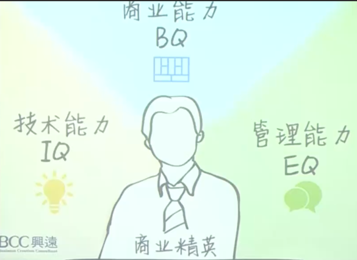

商业模式？什么是商业模式？

这堂课要带来的是——一个完整的商业思考框架：模板化的工具（通用的语言/模型）

《商业模式新生代》——亚历山大 奥斯特沃尔，Alex，他是商业模式画布的发明人。他把所有的商业元素，都放在了一张9格画布中，用9个元素来描述/呈现它。

sopio郑雷，率先去和Alex谈了合作，拿了专利之后去做了商业模式创新教练，提供商业画布咨询设计服务等，蛮赚钱。
---
**本课程的百度讲师—孙琳**：主任架构师，推荐了《穷查理宝典》，她根据这本书，也提出，说一个人要有发展需要掌握三门学科：
- 统计学
- 经济学
- 心理学
---
- 课程分为两部分：
    1. 商业语言学习（language）/ 分析商业模型（Business Model Analyze）；
    2. 商业模式设计和应用（Practice）

- 学习工具：大画布、编写、笔、大脑

## 课程引入

诺基亚，一个芬兰公司，请了唯一一个非芬兰籍的CEO的人，叫埃洛普，但他2010年来的，却在2013年把手机业务卖给了微软，诺基亚的市值跌了16倍，所以这个牛逼的CEO并没有救活诺基亚手机，但是你说他完全错呢？失败呢？也不对，并且诺基亚公司也没有就此倒下，一直做通信，5g布局，靠5g布局重回大众视野，并在2018-2019年又重新做手机

人人网【前身校内网由王兴创建的，（这个王兴也很厉害，虽然卖校内网的时候蛮惨的后面创办了美团），被陈一舟买下后发展为人人网】，起初是最像facebook的，基本是像素级还原，facebook在国外很火的，按理来说人人应该也可以的，但为什么这种商业模式最终还是灭亡了？人人网在做流量运营其实是很超前的，那种抓人眼球的drama标题”不转不是中国人、什么什么小秘密“就是他们领军的。陈一舟是个比较爱折腾的人，一直在不断拓宽业务和激发想法，也导致了公司人员留存率低，做了很多尝试和探索，人人影视，人人直播，猫扑网什么的，但成功的也较少。 

看到这些商业案例，会有什么感受？

亚历山大奥斯特沃尔说：商业模式就像冰箱中的酸奶。什么意思？就是说，所有的商业模式都是会过期的，不可能一招包到底。

可以思考一下，你还能想到哪些“过期酸奶”？

1. 飞信、msn、米聊这种im软件
2. Ofo小黄车，这种比较特别，不是说共享单车不可取，商业模式不可取，还有很多很多因素
3. 还有一些电商平台，靠买量上去的，一些团购的网站和app。
4. 杀毒软件
5. 或者像百度外卖、百度空间，做的火的时候决定不做了，被百度决策放弃，并非因为没有流量和客户，而是上层的战略性裁撤。
6. 百度搜索是不是也会有过期的风险？

75%的用户已经不再相信广告了，百度搜索的广告体验就很不好，可能抖音那种都好一些。那应该怎么办呢？这种有时候不是招再多的产品经理能改变的。

---

那么，一个商业要持续生存的关键挑战有哪些？

1. 环境
2. 自身

商业模式是会过期的，需要应对“变化”。

讲一个人，段永平，小霸王的创始人，从游戏机做到学习机，然后去东莞创办了步步高，他把业务分成三大块：1.教育设备 2.影音视听多媒体 3.通信设备，培养了3个人。他很了解人性，他没有像常规做法把这三个业务模块搞成3个大部门，而是成立了三个公司，就是现在的小天才、oppo和vivo。他说”狼性文化最终会被人性文化打败“。小天才的市场份额仅居苹果、华为、三星之后。你会发现，你的孩子要手表只要小天才，为啥，因为身边的同学也是小天才，只有小天才才能互相碰一碰加同学们的好友，他卖出了溢价，卖出了护城河。

---

## 商业画布

我们在使用商业画布时，不要直接去写上去，可以使用便利贴的形式，并不是说心疼画布，而是说，整个画布是一个动态更新的过程，会有迭代。

### 1. 9个构造块——客户细分

客户细分构造块用来描绘一个企业想要接触和服务的不同人群或组织。

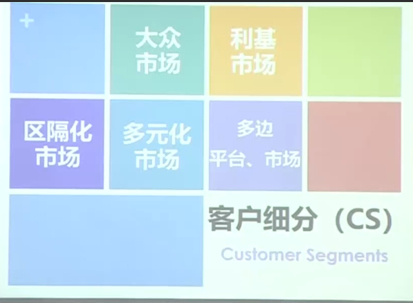

不同的市场没有绝对的好与坏，与实际/资源/产品都有关联，找准切入点，选择客户。

思考：宝洁这个品牌的用户是什么？

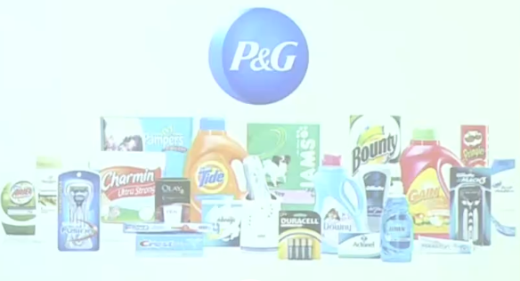

你会发现，这个品牌面向的用户，可以用“大众”来概括，它覆盖面非常广，家庭可以用、公司可以用、保洁人员、居家的人都可以用，所有人都可以用。

有一种市场，就叫大众市场，如果你的产品是面向大众市场的，那你的市场一定很广，规模也会很大，但一般来讲，起步的企业很难做到大众市场，需要非常多的投入和资本，并非一朝一夕能建成的。一般来说，切入大众市场的不多，要么是具有实力的大公司/大集团，要么就是发现了一片蓝海。

> 题外话：现在老年人和女人的钱很好赚的，但是现在还没有很好的产品去赚他们的钱。

思考：红海市场到底还能不能做？

不是不能做，而是从红海中找到切入点，从一个小众的市场出发，逐渐燎原。比如“拼多多”，电商本是大红海，可他却杀出一条路。

#### 客户/用户层级

角色不同。

这样的细分，在ToC场景不多，但是在ToB场景就很多，如果你是做ToB业务就要多注意这个，就比如你给企业做服务，买你产品和用你产品的人往往都是不同的人。所以如果当你有一天去见客户，你就思考一下，你今天见的是谁，是哪种角色，不同角色之间他们关注的东西是不一样的。

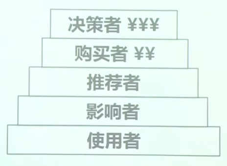

 假如以上所有角色，有一个人say no了，那么你的商业模式就推不下去。 你想要创办一个产品，你要把这五类角色全都打通才可以。

### 2. 9个构造块——价值主张

价值主张构造块用来描绘为特定客户细分创造价值的系列产品和服务。就是你设计出来，别人为你买单的理由。

eg：大米，它的价值主张是什么？普通大米也就几块钱一斤。

但有的大米买的很贵，淘宝上最贵的能达到200元/斤，那这种大米的价值主张是什么？所以就说，价值主张不一定非得是实打实的东西，它会产生一些溢价，那必然200元的大米就会比普通大米多一些附加的精神类的价值主张，虽然不具有实操/实用性的价值主张，但是让人心里听了之后愿意为此买单。【这恰恰也是在红海里，能让产品脱颖而出的一种路径，你会发现很多农产品就在走这条路】

价值主张，就是你能卖出钱的卖点。你设计的价值主张，有人愿意买单才行。

---

eg：杀毒软件的价值主张是什么？安全服务。所以一开始的杀毒软件都以“安全服务”这样的价值主张在收费使用。

后来，360出来搅局了，它推出了免费的安全软件，给这些其他的收费杀毒软件干死了。【不得不说，免费是一个非常好用的商业价值主张，是一个很特别的商业模式，以免费赚流量，再通过流量/收获到一些别的东西去变现，但是现在又不太好使了】

---

eg：IBM的大型主机，它的价值主张是什么？并不是大型机本身，而是稳定的算力/计算服务。

所以，要能够抽象出一个很好的价值主张，你的客户和卖点就会不一样。

---

eg：奢侈品手表-百达翡丽，这种奢侈品的价值主张是啥呢？身份的象征，而不再是看时间/看日期等。

所以，你的价值主张一定是打动客户为产品买单的理由。但是身份这个事情，是看场景和人的，这就又牵扯到你面向的客户细分，比如普京带这个表很正常，是他总统身份的象征，但如果是达康书记带这个表，就不对劲了。所以当你设计一个产品的时候，在选择受众的时候，要把身份地位的匹配都考虑进去，你的客户是谁，你给这些客户的价值主张是什么。

---

eg：中国平安 / 友邦 / 美团 / 招商银行 / 美团外卖 / 刀小蛮米线等

如果你的产品有一个很好的价值主张，你可以把它浓缩/抽象成一个词语/短句，融入到产品/公司的logo中，有助于客户更好的记得这个产品，记得你的产品的价值主张。

---

价值主张可以从1个/多个维度去设计：

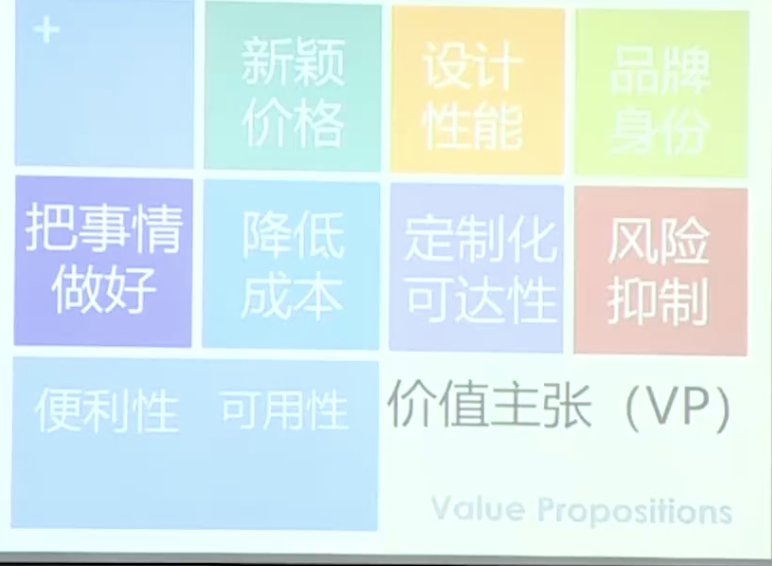 

价值主张是很重要的东西，如果价值主张走不通的话，你的商业模式整个就是失败的。价值主张是商业模式的必要非充分条件。

那么怎么验证你设计出来的价值主张是合理的呢？快速小额量。想办法在一个小的人群中跑通，看这些人接不接受你的价值主张。这一步是不能跳过的，你必须要在一小部分人群中去跑通去验证，不然你会失败的很惨。

> 价值主张这一个部分就能拓展很多书很多课去讲，但大部分人是在这些书中/课程中去悟，去找感觉。标准化的东西就是上述这张图了。 

### 3. 9个构造块——渠道通路

当你有了客户，并能够给予客户价值主张之后，我们就需要一个非常重要的商业元素，叫渠道通路。就是说，你要通过什么样的方式把你的产品/服务销售给客户。

渠道通路用于传递价值主张。

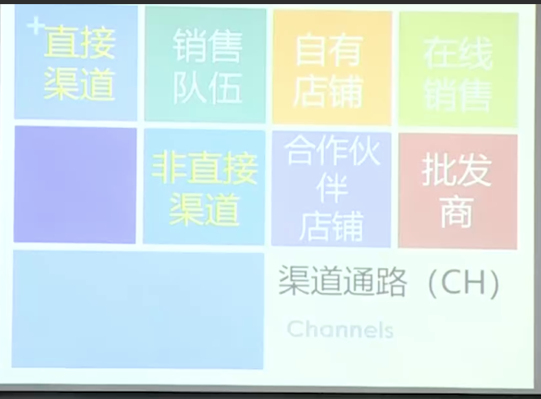

eg：苹果直营店。

思考：直营店的优点和缺点是什么？
- 优点：服务好，员工是自己本部员工，控制力更强。
- 缺点：成本高。

所有的渠道通路，都有一个最基本的要求，就是要能把产品卖出去，能够完成销售的，才叫渠道（只有展示功能的不算渠道）

---

eg：各大厂商渠道商

同样的，也是卖手机的，非直营的，渠道商，那这些渠道商的优点和缺点是什么？
- 优点：成本低，能够快速铺量覆盖市场。
- 缺点：不好管理，服务稍差，控制力差。

小米之前就主要以渠道/代理商的形式售卖，由于渠道商本身希望为自己的店铺盈利，就会将卖的不好的小米产品放在不显眼的位置，导致这款产品彻底滞销，近乎下架。所以，小米痛定思痛，决定发展自己的直营店，可以看到，现如今各大商场也都有了小米的直营店。

所以说，一个有远景，希望做大的公司，一般都会很重视自己直营渠道的发展课，因为直营渠道才是自己的根基，直营渠道是一种很重要的布局。可以看出一个公司是想做长期的发展还是短视的生意。就比如字节，在起步初期，就在各大省会城市，建立了直销点。

但这两种方式，没有绝对的好与坏，也是要看企业的资金和发展阶段，去做平衡。

---

eg：网络渠道

那么网络渠道的优点和缺点是什么？
- 优点：足不出户易获得
- 缺点：几乎无服务体验，履约成本高（退换货），时效性

### 4. 9个构造块——客户关系

客户关系构造块用来描绘公司与特定客户细分群体建立的关系类型。

eg：711便利店：零售，即买即走。

eg：麦德龙/山姆：会员制度

eg：海底捞：vip服务

eg：理发店：办卡，预付费（这几年预付费不太行了，因为跑路的商家太多了，整个社会信用对预付费打击很大，但是有些餐饮/理发把预付费的门槛降的很低，以吸引你常来）

eg：苹果的AppStore：强账号（强绑定，付费资产积累）

eg：两桶油（中石油、中石化）：当你的生意是一个垄断性生意，而又是客户们必须的，你可以不需要任何客户关系，就叫自助服务。

eg：微信：社区关系

eg：大型商场-综合体（里面有很多商铺）：共创关系

客户关系并非越重越好，比如海底捞搞的VIP服务，其实很难学，成本也很高的，越重的客户关系还会影响产品的规模化。你可以根据你的产品特点和不同时期选择你需要的客户关系。

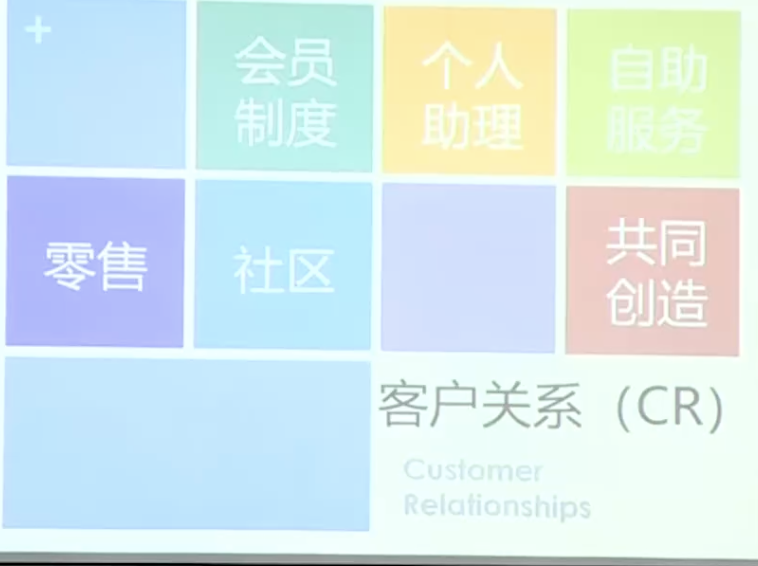

### 5. 9个构造块——收入来源

收入来源构造块用来描绘公司从每个客户群体中获取的现金收入（包括一次性收入和经常性收入）

1. 资产销售，产品销售
2. 服务费用
3. 租赁收费
4. 技术授权（专利费）
5. 中介费用（买卖双方的信息不对称）、经纪收费
6. 广告收费
7. 订阅收费
8. 免费（能换来什么，看上述那个360的例子）

--- 

以上内容都算是商业的前台，后面4个模块是商业的后台。

其实前台是比较好理解的，这是基本在谈产品时都会被问到的：客户是谁？主张是什么？渠道是什么？客户关系是什么？都是非常看得见的。

而接下来讲的是商业的后台，探求为什么是这个企业来做，有什么不一样的地方？

---

### 6. 9个构造块——核心资源

核心资源其实就是用于回答：Why us？为什么是我们来做这个事情？为什么我们做这件事能做成？

核心资源构造块用来描绘让商业模式有效运转所必需的最重要因素。

公司的核心资源必须要满足一个条件——受公司控制。

企业的核心资源有什么呢？
1. 员工
2. 品牌（比如星巴克。`霍华德·舒尔茨，星巴克前CEO，著作《将心注入》`）
> 世界上有三种公司：1.对股东好；2.对客户好；3.对员工好。星巴克属于哪一种？星巴克的企业文化中给出的答案是：对员工好，认为员工是核心资产。而星巴克的员工是全员持股的。
3. 资质批文：这是一个很重要的门槛，你有，但别人没有的东西，这也是核心资产
4. 金融资源：说白了就是钱，能拉到很大的资本也是做生意非常重要的一环。
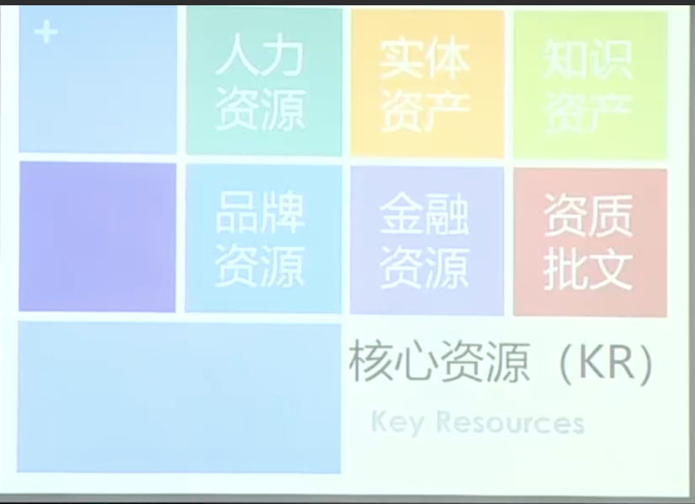

### 7. 9个构造块——关键活动

关键活动构造块用来描绘确保其商业模式可行，企业必须做的最重要的事。
（不做会死的事，年度最重要的事，就是团队OKR）

> 讲淘宝这个案例，为什么它能把网购/电商做起来，明明在淘宝之前其实有其他的网店在做的。
> 首先，淘宝开启了评价机制，再一个，淘宝开放淘宝大学，为入驻商家做培训，让每一个人都有学会开网店的可能。

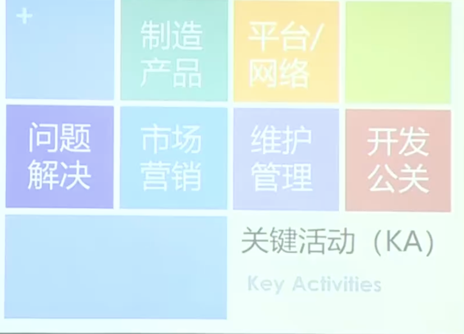

所以，对于关键活动而言，其实就是说，你要干什么，无法呈现一个结果，有点像OKR，我要做什么事情/产品/公关/营销。

### 8. 9个构造块——重要伙伴

重要伙伴构造块用来描绘让商业模式有效运作所需的供应商与合作伙伴的网络。

eg：一个足球俱乐部，它的收入一部分来源于赞助商给他的钱，是这个足球俱乐部的收入，所以赞助商并非伙伴，而是客户。而伙伴可能还需要俱乐部给他们钱，比如足球场地、媒体。

也就是说，伙伴并不能为你提供收入，而是和你一起赚钱，给你提供一个比较稳定的服务。

#### 合作关系类型

- 在非竞争者之间的合作——“战略联盟”
- 竞合：在竞争者之间的合作——“战略合作” （这种就比较难，毕竟是竞争关系）
- 为开发新业务而构建的“合资关系”
- 为确保可靠供应的购买方——“供应商关系”

#### 合作关系作用

- 降低风险和不确定性
- 商业模式优化和规模经济
- 特定资源和服务的获取

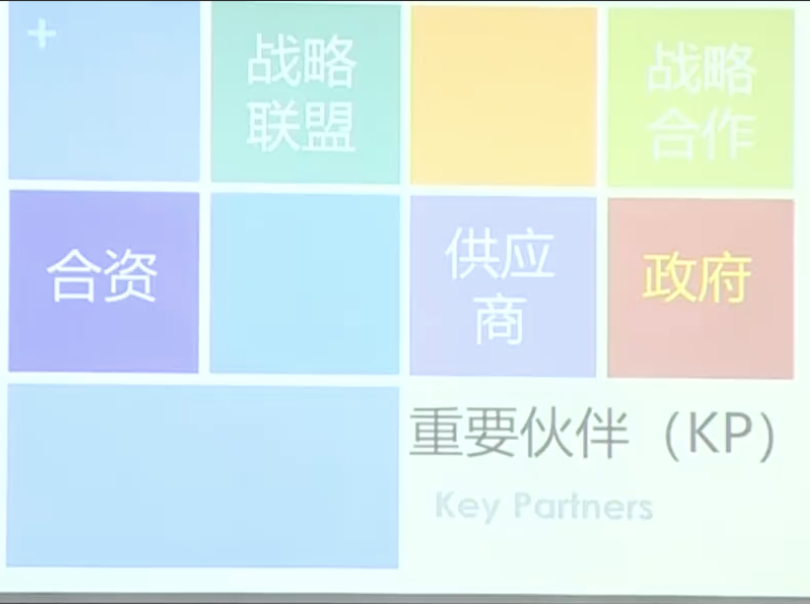

在中国，出了合资/合作这些关系之外，还有一个非常重要的合作伙伴就是——**政府**。如果你的项目里，你要做的事儿里，有可能能和政府产生伙伴关系的，就一定要带上政府。

> XX说：中国最大的经济风险，是政策风险。（看看双减之后的教育）

### 9. 9个构造块——成本结构

成本结构构造块用来描绘一个商业模式所引发的所有成本。

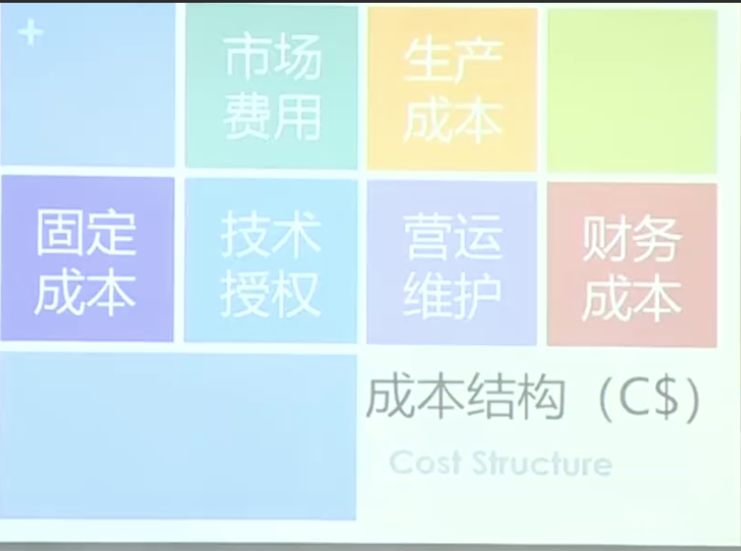

固定成本 ｜ 可变成本

这两者是可以相互转化的。eg：中国移动通信，它们原本是需要建铁塔的，这就很贵，且铁塔是实打实的“重资产”。它后面把这个建铁塔的业务拆成了一个独立集团——中国铁塔，相当于把铁塔这个资产拆出去了，这样对于中国移动通信的成本核算一下就不一样了，没有铁塔了，有的只是一个可变成本——使用铁塔的费用。一下子就把中国移动通信的成本结构变轻了。

这种方式，是在整个商业运作中非常常见的一种资产轻重转化的一种运营模式，改变企业的成本结构。

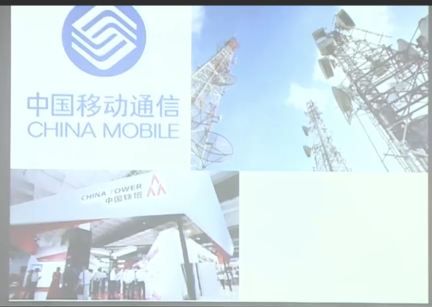
#### 从资产配置看战略选择

重资产 VS 轻资产

eg：钢铁集团这种重金属制造业等——是毫无争议的重资产企业
eg：可口可乐公司？——它就是一个比较特殊的案例，有时候重资产，有时候轻资产

> 对于重资产和轻资产来说，如果这个生产线是我自己的，重资产的好处就是可控、品控好。而轻资产就是可以达到高利润率，高增长。所以可口可乐公司就是，如果某个阶段公司需要高增长，就把生产线剥离出去，过几年需要做战略性创新/调整时，它会重新把重资产收回来。

当一个公司财报显示利润率增长很快的时候，我们可以看到财报里它的增长驱动点是什么？

|  成本驱动   | 价值驱动  |
| --------- | --------- |
| “低价”的主张 最经济的成本结构 （降成本，抛离“重资产”） | “增值型”的价值主张 专注于差异化的价值创造 （互联网公司爱用这种，就说创造了新的增值价值） |

### 画布怎么用？

#### 1.豪华邮轮这个产品的画布使用法

用客户群区分，不同的客户群用不同颜色的便利贴，贴在画布上。

以下就是以“中产家庭”为客户群的一条线的商业画布。

- 前台：
    1. 客户群：中产家庭
    2. 价值主张：奢华海上邮轮体验旅游
    3. 渠道：官网直销；OTA代理；（每个便利贴只写一个元素，像这里就写两个便利贴）
    4. 客户关系：会员
    5. 收入：船票；服务费；
- 后台：
    6. 核心资源：船；团队；航线；
    7. 关键活动（OKR，做什么事儿）：做营销方案；做产品设计；Set up；
    8. 伙伴：旅游局；渠道公司；旅游景点；导游；保险公司
    9. 成本：固定成本【买船的钱】；可变成本【团队费用；广告费用】

### 增长

再来说一下增长，我们在做企业和业务的时候，一定是会面临增长的。

<strong style="color:red;">增长思路：开源节流 profit=revenue-cost</strong>

- 如何开源：revue=sigma[客户数*arpu]
    1. 扩大需求量（供给要跟上）
    2. 增加新的客户价值主张（提升arpu）
    3. 增加新的收入源（引入新的客户）：下一盘更大的棋

- 如何节流：抛重资产
    - 把 “持有” —> “服务” ：固定资产 —> 可变资产

- 当你发现一个看起来不可能的增长？
    - 这就要引入资本的力量：买买买，并行

### 总结

商业模式：它是一个可重复的<strong style="color:red;">盈利计划</strong>，以及<strong style="color:red;">资源整合</strong>的策略。

商业模式画布：它更是呈现一个<strong style="color:red;">设计价值，传递价值和获得价值</strong>的过程。

《商业画布®️》可以分析大到整个企业甚至国家，小到一个项目或者个人。它是非常有系统的逻辑工具。（以“我”为中心，第一人称视角） 

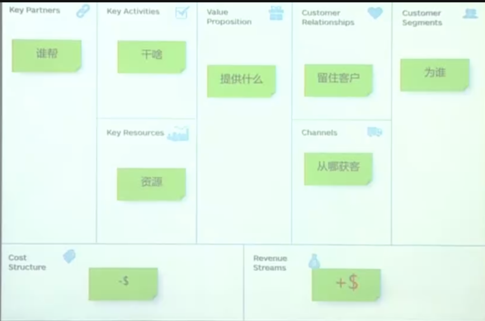

## 商业模式设计和应用（Practice）

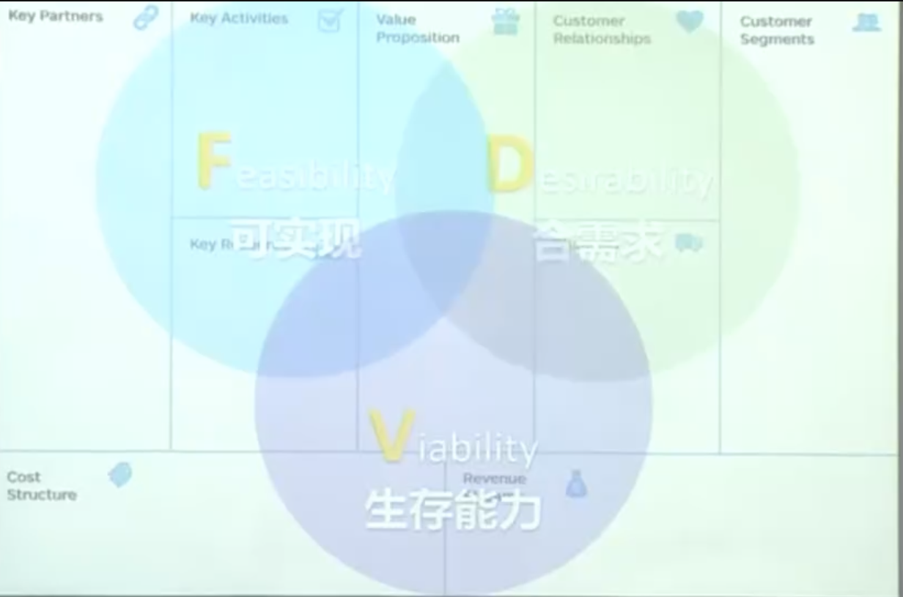

### 商业画布的使用习惯

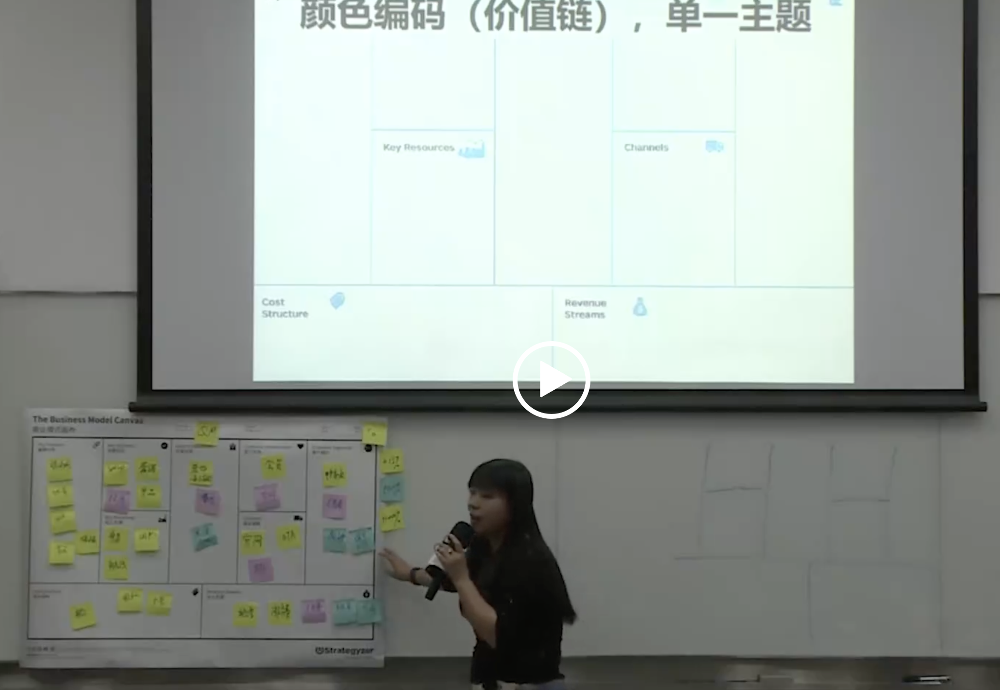

- 画布不要直接写字，而是要用便利贴贴，为了动态设计的过程。
- 每一个角色/客户都是一个价值链，是单一主体的。
- 他们之间建立了纵横的故事。是一个完整的故事。你去和投资人和合伙人什么讲，就是用画布贯穿的故事。

### 商业画布Model应用场景

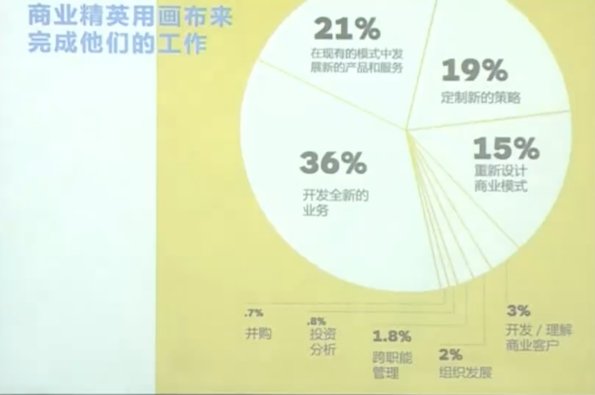   
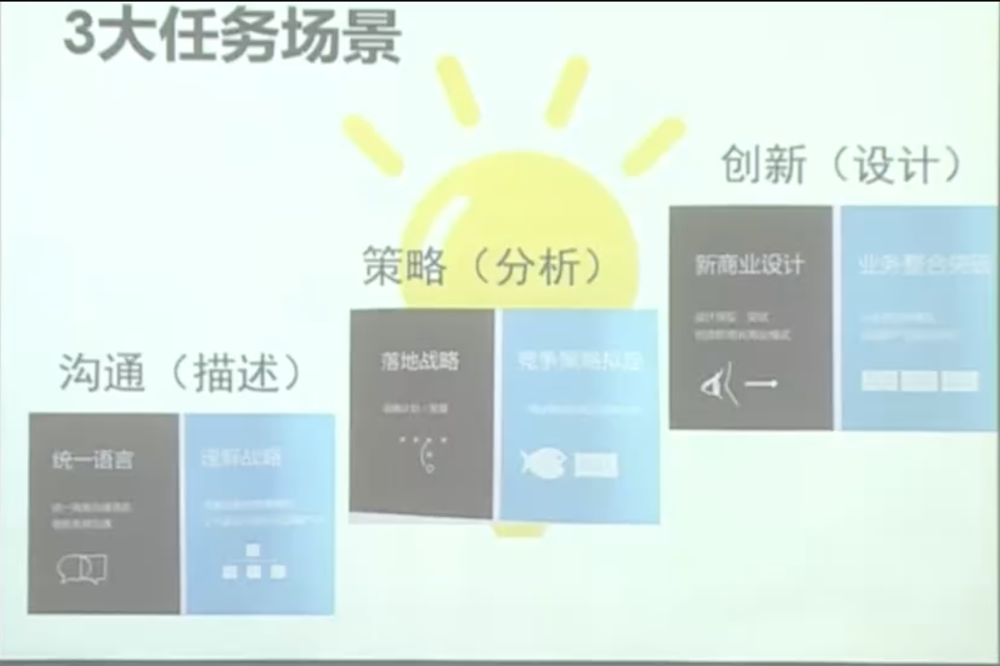   

1. 沟通：跟投资人、团队、下属、客户讲，可以讲画布作为沟通工具。
2. 分析：可以用这个工具分析你的竞争对手等。
3. 设计：当你有一个好的idea时，就可以用这个画布来做设计。

### 商业画布的评估

当你有一个主意，不管它好不好，都能用这个画布走通一套故事，所以我们要能够评估你设计出的这个画布的好与坏。

::: tip
首先，商业的四种死法有：
1. 模式假设错误：需求没跑通，这种是死的最多的，能占到70%。你所认为的需求，其实是伪需求，这是造成商业死掉最多的一个死法。
2. 财务有缺陷：最遗憾
3. 糟糕的执行：团队不行，但这种比较少见
4. 未能成功应对环境：宿命，一个公司，最终是要死的，是逃脱不掉的宿命，所以那种百年公司其实很少见的。
:::
#### 1. 定性评测
四个维度的多个问题：
1. 核心趋势
2. 行业环境
3. 市场环境
4. 宏观经济

#### 2. 定量：问卷打分
七个维度：
1. 转移成本
2. 连续利润
3. 先赚后花
4. 成本变动
5. 他人代劳
6. 规模可能
7. 自我保护

> 常规的建议是：有两个维度打分在8分以上，才能继续进行该商业模式

#### 3. 定量计算： Cost vs. Revenue

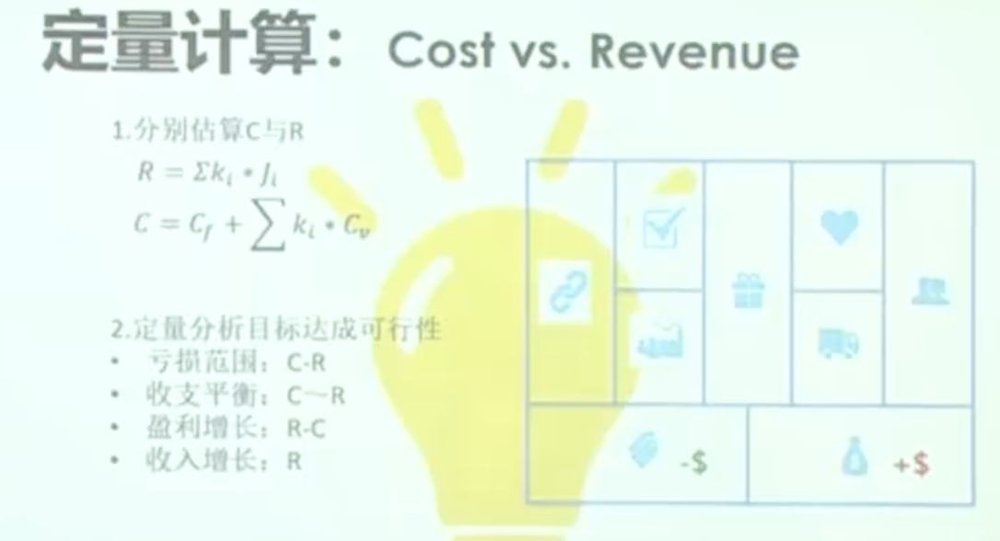

### 商业模式的4种热门套路

#### 1. 诱钓：低门槛 + 捆绑组合

- “剃须刀”生意（LTV，生命周期总价值）- Life Time Value，虽然剃须刀本身不贵，但是之后需要持续买刀片
- “电冰箱”生意（CAC，用户获取成本）- 买个电冰箱，送到货之后，就是一锤子的买卖，所以这种类型的产品往往定价就较贵。
    
所以，你就要确定一下你的生意赚的是什么钱，如果你是“电冰箱”生意，你就要把定价定到位，因为定完价卖出去之后，就没有其他赚钱机会了；所以现在其实更多的产品是在走LTV的路线，能在生意链路上加很多附加的东西，不断的开拓用户和其他产品，所以现在LTV的玩法更多（比如：拍立得/打印机/电动牙刷/医美）。

#### 2. 租赁/共享

把**拥有权**与**使用权**分离，用服务化形式呈现

“高Value + 非便利性携带”

#### 3. 平台：提供流量，连接供需

交易平台 vs. 信息平台

供给侧才是核心：“短期看需求，长期看供给”

#### 4. 免费

“羊毛出在狗身上，猪来买单”
 
or

边际成本极低：免费 + 付费增值

---

::: tip
补充一个问题：思考，你在赚什么钱：红利、工资、利润
用一个小故事来让大家明白什么是红利，什么是利润。
> 在一个沙滩上，大家都在玩耍，但是这个沙滩上没有卖水的，大家玩累了都很渴，你看到了商机，去外面的超市拉来了一箱可乐，你买可乐的成本是3元，但你拉到沙滩这边你卖给大家20元。你赚到的是什么？这就是**红利**。此时，另一个人也发现了该商机，他也去拉了一箱可乐过来，他卖15元，你们之间就产生了竞争，你就会纷纷降价，但始终不会低于3元，但是太低你就慢慢不想干了，这就是红利，慢慢会消失的红利，等到红利消失，你基本就是处于赚个工资的状态了，而并非创业了，因为你根本无法控制这个东西的价格。不要以为你在自己当老板就是创业，而是在给社会打工赚工资而已。
> 所以说，红利是临时的、不持久的。那怎么才能是赚到利润了呢？
> 这个时候，沙滩上的另一个人看到了这一切，他很聪明，他发现你们拉过来的可乐一会儿就在沙滩上被晒热了，失去了原有的清凉口感，于是他发明出了一种恒温杯托，大家使用这种杯托能保持饮品温度不变。发明成功之后，他去申请了一个专利，然后他开始卖他的杯托，别人不能卖，因为他申请了专利，他通过卖杯托赚到的钱就是利润。
> 综上，你想要赚到钱，你要么拥有一直发现的红利的能力，赚一笔是一笔；要么就是把这个东西变成自己的护城河，变成没有竞争的东西，是能够成为你的关键资源的东西，这也是为什么那么多公司去不断的申请专利的原因。
:::

## 课堂同学分享的自建画布

1. 共享充电桩
2. 小饭桌，为企、事业单位提供一站式餐饮服务
3. 王者荣耀主题乐园