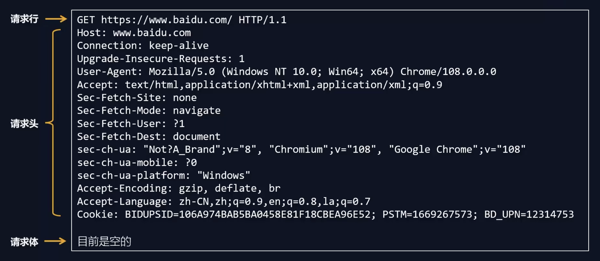
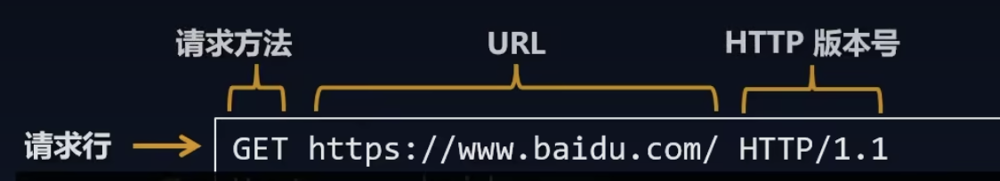
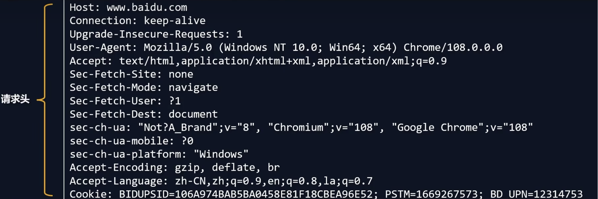
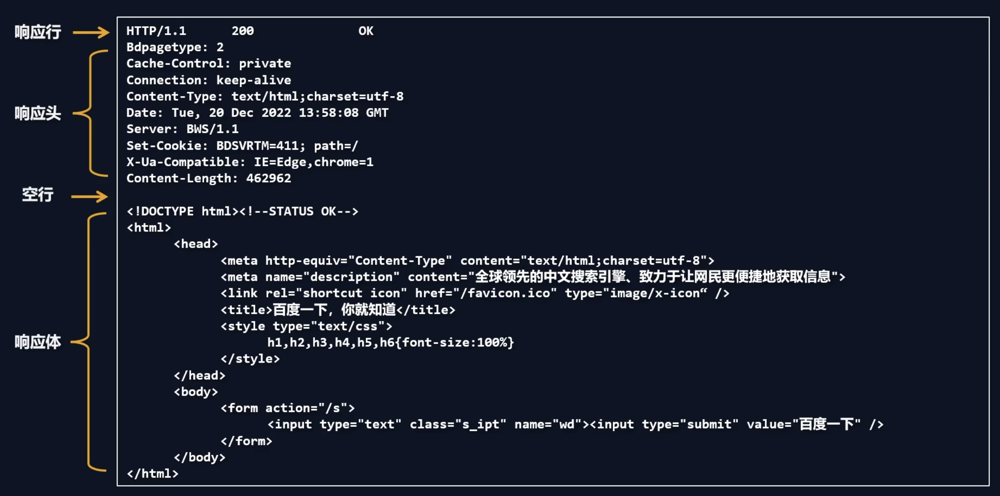

## 一、概念

HTTP (hypertext transport protocol)协议：超文本传输协议
- 是一种基于`TCP/IP`的`应用层`通信协议
- 用于客户端和服务端之间的通信
- 这个协议详细规定了<strong style="color:red">浏览器</strong> 和 <strong style="color:red">万维网服务器</strong> 之间互相通信的规则。 

- 协议中主要规定了两个方面的内容
    - 客户端: 用来向服务器发送数据，可以被称之为`请求报文`
    - 服务端: 向客户端返回数据，可以被称之为`响应报文`

## 二、HTTP请求报文

HTTP请求报文的组成如下：
    **- 请求行
    - 请求头
    - 空行
    - 请求体**

### 1. HTTP请求行

- 请求方法
    - GET: 获取资源
    - POST: 传输实体主体
    - PUT: 传输文件
    - DELETE: 删除文件
    - HEAD: 获得报文首部
    - OPTIONS: 询问支持的方法
    - TRACE: 追踪路径
    - CONNECT: 要求用隧道协议连接代理
    - PATCH: 对资源应用部分修改
---
- 请求 URL (Uniform Resource Locator: 统一资源定位器)
    - 以`http://www.baidu.com:80/index.html?a=100&b=200#logo`为例
        - `http`: 协议( 还有`https`、`ftp`、`ssh`等)
        - `www.baidu.com`: 域名
        - `80`: 端口号
        - `/index.html`: 路径
        - `a=100&b=200`: 查询字符串 
        - `#logo`: 哈希(锚点链接)
---
- HTTP协议版本号
    - HTTP/1.0: 1996年发布
    - HTTP/1.1: 1999年发布
    - HTTP/2.0: 2015年发布
    - HTTP/3.0: 2018年发布s

### 2. HTTP请求头

| 请求头 | 说明 |
| ----- | ---- |
| Host | 请求的域名和端口号 |
| Connection | 连接状态，比如：`keep-alive`（保持连接） ; `close`（关闭连接） |
| Cache-Control | 浏览器缓存机制，比如：缓存控制 `max-age=0` (没有缓存) |
| Upgrade-Insecure-Requests | 升级为安全请求，将网页中的`http`请求转化为`https`请求(很少用)老网站升级|
| User-Agent | 用户代理，客户端字符串标识，服务器可以通过这个标识来识别这个请求来自哪个客户端 ，一般在PC端和手机端的区分 |
| Accept | 设置浏览器能够处理的内容类型 |
| Accept-Charset | 设置浏览器能够显示的字符集 |
| Accept-Encoding | 设置浏览器能够处理的压缩编码 |
| Accept-Language | 设置浏览器当前设置的语言，`q=0.7`为喜好系数，满分为`1` |
| Authorization | Web服务器对客户端的授权信息 |
| Cookie | 当前请求携带的`Cookie`，「后面单独会讲」 |
| Referer | 发出请求的页面地址 |

### 3. HTTP请求体

请求体内容的格式是非常灵活的，
- (可以是空)==> `GET请求`
- (也可以是字符串，还可以是`JSON`)===> `POST请求 `

例如:
- 字符串: `keywords=手机&price=2000`
- JSON: `{"keywords":"手机","price":2000}`

## 响应报文

- 响应行
- 响应头
- 空行
- 响应体
### 响应行

`HTTP/1.1 200 OK`

- `HTTP/1.1`: `HTTP`协议版本号
- `200`: 响应状态码 [参考该博文查看其他状态码](https://developer.mozilla.org/zh-CN/docs/Web/HTTP/Status)
- `OK`: 响应状态描述, 和状态码一一对应

### 响应头

| 响应头 | 说明 |
| ----- | ---- |
| Cache-Control | 浏览器缓存机制，比如：`private`私有的，只允许客户端缓存数据 |
| Connection | 连接状态，比如：`keep-alive`保持连接 |
| Content-Type | 响应体的数据类型，比如：`text/html;charset=utf-8` 设置响应体的数据类型以及字符集,响应体为`html`，字符集`utf-8` |
| Date | 响应的时间 |
| Server | 服务器的信息 |
| Set-Cookie | 设置`Cookie`,比如：`name=zs; path=/; domain=.baidu.com; expires=Wed, 21 Oct 2015 07:28:00 GMT`; |
| Content-Encoding | 响应体的压缩编码 |
| Content-Length | 响应体的长度，单位为字节 |
| Content-Language | 响应体的语言 |
| Location | 重定向地址 |

### 响应体

响应体内容的类型是非常灵活的，常见的类型有
1. HTML
2. CSS
3. JS
4. 图片
5. 视频
6. JSON

::: tip
补充知识：[IP标准分类](https://zhuanlan.zhihu.com/p/193729352)
:::