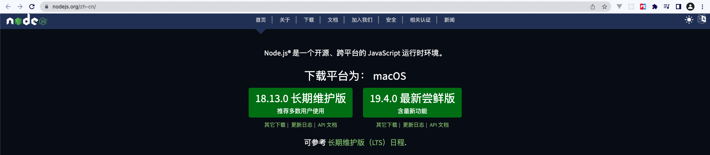
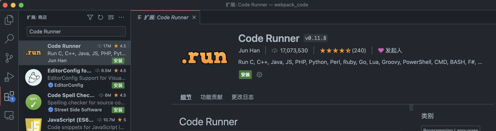
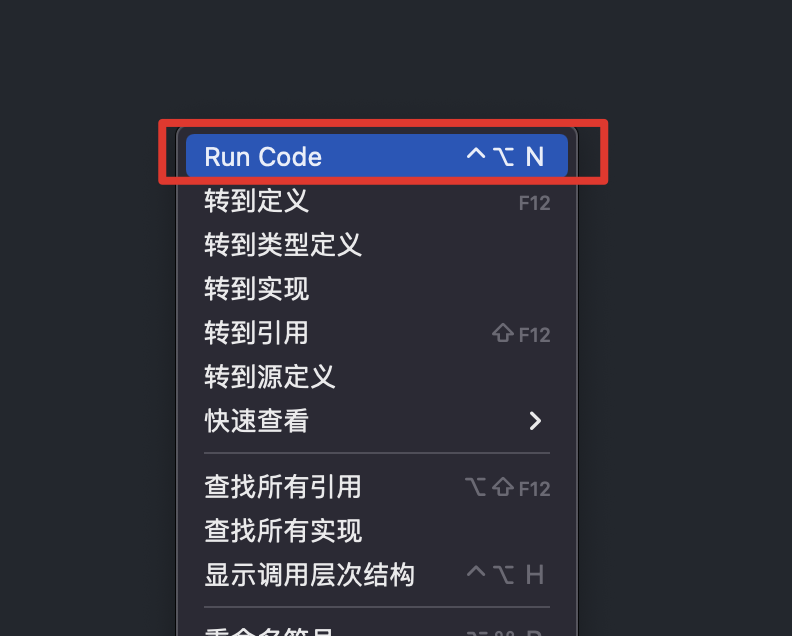

## Node是什么

[Node官网](https://nodejs.org/zh-cn/)



::: warning

官网是很重要的学习文档。

:::

- Node.js是一个基于Chrome V8引擎的JavaScript运行环境

## Node怎么安装

::: warning

安装nvm之前，先删除原下载的node

:::

- nvm管理node版本（略）
- 常用命令
  - `nvm install/uninstall 版本号 ` 下载/卸载某版本
  - `nvm use 版本号` 使用某版本
  - `nvm list` 查看当前已安装的所有node的版本

## Node怎么用

- 方法一：命令行交互模式
- 方法二：在命令行中使用node命令解释js文件`node hello.js` ✅（常用）

## VSCode插件配置

- Code Runner



安装该插件之后，就可以直接通过VSCode来运行Js代码了。（右键编辑器，可以看到Run Code项）



## Node注意事项

首先，抛出一个问题，JS是由哪三部分组成的？

- ECMAscript（核心语法）
- DOM
- BOM

**而Node无法运行Dom和Bom**

比如，如下代码，node都是无法正常运行的

```js
let div = document.createElement('div'); ❌
console.log(location.href); ❌
```

但例如普通的Js语法`console.log("hello node");` 执行是完全没问题的。