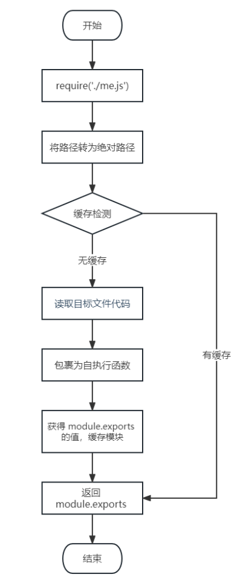

在模块中使用 `require` 传入文件路径即可引入文件 

```js
const test = require('./me.js');
```

`require` 使用的一些注意事项:

1. 对于自己创建的模块，导入时路径建议写**相对路径** ，且不能省略 `./` 和 `../`
2. `js` 和 `json` 文件导入时可以不用写后缀，`c/c++`编写的 `node` 扩展文件也可以不写后缀，但是一般用不到
3. 如果导入其他类型的文件，会以 `js` 文件进行处理
4. 如果导入的路径是个文件夹，则会首先检测该文件夹下 `package.json` 文件中 `main` 属性对应的文件，
    - 如果存在则导入，反之如果文件不存在会报错。
    - 如果`main`属性不存在，或者`package.json`不存在，则会尝试导入文件夹下的 `index.js` 和 `index.json`
    - 如果还是没找到，就会报错
5. 导入`node.js`内置模块时，直接`require`模块的名字即可，无需加`./`和`../`，比如 `require('fs')`，`require('http')`，`require('path')` 等

## 导入模块的基本流程

这里我们介绍一下`require`导入**自定义模块**的基本流程:
1. 将相对路径转为绝对路径，定位目标文件
2. 缓存检测
3. 读取目标文件代码
4. 包裹为一个函数并执行(自执行函数)。通过 arguments.callee.toString() 查看自执行函数 
5. 缓存模块的值
6. 返回 module.exports 的值

