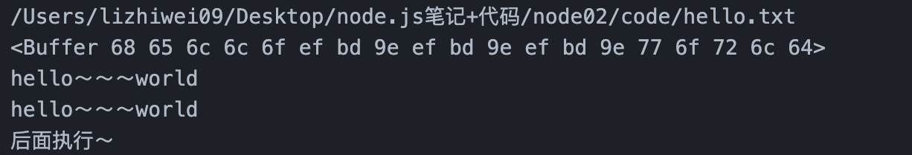
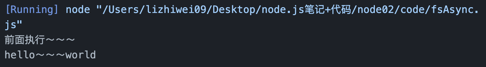

fs (file system) —— 文件系统模块：用于对系统文件及目录进行读写操作。

## fs同步读取文件信息

- `hello.txt`内容
```
hello～～～world
```

- `fsSync.js`

```js
//引入fs模块
const fs = require('fs');

//引入path模块
const path = require('path');
let filePath = path.join(__dirname, 'hello.txt');
console.log(filePath);  // 输出：/Users/lizhiwei09/Desktop/node.js笔记+代码/node02/code/hello.txt

// fs.readFileSync(指定文件路径) —— 同步读取指定文件路径下的文件内容
let content = fs.readFileSync(filePath);
console.log(content); // 打印的是一个Buffer对象：<Buffer 68 65 6c 6c 6f 7e 77 6f 72 6c 64>
console.log(content.toString()); // 通过toString转换Buffer对象，输出filePath指向的hello.txt文件里面的内容：hello～～～world

//使用utf-8转换Buffer
let content01 = fs.readFileSync(filePath,'utf-8');
console.log(content01);  // 使用utf-8编码后，就不用toString()函数了

// 由于是同步，肯定是先把上述都执行完之后，再执行后续代码
console.log("后面执行～");
```
::: details

:::

::: warning
但在实际的工作中，我们肯定不是读取的像上述`hello.txt`这样非常小的文件，有可能读取很大的文件，耗时较长。
在同步的情况下，我们就只有等待文件读取完，才能执行后面的代码，这样是非常耗时的，所以我们**一般会采用异步读取文件的fs方法**。
:::

## fs异步读取文件信息

- `hello.txt`内容
```
hello～～～world
```

- `fsAsync.js`

```js
// 引入fs模块
const fs = require('fs');

// 引入path模块
const path = require('path');
let filePath=path.join(__dirname,'hello.txt');

// 异步读取readFile()
// 需要三个参数: 1. 指定路径  2. 转码方式  3. 回调函数
fs.readFile(filePath, 'utf-8', (error, data) => {
    // 如果读取文件成功，error是null
    if (error) { 
        console.log(error);
        return
    }
    console.log(data); // 打印hello.txt里的内容 hello～～～world
})
console.log('前面执行～～～');
```
::: details

:::

## fs异步写入文件信息

- `hello.txt`内容
```
hello～～～world
```

- `fsAsync-write.js`

```js
const fs = require('fs');

const path = require('path');
let filePath=path.join(__dirname,'hello.txt');

// 异步写入(临时处理一个文件时可用，保存少量的数据)：真实项目中是用的很少的
// 函数格式：fs.writeFile( 1.文件路径, 2.写入的内容, 3.'utf-8', 4.回调函数) —— 四个参数
fs.writeFile(filePath, 'heiheihei', 'utf-8', (error) => {
    if (error) {
        console.log(error);
        return
    }
    console.log('写入成功');
})
// 注意：写入不是叠加，而是进行覆盖
```
观察，hello.txt的内容已经变成了heiheihei


## fs的其他常用方法

```js
const fs = require('fs');

// 修改文件名
// fs.renameSync(旧文件名，新文件名); 
fs.renameSync('hello.txt','hello01.txt'); // 把hello.txt改成hello01.txt了，只是重命名，内容不变

// 获取当前路径下所有的文件名列表：是一个数组样子的
// fs.readdirSync
let paths = fs.readdirSync(__dirname);
console.log(paths);  
// [
//   'buffer数据类型.js',
//   'fs-methods.js',
//   'fsAsync-write.js',
//   'fsAsync.js',
//   'fsSync.js',
//   'hello02.txt',
//   'module',
//   'path内置模块.js',
//   '案例.js',
//   '模块.md'
// ]

let str = 'hello';
console.log(str.endsWith('lo')); // str这个字符串是否以lo结尾的：此处为true
console.log(str.startsWith('e')); // str这个字符串是否以e开头的：此处为false
```

## fs的应用小案例

脚本目标：把当前文件夹的js文件的名字都添加前缀`node-`

```js
//引入fs模块
const fs = require('fs');

let paths = fs.readdirSync(__dirname); // 获取当前文件夹下的所有文件名列表
console.log(paths);

//循环，拿到列表每一个项
//把当前文件夹的js文件的名字都删除前缀node-
paths.forEach( item => {
    // 将js文件（后缀为js的）都加上node-
    if (item.endsWith('.js')) {
        fs.renameSync(item,`node-${item}`); // 给item重命名
    }
})

//把当前文件夹的js文件的名字都删除前缀node-
// paths.forEach( item => {
//     if (item.startsWith('node-')) {
//         // node-buffer数据类型.js
//         fs.renameSync(item, item.substring('node-'.length)); //给item重命名
//     }
// })
```