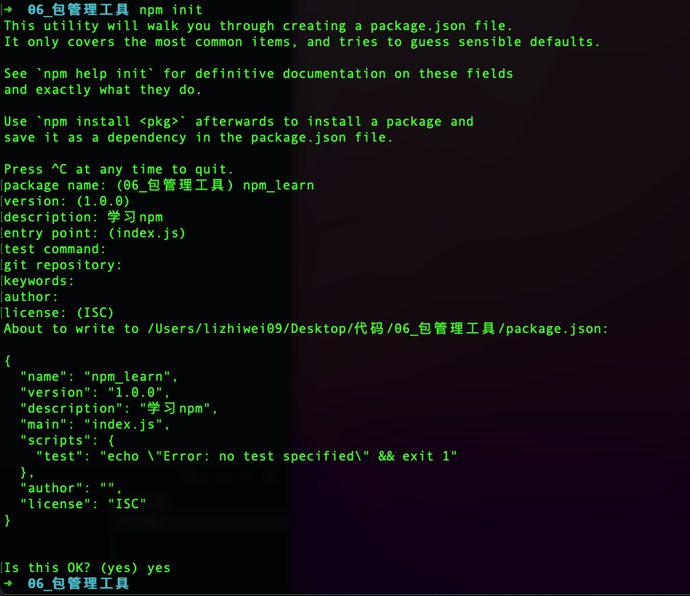

npm，全称<span style="color:red">Node Package Manager</span> ，翻译为中文意思是<strong style="color:red">"Node 的包管理工具"</strong> 

> npm是Node.js官方内置的包管理工具，是**必须要掌握住的工具**

## 1.npm的安装

略

## 2.npm的基本使用

### 初始化

创建一个空目录，然后**以此目录作为工作目录**启动命令行工具 ，执行`npm init`

- `npm init`命令的作用是将文件夹初始化为一个『包』，**交互式**创建`package.json`文件。
- `package.json`是包的配置文件，每个包都必须要有`package.json`
- `package.json`内容示例:



```bash

```