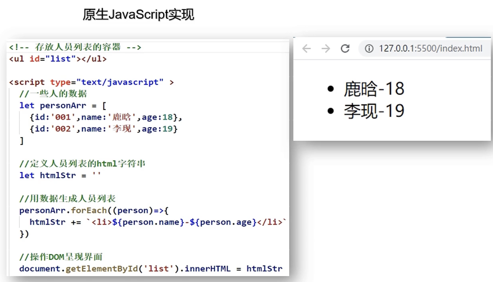
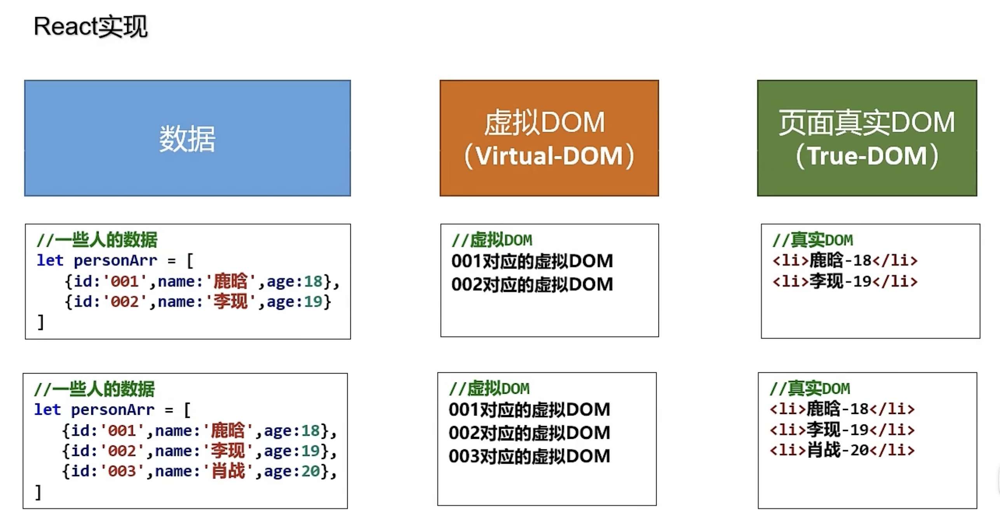

 
## React是什么

React是用于**构建用户界面的JavaScript库**，起源于Facebook的内部项目，该公司对市场上所有 JavaScript MVC 框架都不满意，决定自行开发一套，用于架设 Instagram 的网站。起初由 Facebook 的软件工程师 Jordan Walke 创建，于2011年部署宇 Facebook 的 newsfeed ，随后在2012年部署于 Instagram ，于2013年5月开源。

前端需要呈现一个页面的时候，需要经过以下几个步骤：

1. 发送请求，获取数据
2. 处理数据（过滤、整理数据格式等）
3. **操作DOM呈现页面**



React不帮我们处理前两步，但是它会帮助我们**操作DOM，使得我们的页面呈现出来。**

故，可以将React看作是一个将数据渲染为HTML视图的开源JavaScript库。

## React特点

1. 声明式编码设计：React 使创建交互式 UI 变得轻而易举。为你应用的每一个状态设计简洁的视图，当数据变动时 React能高效更新并渲染合适的组件。
    - 与之相对的是命令式编码设计，如原生JavaScript，需要手动操作DOM，比如我们想改变一个元素的背景色，我们需要先获取到这个元素，然后再 .style 修改它的背景色，这就是命令式编码设计。
---
2. 组件化: 构建管理自身状态的封装组件，然后对其组合以构成复杂的 UI。
    -  原生JavaScript没有组件化的概念，代码的复用性差。
---
3. 高效：React使用虚拟DOM + 优秀的Diffing算法，最大限度地减少与真实DOM的交互。


原来有2条虚拟dom，后面数据增加了一条之后，变成了3条虚拟dom。

这个时候，通过diff算法比较两个虚拟dom的区别：发现前两个虚拟dom没变。

此时，真实dom中就可以直接拿过来用之前那两条真实dom，而新生成的真实dom只有最后的一条“肖战-20”。这样就减少了与真实dom的交互，提高了效率。

- 原生JavaScript操作DOM繁琐、效率低（DOM-API操作UI），如以下这段duan代码：

    ```js
    document.getElementById('app')
    document.querySelector('#app')
    document.getElementsByClassName('span')
    ```

- 使用JavaScript库操作DOM，如jQuery，可以简化DOM操作，但是效率仍然不高，因为jQuery也是通过原生DOM-API操作UI的。大量的DOM操作，如：查询、遍历、修改、删除等，这些操作都会引起浏览器的重绘和重排，这些操作都会消耗大量的CPU和内存资源，从而导致页面卡顿。

---

4. 灵活：React还推出了React Native，可以使用React来开发移动端。

5. 跨平台：React Native可以使用React来开发移动端。

## 学习React的前提

1. 熟悉JavaScript
2. 会判断this指向
3. 了解ES6语法规范
4. 了解模块化开发
5. 了解class（类）
6. npm包管理工具
7. 原型和原型链
8. 数组的常用方法