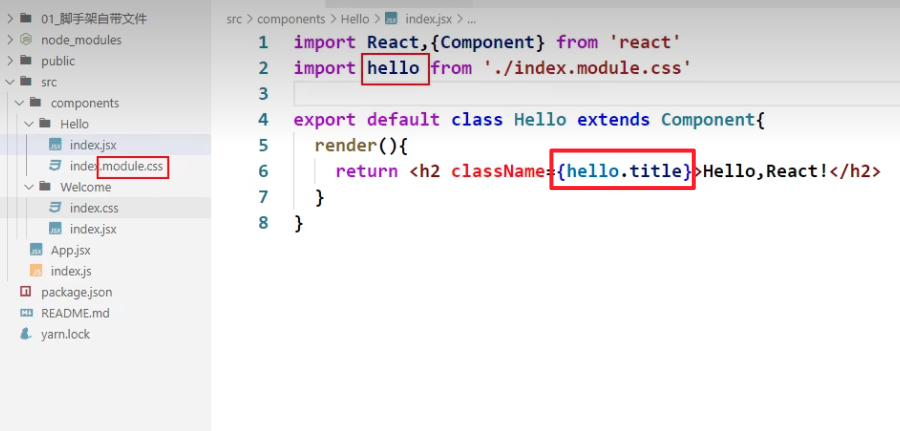
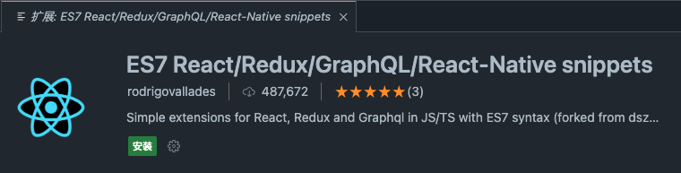

## 什么是脚手架

1. xxx脚手架: 用来帮助程序员快速创建一个基于xxx库的模板项目
    - 包含了所有需要的配置（语法检查、jsx编译、devServer…）
    - 下载好了所有相关的依赖
    - 可以直接运行一个简单效果
2. react提供了一个用于创建react项目的脚手架库: `create-react-app`
3. 项目的整体技术架构为:  `React` + `WebPack` + `ES6` + `ESlint`
4. 使用脚手架开发的项目的特点: 模块化, 组件化, 工程化

## 创建项目并启动

1. 全局安装：`npm i -g create-react-app`
2. 切换到想创项目的目录，使用命令：`create-react-app hello-react`
3. 进入项目文件夹：`cd hello-react`
4. 启动项目：`npm start`

## react脚手架项目结构

```bash{3,10,13}
├── public ---- 静态资源文件夹
│    ├── favicon.icon ------ 网站页签图标
│    ├── index.html -------- 主页面
│    ├── logo192.png ------- logo图
│    ├── logo512.png ------- logo图
│    ├── manifest.json ----- 应用加壳的配置文件
│    └── robots.txt -------- 爬虫协议文件
├── src ---- 源码文件夹
│    ├── App.css -------- App组件的样式
│    ├── App.js --------- App组件
│    ├── App.test.js ---- 用于给App做测试，几乎不用
│    ├── index.css ------ 样式（通用的一些样式，一般来说，我们会在public下面建一个样式文件夹，然后把index.css文件放到public/css下）
│    ├── index.js ------- 入口文件
│    ├── logo.svg ------- logo图
│    ├── reportWebVitals.js --- 页面性能分析文件(需要web-vitals库的支持)
└──--└── setupTests.js ---- 组件单元测试的文件(需要jest-dom库的支持)
```
### public/index.html

```html
<!DOCTYPE html>
<html lang="en">
  <head>
		<meta charset="utf-8" />
		<!-- %PUBLIC_URL%代表public文件夹的路径 -->
		<link rel="icon" href="%PUBLIC_URL%/favicon.ico" />
		<!-- 开启理想视口，用于做移动端网页的适配 -->
		<meta name="viewport" content="width=device-width, initial-scale=1" />
		<!-- 用于配置浏览器页签+地址栏的颜色(仅支持安卓手机浏览器) -->
    <meta name="theme-color" content="red" />
    <meta
      name="description"
      content="Web site created using create-react-app"
		/>
		<!-- 用于指定网页添加到手机主屏幕后的图标 -->
		<link rel="apple-touch-icon" href="%PUBLIC_URL%/logo192.png" />
		<!-- 应用加壳时的配置文件 -->
		<link rel="manifest" href="%PUBLIC_URL%/manifest.json" />
    <title>React App</title>
  </head>
  <body>
		<!-- 若llq不支持js则展示标签中的内容 -->
    <noscript>You need to enable JavaScript to run this app.</noscript>
    <div id="root"></div>
  </body>
</html>
```

### src/index.js

```js
import React, { StrictMode } from 'react';
import ReactDOM from 'react-dom';
import './index.css';
import App from './App';
import reportWebVitals from './reportWebVitals';

ReactDOM.render(
  // StrictMode是什么？
  // StrictMode是React16.3版本新增的一个组件，它可以在开发模式下对组件进行额外的检查。
  // StrictMode并不会渲染任何额外的DOM节点，它为其后代元素触发额外的检查和警告。
  <React.StrictMode>
    <App />
  </React.StrictMode>,
  document.getElementById('root')
);

// reportWebVitals是什么？
// reportWebVitals是React16.4版本新增的一个方法，用于收集用户的性能指标。
reportWebVitals();
```

## 样式的模块化（不常用）



## Vscode中提高React开发效率的插件



1. rcc快捷键

```js
import React, { Component } from 'react'

export default class App extends Component {
  render() {
    return (
      <div>
        
      </div>
    )
  }
}
```

2. rfc快捷键

```js
import React from 'react'

export default function App() {
  return (
    <div>
      
    </div>
  )
}
```

## 功能界面的组件化编码流程（通用）
step1. 拆分组件: 拆分界面,抽取组件

step2. 实现静态组件: 使用组件实现静态页面效果

step3. 实现动态组件
- 动态显示初始化数据
    - 数据类型
    - 数据名称
    - 保存在哪个组件?
- 交互(从绑定事件监听开始)