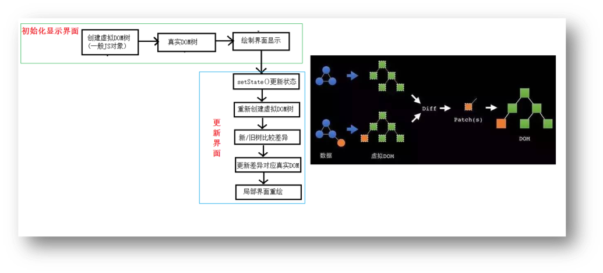
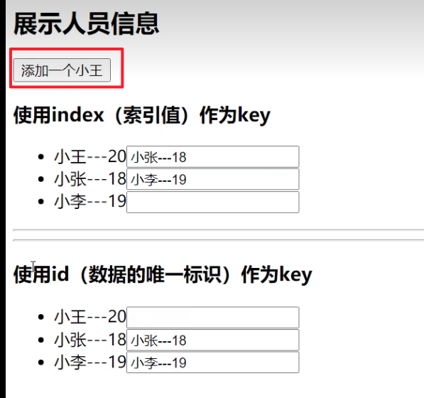

## 需求内容

需求：验证虚拟DOM Diffing算法的存在

## 基本原理图




## 用一个时钟代码来验证diff算法
	
```html
<script type="text/babel">
    class Time extends React.Component {
        state = { 
            date: new Date()
        }

        componentDidMount () {
            setInterval(() => {
                this.setState({
                    date: new Date()
                })
            }, 1000)
        }

        render () {
            return (
                { /* 我们分析div里放的这三个标签，
                        第一次渲染之后，h1和input标签都不会再渲染
                        diff算法，会帮我们比较两次的虚拟DOM，只会渲染变化的部分，它发现h1和input标签没有变化，所以不会再渲染
                        而因为date不断变化，diff算法比较出两次不同了，所以span每次都会重新渲染，
                */}
                <div>
                    <h1>hello</h1>
                    <input type="text"/>
                    { /* 我们还要注意一个点，diff算法比较的最小粒度是标签（或者说是一个dom节点），虽然我们只改变了date，但是span标签里面的没有改变的文字“现在是：”也会一直重新渲染 */}
                    <span>
                        现在是：{this.state.date.toTimeString()}
                        { /* 那如果我们再在span标签写一个input框呢，这个input框也还是会重新渲染吗？
                            答案是否定的。因为diff算法类似于一棵树，是会层层比较的，如果发现某个节点没有变化，那么它的子节点也就不会再比较了
                            对于input框来说，span标签发生了改变，就会再去比较span节点下的子节点，发现input这个节点没有改变，所以也不会再次渲染
                        */}
                        <in put type="text">
                    </span>
                </div>
            )
        }
    }
    ReactDOM.render(<Time/>,document.getElementById('test'))
</script>
```

## key的作用（经典面试题）

### 代码demo

```html
<script type="text/babel">
	class Person extends React.Component{
		state = {
			persons:[
				{id:1,name:'小张',age:18},
				{id:2,name:'小李',age:19},
			]
		}

		add = ()=>{
			const {persons} = this.state
			const p = {id:persons.length+1,name:'小王',age:20}
			this.setState({persons:[p,...persons]})
		}

		render(){
			return (
				<div>
					<h2>展示人员信息</h2>
					<button onClick={this.add}>添加一个小王</button>
					<h3>使用index（索引值）作为key</h3>
					<ul>
						{
							this.state.persons.map((personObj,index)=>{
								return <li key={index}>{personObj.name}---{personObj.age}<input type="text"/></li>
							})
						}
					</ul>
					<hr/>
					<hr/>
					<h3>使用id（数据的唯一标识）作为key</h3>
					<ul>
						{
							this.state.persons.map((personObj)=>{
								return <li key={personObj.id}>{personObj.name}---{personObj.age}<input type="text"/></li>
							})
						}
					</ul>
				</div>
			)
		}
	}

	ReactDOM.render(<Person/>,document.getElementById('test'))
</script>
```

### 结合经典面试题分析上述demo
#### 1.react/vue中的key有什么作用？（key的内部原理是什么？）
- 简单的说: `key`是`虚拟DOM对象`的标识, 在更新显示时，key起着极其重要的作用。
- 详细的说: 当状态中的数据发生变化时，`react` 会根据**【新数据】**生成**【新的虚拟DOM】**, 随后`React`进行**【新虚拟DOM】**与**【旧虚拟DOM】**的`diff`比较，比较规则如下：
    - a. 旧虚拟DOM中找到了与新虚拟DOM相同的key：
        (1) 若虚拟DOM中内容没变, 直接使用之前的真实DOM
        (2) 若虚拟DOM中内容变了, 则生成新的真实DOM，随后替换掉页面中之前的真实DOM
    - b. 旧虚拟DOM中未找到与新虚拟DOM相同的key
        根据数据创建新的真实DOM，随后渲染到到页面
#### 2.为什么遍历列表时，key最好不要用index?

用index作为key可能会引发的问题：

1. 若对数据进行：逆序添加、逆序删除等破坏顺序操作:
    - 会产生没有必要的真实DOM更新 ==> 界面效果没问题, 但效率低。
---
2. 如果结构中还包含输入类的DOM：
    - 会产生错误DOM更新 ==> 界面有问题。
---        
3. 注意！如果不存在对数据的逆序添加、逆序删除等破坏顺序操作，
    - 仅用于渲染列表用于展示，使用index作为key是没有问题的。

::: details
1. 慢动作回放——使用index索引值作为key
- 初始数据：
    ```json
    {id:1,name:'小张',age:18},
    {id:2,name:'小李',age:19},
    ```
- 初始的虚拟DOM：
    ```html
    <li key=0>小张---18<input type="text"/></li>
    <li key=1>小李---19<input type="text"/></li>
    ```
- 更新后的数据：
    ```json
    {id:3,name:'小王',age:20},
    {id:1,name:'小张',age:18},
    {id:2,name:'小李',age:19},
    ```
- 更新数据后的虚拟DOM：
    ```html
    <li key=0>小王---20<input type="text"/></li>
    <li key=1>小张---18<input type="text"/></li>
    <li key=2>小李---19<input type="text"/></li>
    ```
- 

> 你会发现，初始的虚拟dom和更新数据后的虚拟dom，每一条都发生了改变，但其实有两条数据是没有变化的，这就是使用index作为key所带来的问题。

---
2. 慢动作回放——使用id唯一标识作为key

- 初始数据：
    ```json
    {id:1,name:'小张',age:18},
    {id:2,name:'小李',age:19},
    ```
- 初始的虚拟DOM：
    ```html
    <li key=1>小张---18<input type="text"/></li>
    <li key=2>小李---19<input type="text"/></li>
    ```
- 更新后的数据：
    ```json
    {id:3,name:'小王',age:20},
    {id:1,name:'小张',age:18},
    {id:2,name:'小李',age:19},
    ```
- 更新数据后的虚拟DOM：
    ```html
    <li key=3>小王---20<input type="text"/></li>
    <li key=1>小张---18<input type="text"/></li>
    <li key=2>小李---19<input type="text"/></li>
    ```
> 你会发现，初始的虚拟dom和更新数据后的虚拟dom，只有一条数据发生了改变，视图就只需要新渲染一条数据，这就是使用id作为key所带来的好处。
:::
#### 3.开发中如何选择key?

1. 最好使用每条数据的唯一标识作为key, 比如id、手机号、身份证号、学号等唯一值。
2. 如果确定只是简单的展示数据，用index也是可以的。
3. 如果没有唯一标识，可以使用随机数作为key。