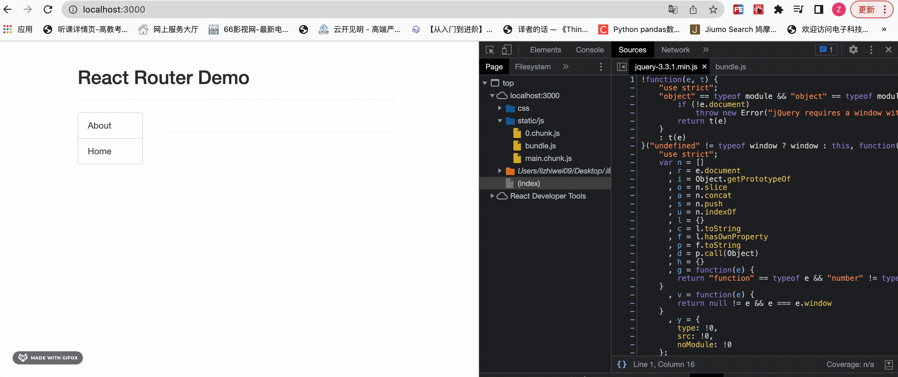

## 路由组件的lazyLoad

```js
import React, { Component, lazy, Suspense} from 'react'

import Loading from './Loading'; // Loading组件, 不能使用懒加载

const Home = lazy(() => import('./Home'))
const About = lazy(() => import('./About'))

{/* 2. Suspense fallback={<Loading/>}：当组件被Suspense包裹时，如果组件还没有加载完毕，就会显示fallback中的内容 */}
<Suspense fallback={<Loading/>}>
    {/* 注册路由 */}
    <Route path="/about" component={About}/>
    <Route path="/home" component={Home}/>
</Suspense>
```

配置了路由懒加载之后，只有访问到对应的路由组件时，才会加载对应的路由组件代码，从而实现路由组件的lazyLoad

