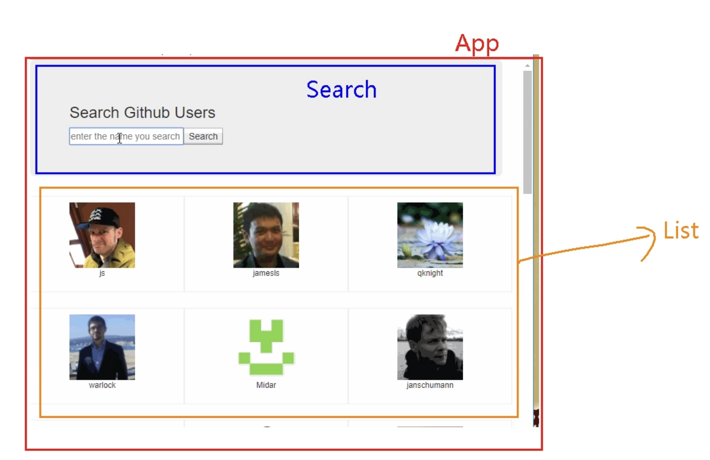

## 需求概览

实现一个如下图所示的搜索页面，输入关键字后，点击搜索按钮，可以显示所有相关用户。



## 消息订阅与发布


什么是消息订阅与发布？

- 消息订阅：订阅者订阅消息
- 消息发布：发布者发布消息
- 消息订阅与发布：订阅者订阅消息，发布者发布消息，订阅者收到消息

在我们的项目中，就是List（下面展示用户列表区）订阅消息，Search（搜索区）发布消息。

[插件：`pubsub-js`](https://github.com/mroderick/PubSubJS)

1. 工具库: `PubSubJS`
2. 下载: `npm install pubsub-js --save`
3. 使用: 
    - `import PubSub from 'pubsub-js' //引入`
    - `PubSub.subscribe('msg', function(data){ }); //订阅`
    - `PubSub.publish('msg', data) //发布消息`

## 知识补充-Fetch

Fetch被称为下一代Ajax技术,采用Promise方式来处理数据。

- [Github官方文档](https://github.github.io/fetch/
- [思否博客介绍](https://segmentfault.com/a/1190000003810652)

### Fetch的优势

页面中需要向服务器请求数据时，基本上都会使用Ajax来实现。Ajax的本质是使用XMLHttpRequest对象来请求数据，而XMLHttpRequest对象是通过事件的模式来实现返回数据的处理。
与XMLHttpRequest类似，Fetch允许你发出AJAX请求。区别在于Fetch API使用Promise方式，Promise是已经正式发布的ES6的内容之一，因此是一种简洁明了的API，比XMLHttpRequest更加简单易用。

### Fetch的基本使用

```js
// get请求
fetch(url).then( (response) => {
    return response.json()
})
.then(function(data) {
    console.log(data)
})
.catch(function(e) {
    console.log(e)
});

// post请求
fetch(url, {
    method: 'POST',
    headers: {
        'Content-Type': 'application/json'
    },
    body: JSON.stringify(data)
})
.then(res => res.json())
.catch(error => console.error('Error:', error))
```

### Fetch的缺陷

1. Fetch默认不会携带cookie，需要设置`credentials: 'include'`
2. Fetch默认不会携带`Content-Type`，需要设置`headers: {'Content-Type': 'application/json'}`
3. Fetch默认不会携带`Accept`，需要设置`headers: {'Accept': 'application/json'}`
4. Fetch默认不会携带`X-Requested-With`，需要设置`headers: {'X-Requested-With': 'XMLHttpRequest'}`
5. Fetch默认不会携带`Authorization`，需要设置`headers: {'Authorization': 'Bearer ' + token}`
6. Fetch默认不会携带`X-CSRF-TOKEN`，需要设置`headers: {'X-CSRF-TOKEN': csrfToken}`

Fetch 还不是 W3C 规范，因此原生支持率并不高。
幸运的是，引入下面这些 polyfill 后可以完美支持 IE8+ ：
1. 由于 IE8 是 ES3，需要引入 ES5 的 polyfill: es5-shim, es5-sham
2. 引入 Promise 的 polyfill: es6-promise
3. 引入 fetch 探测库：fetch-detector
4. 引入 fetch 的 polyfill: fetch-ie8
5. 可选：如果你还使用了 jsonp，引入 fetch-jsonp
6. 可选：开启 Babel 的 runtime 模式，使用 async/await


::: tip
如果有人问你，不用xhr，还可以用什么方式发送ajax请求，你可以说：可以用fetch
fetch与jquery和axios的区别：
- fetch是原生的，不需要引入任何库
- 而jquery和axios都是第三方库，需要引入

可以简单理解，fetch是原生的，与xhr地位相当的，而jquery和axios是第三方库，是对xhr的封装
:::


## 完整项目地址

我在这个图片的基础上，引入了antd的UI框架，整体项目最终如下图所示：


[Github:react-github-usersearch-demo]()