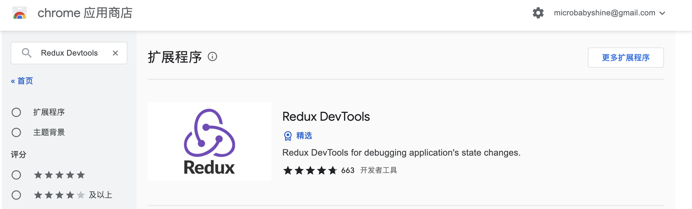

之前我们说到，`redux`是一个专门用于做状态管理的JS库，它可以用在`react`, `angular`, `vue`等项目中, 但基本与`react`配合使用。

于是，我们就有了专属于`react`的`react-redux`库（facebook出品的官方库），它是`react`和`redux`的官方绑定库，它可以让我们更方便的使用`redux`。


## 理解

1. 一个`react`插件库
2. 专门用来简化`react`应用中使用`redux`
3. `react-redux`将所有组件分成两大类
    - UI组件
        1. 只负责 UI 的呈现，不带有任何业务逻辑
        2. 通过`props`接收数据(一般数据和函数)
        3. 不使用任何 `Redux` 的 `API`
        4. 一般保存在`components`文件夹下
    - 容器组件
        1. 负责管理数据和业务逻辑，不负责UI的呈现
        2. 使用 `Redux` 的 `API`
        3. 一般保存在`containers`文件夹下

## 常用API

1. `Provider`：让所有组件都可以得到`state`数据
2. `connect`：用于包装 UI 组件生成容器组件
3. `mapStateToprops`：将外部的数据（即`state`对象）转换为UI组件的标签属性
4. `mapDispatchToProps`：将分发`action`的函数转换为UI组件的标签属性

## Redux开发者工具

在chrome浏览器中安装`Redux DevTools`插件

（科学上网）打开chrome应用商店，搜索`Redux DevTools`，点进去，点击`添加到chrome`，安装成功



但是，光安装了这个插件，想要在项目中使用，还需要做一些配置

### 1.安装依赖

```bash
npm install redux-devtools-extension
``` 

### 2.store中进行配置
```js
import {composeWithDevTools} from 'redux-devtools-extension'

// 创建store时，第二个参数用composeWithDevTools包裹
const store = createStore(allReducer,composeWithDevTools(applyMiddleware(thunk)))
```