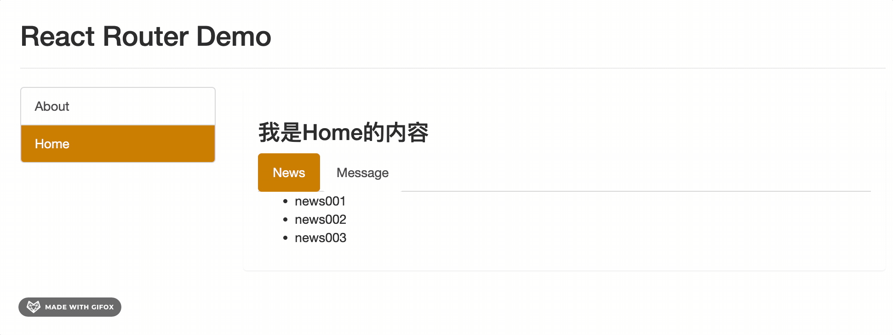

本章节我们先讨论`Router5`版本，后续我们学习完`hooks`，再学习`Router6`版本。

整体路由项目的GitHub地址：[router5的基本使用](https://github.com/Fancy911/React-Learning-Demo-ALL/tree/main/React-Router)

## `react-router-dom`是什么

- [官网](https://v5.reactrouter.com/web/guides/quick-start)
- [印记中文提供的中文网](https://react-router.docschina.org/web/guides/philosophy)

1. `react`的一个插件库。
2. 专门用来实现一个`SPA应用`。
3. 基于`react`的项目基本都会用到此库。

> `react-router`: 一个路由库，用来实现前端路由
> - `react-router-dom`: 专门用来实现`SPA应用`的路由库 (WEB应用)
> - `react-router-native`: 专门用来实现`RN应用`的路由库（移动端）
> - `react-router-config`: 专门用来实现`配置式路由`的路由库

::: tip
- `router`：路由（可以理解为路由器)
- `route`：路由规则（可以理解为路由器上包裹的多个路由插口）
:::

## 安装

```bash
npm install react-router-dom@5
```
> 目前我们学习的是5版本，所以需要在后面加上@5

## 基本使用

### 基本结构

```
├── public
│     ├── index.html
│     └── css
│	       └── bootstrap.css
│── src
│	 ├── App.jsx                # 根组件
│	 ├── index.js
│	 ├── components             # 一般组件
│	 │     │── Header           # 头部组件
│	 │     │    └── index.jsx 
│	 │     └── MyNavLink        # 封装的自定义的NavLink组件
│	 │          └── index.jsx
│	 └── pages                  # 路由组件
│		   │── About            # About组件
│		   │    └── index.jsx
│		   └── Home.js			# Home组件
│		        └── index.jsx
└── package.json
```

1. 明确好界面中的导航区、展示区
2. 导航区的`a标签`改为`Link标签`

	```jsx
	<Link to="/about">About</Link>
	<Link to="/home">Home</Link>
	```
	> 浏览器其实是不认识Link标签的，那么，代码要交给浏览器运行，必然要把它变成浏览器能认识的标签，即`<a>`标签
	> 所以，我们需要在`<Link>`标签上添加`to`属性，来指定它的跳转路径，to属性的值，就是a标签的href属性的值。

3. 展示区写`Route`标签进行路径的匹配
	```jsx
	<Route path='/about' component={About}/>
	<Route path='/home' component={Home}/>
	```

4.  `src/index.js`文件中，将`<App/>`标签的的最外侧包裹上一个`<BrowserRouter>`或`<HashRouter>`

::: tip
`BrowserRouter`与`HashRouter`的区别
1. 底层原理不一样：
	- `BrowserRouter`使用的是`H5`的`history`API，不兼容`IE9`及以下版本。
	- `HashRouter`使用的是`URL`的哈希值。
2. `path`表现形式不一样
	- `BrowserRouter`的路径中没有`#`, 例如：`localhost:3000/demo/test`
	- `HashRouter`的路径包含`#`, 例如：`localhost:3000/#/demo/test`
3. 刷新后对路由`state`参数的影响 (🌟)
	- `BrowserRouter`没有任何影响，因为`state`保存在`history`对象中。
	- `HashRouter`刷新后会导致路由`state`参数的丢失！！！
4. 备注：`HashRouter`可以用于解决一些路径错误相关的问题 (比如，刷新二级路由页面时的资源丢失问题）
:::

### 改造1: 区分路由组件和一般组件

1. 写法不同：
	- 一般组件：`<Demo/>`
	- 路由组件：`<Route path="/demo" component={Demo}/>`
2. 存放位置不同：
	- 一般组件：放在`src/components`目录下
	- 路由组件：放在`src/pages`目录下
3. 接收到的`props`不同：
	- 一般组件：写组件标签时传递了什么，就能收到什么
	- 路由组件：接收到三个固定的属性

	```js
	history:
		go: ƒ go(n)
		goBack: ƒ goBack()
		goForward: ƒ goForward()
		push: ƒ push(path, state)
		replace: ƒ replace(path, state)
	location:
		pathname: "/about"
		search: ""
		state: undefined
	match:
		params: {}
		path: "/about"
		url: "/about"
	```

### 改造2. 改`Link`标签为路由中的`NavLink`标签

我们发现，使用`<Link>`标签，可以实现路由链接的跳转，但是，它没有高亮的效果，所以，我们可以使用`<NavLink>`标签来实现路由链接的高亮效果，并通过`activeClassName`指定样式名。

```jsx
<NavLink activeClassName="demo" className="list-group-item" to="/about">About</NavLink>
<NavLink activeClassName="demo" className="list-group-item" to="/about">About</NavLink>
```

这个`demo`样式可以自己写，也可以使用`bootstrap`的样式。

写一个简单的示范：

```css
.demo {
	background-color: #ddd;
	color: #000;
}
```
如果不指定`activeClassName`，默认的类名是`active`。`active`有一个默认的样式。

### 改造3: 封装`NavLink`标签为`MyNavLink`组件

由于在项目中，我们经常会使用`<NavLink>`标签，并向其中传入很多属性，比如`to`、`className`、`activeClassName`等。

每次**都要写很多属性**，会很麻烦，不如我们封装一个组件，专门用来封装`<NavLink>`标签。我们可以在`src/components`一般组件目录下，新建一个`MyNavLink`组件，专门用来封装`<NavLink>`标签，代码如下：

```jsx
import React, { Component } from 'react'
import { NavLink } from 'react-router-dom'

export default class MyNavLink extends Component {
	render() {
		return (
			<NavLink className="list-group-item" activeClassName="demo" {...this.props}/>
		)
	}
}
```

然后，我们就可以在其他组件中，通过`<MyNavLink>`标签来代替`<NavLink>`标签，简化我们的代码。

```jsx
<MyNavLink to="/about">About</MyNavLink>
<MyNavLink to="/home">Home</MyNavLink>
```

::: warning
- Q1：为什么`MyNavLink`组件中，要写`{...this.props}`？
- A1：因为，我们在使用`<MyNavLink>`标签时，可能会传入很多属性，比如`to`、`className`、`activeClassName`等，所以，我们需要把这些属性，传递给`<NavLink>`标签，这样，`<NavLink>`标签才能正常使用。
---
- Q2：为什么`MyNavLink`标签，写标签体内容About，也能被渲染出来？
- A2：因为**标签体内容也同样会被当做`props`传递给组件，它的属性名是`children`**。所以，我们可以通过`this.props.children`来获取标签体内容。所以当`<MyNavLink to="/about">About</MyNavLink>`中的标签体`About`，是被当做了`this.props.children`传递给了`<NavLink>`标签，所以，`<NavLink>`中的`{...this.props}`也能获取到`About`，从而渲染出来。
:::

### 改造4: 添加`Switch`标签

```jsx
<MyNavLink to="/about">About</MyNavLink>
<MyNavLink to="/home">Home</MyNavLink>

<Route path="/about" component={About}/>
<Route path="/home" component={Home}/> 
<Route path="/home" component={Test}/>
```
默认情况下，不被`Switch`标签包裹时，`/home`路径匹配到了两个路由，所以会同时渲染两个组件。


我们大多时候，都期望一个路径只能匹配到一个组件，那么就可以使用`<Switch>`标签，来包裹所有的路由规则，从而实现只匹配一个路由规则。`<Switch>`标签中，只要匹配到一个路由，就不再向后继续匹配了。

```jsx
<MyNavLink to="/about">About</MyNavLink>
<MyNavLink to="/home">Home</MyNavLink>

<Switch>
	<Route path="/about" component={About}/>
	<Route path="/home" component={Home}/>
	<Route path="/home" component={Test}/> {/* 这个路由规则永远不会匹配到 */} 
</Switch>
```

### 改造5: 解决多级路径刷新页面样式丢失的问题

如果我们的路由写成多级的形式，比如：

```jsx
<MyNavLink to="/about/a">About</MyNavLink>
<MyNavLink to="/home/a">Home</MyNavLink>

<Switch>
	<Route path="/about" component={About}/>
	<Route path="/home" component={Home}/>
</Switch>
```

首次访问`/about/a`，样式正常，但是如果在`http://localhost:3000/about/a`刷新页面，会发现样式就丢失了。

- 原因：

	因为一开始只是切换路由的时候，只是组件切换，不会发生页面的刷新，所以样式不会丢失。

	但是，如果是在浏览器地址栏输入`http://localhost:3000/about/a`，然后回车，就会发生页面的刷新，样式寻找的路径就变成了`http://localhost:3000/a/css/bootstrap.css`，而样式实际是在`http://localhost:3000/css/bootstrap.css`下，所以就找不到样式了。

- 解决方式：
	1. `public/index.html`中引入样式时不写 `./` 写 `/` （常用）
	2. `public/index.html`中引入样式时不写 `./` 写 `%PUBLIC_URL%` （常用）
	3. 使用`HashRouter`

### 改造6: `Redirect`标签

- 当所有路由都无法匹配时，跳转到`Redirect`指定的路由。
- 一般写在所有路由注册的最下方。
- 具体编码：
	```jsx
	<MyNavLink to="/about">About</MyNavLink>
	<MyNavLink to="/home">Home</MyNavLink>

	<Switch>
		<Route path="/about" component={About}/>
		<Route path="/home" component={Home}/>
		<Redirect to="/about"/> // 所有路由都无法匹配时，跳转到About, 一般写在所有路由注册的最下方
		// 比如localhost:3000/demo，就会跳转到localhost:3000/about
		// localhost:3000也会跳转到localhost:3000/about
		// 因为localhost:3000的本质是localhost:3000/，而/后面取出来的是空字符串，在Route路由中，没有匹配到空字符串，所以会跳转到Redirect指定的路由
	</Switch>
	```

### 改造7: 路由的严格匹配和模糊匹配

模糊匹配示例：

```jsx
<MyNavLink to="/about">About</MyNavLink>
<MyNavLink to="/home/a/b">Home</MyNavLink> // 这个路径是可以匹配到home的
<MyNavLink to="/a/home/b">Home</MyNavLink>  // 这个路径是不可以匹配到home的，因为，在/a/home/b这个路径中，会先拿出来一个a，去寻找Route中的path="/a"，但是找不到，所以就不会继续往下匹配了

<Switch>
	<Route path="/about" component={About}/>
	<Route path="/home" component={Home}/>
</Switch>
```

- 严格匹配示例：

```jsx
<MyNavLink to="/about">About</MyNavLink>
<MyNavLink to="/home/a/b">Home</MyNavLink> // 开启严格匹配后，这个路径就匹配不到home了

<Switch>
	<Route exact={true} path="/about" component={About}/>
	<Route exact={true} path="/home" component={Home}/> 
</Switch>
```

1. 默认使用的是模糊匹配（简单记：【输入的路径】必须包含要【匹配的路径】，且顺序要一致）
2. 开启严格匹配：
	`<Route exact={true} path="/about" component={About}/>` 
	或 `<Route exact path="/about" component={About}/>`
3. 严格匹配不要随便开启，需要再开，有些时候开启会导致无法继续匹配二级路由

## 嵌套路由（多级路由）	

我们继续扩展案例, 在`Home`组件中，添加`News`和`Message`组件的详情页面，实现点击列表项，跳转到对应的详情页面。


像上图这样，我们在路由`Home`组件中，还有`Home`的子组件`News`和`Message`可以使用路由进行切换，这样的路由结构，就叫做嵌套路由。 

```
│── src
│	 ├── App.jsx                # 根组件
│	 ├── index.js
│	 ├── components             # 一般组件
│	 │     │── Header           # 头部组件
│	 │     │    └── index.jsx 
│	 │     └── MyNavLink        # 封装的自定义的NavLink组件
│	 │          └── index.jsx
│	 └── pages                  # 路由组件
│		   │── About            # About组件
│		   │    └── index.jsx
│		   └── Home.js			# Home组件
│		        │── News		# News组件
│		        │    └── index.jsx
│		        │── Message	    # Message组件
│		        │    └── index.jsx
│		        └── index.jsx
```


- 在`Home`组件`index.jsx`中，注册嵌套路由, 编写路由链接，实现路由的切换。

```jsx
import React, { Component } from 'react'
import { Route } from 'react-router-dom'
import News from './News'
import Message from './Message'

export default class Home extends Component {
	render() {
		return (
			<div>
				<h2>Home组件内容</h2>
				{/* 编写路由路链接 */}
				<MyNavLink to="/home/news">News</MyNavLink>
				<MyNavLink to="/home/message">Message</MyNavLink>

				{/* 注册嵌套路由 */}
				{/*
					注意：
					1. 注册子路由时要写上父路由的path值
					2. 因为路由的匹配是按照注册路由的顺序进行的（先匹配最先注册的父路由/home，再匹配子路由/home/news 和 /home/message）
				*/}
				<Switch>
					<Route path="/home/news" component={News}/>
					<Route path="/home/message" component={Message}/>
					<Redirect to="/home/news"/>
				</Switch>
			</div>
		)
	}
}
```

## 向路由组件传递参数

我们继续扩展案例, 在`Message`组件中，添加`Detail`组件的详情页面，实现点击列表项，跳转到对应的详情页面。如下图所示



### src的基本结构

```
│── src
│	 ├── App.jsx                # 根组件
│	 ├── index.js
│	 ├── components             # 一般组件
│	 │     │── Header           # 头部组件
│	 │     │    └── index.jsx 
│	 │     └── MyNavLink        # 封装的自定义的NavLink组件
│	 │          └── index.jsx
│	 └── pages                  # 路由组件
│		   │── About            # About组件
│		   │    └── index.jsx
│		   └── Home.js			# Home组件
│		        │── News		# News组件
│		        │    └── index.jsx
│		        │── Message	    # Message组件
│		       	│    │── Detail	     # Detail组件
│		       	│    │     └── index.jsx
│		        │    └── index.jsx
│		        └── index.jsx
```

### 1.params参数（用的最多）

- 路由链接(携带参数)：
	```jsx
	<Link to='/demo/test/tom/18'}>详情</Link>
	```
- 注册路由(声明接收)：
	```jsx
	<Route path="/demo/test/:name/:age" component={Test}/>
	```
- 接收参数：
	```jsx
	this.props.match.params
	```

### 2.search参数（像ajax中的query参数）

- 路由链接(携带参数)：
	```jsx
	<Link to='/demo/test?name=tom&age=18'}>详情</Link>
	```

- 注册路由(无需声明，正常注册即可)：
	```jsx
	<Route path="/demo/test" component={Test}/>
	```
- 接收参数：
	```jsx
	this.props.location.search
	```
::: tip
从`this.props.location`中获取到的`search`是`urlencoded`编码字符串（`key=value&key1=value1`这种就叫`urlencoded`编码字符串）, 需要借助`querystring`库解析

::: details querystring库的基本用法
```jsx
import qs from 'querystring'

let obj = {name:'tom', age:18}
console.log(qs.stringify(obj)) // name=tom&age=18

let str = 'name=tom&age=18'
console.log(qs.parse(str)) // {name:'tom', age:18}
```
:::

### 3.state参数

> 注意！此state和组件里那个state完全没关系，只是一个路由独有的参数 

- 路由链接(携带参数)：
	```jsx
	<Link to={{pathname:'/demo/test',state:{name:'tom',age:18}}}>详情</Link>
	```

- 注册路由(无需声明，正常注册即可)：
	```jsx
	<Route path="/demo/test" component={Test}/>
	```
- 接收参数：
	```jsx
	this.props.location.state
	```

::: tip
虽然，传递`state`参数不会在`url`中显示，但是，刷新页面后仍旧可以保留住参数。

除此之外，还需要注意：之所以能保留住参数，都是因为我们浏览器的历史记录中保存了这个参数，所以，当我们清空了浏览器缓存之后，再刷新页面，就会发现，`state`参数丢失了，`this.props.location.state`由于没有值，就会报错，所以我们在写代码的时候，要注意判断一下，`this.props.location.state`是否有值，如果没有值，就给一个默认空值	
:::

### 代码实现

1. Message组件传递参数

```jsx
import React, { Component } from 'react'
import {Link,Route} from 'react-router-dom'
import Detail from './Detail'

export default class Message extends Component {
	state = {
		messageArr:[
			{id:'01',title:'消息1'},
			{id:'02',title:'消息2'},
			{id:'03',title:'消息3'},
		]
	}
	render() {
		const {messageArr} = this.state
		return (
			<div>
				<ul>
					{
						messageArr.map((msgObj)=>{
							return (
								<li key={msgObj.id}>

									{/* 向路由组件传递params参数 */}
									{/* <Link to={`/home/message/detail/${msgObj.id}/${msgObj.title}`}>{msgObj.title}</Link> */}

									{/* 向路由组件传递search参数 */}
									{/* <Link to={`/home/message/detail/?id=${msgObj.id}&title=${msgObj.title}`}>{msgObj.title}</Link> */}

									{/* 向路由组件传递state参数 */}
									<Link to={{pathname:'/home/message/detail',state:{id:msgObj.id,title:msgObj.title}}}>{msgObj.title}</Link>

								</li>
							)
						})
					}
				</ul>
				<hr/>
				{/* 声明接收params参数 */}
				{/* <Route path="/home/message/detail/:id/:title" component={Detail}/> */}

				{/* search参数无需声明接收，正常注册路由即可 */}
				{/* <Route path="/home/message/detail" component={Detail}/> */}

				{/* state参数无需声明接收，正常注册路由即可 */}
				<Route path="/home/message/detail" component={Detail}/>
			</div>
		)
	}
}
```

2. Detail组件接收参数

```jsx
import React, { Component } from 'react'
// import qs from 'querystring'

const DetailData = [
	{id:'01',content:'你好，中国'},
	{id:'02',content:'你好，尚硅谷'},
	{id:'03',content:'你好，未来的自己'}
]
export default class Detail extends Component {
	render() {
		console.log(this.props);

		// 接收params参数
		// const {id,title} = this.props.match.params 

		// 接收search参数
		// const {search} = this.props.location
		// const {id,title} = qs.parse(search.slice(1))

		// 接收state参数
		const {id,title} = this.props.location.state || {}

		const findResult = DetailData.find((detailObj)=>{
			return detailObj.id === id
		}) || {}
		return (
			<ul>
				<li>ID:{id}</li>
				<li>TITLE:{title}</li>
				<li>CONTENT:{findResult.content}</li>
			</ul>
		)
	}
}
```

## 路由跳转的两种模式push和replace

默认的路由跳转方式是push，即将新的路由添加到路由栈中。也就是说，每次进行了路由跳转之后，都会在浏览器的历史记录中添加一条记录。

而replace是替换当前路由，会把当前路由替换成新的路由，而不会在浏览器的历史记录中添加一条记录。这样就可以不在浏览器的历史记录中留下痕迹。

- 那么，如何将路由跳转的方式改为replace呢？
- 在`Link`或`NavLink`标签中，通过`replace`属性来指定路由跳转的方式
	```jsx
	<Link to="/about" replace>关于</Link>
	```

## 编程式路由导航

不借助`Link`或`NavLink`组件，通过借助`this.prosp.history`对象上的API对操作路由跳转、前进、后退，这就是编程式路由导航。

```jsx
this.prosp.history.push()
this.prosp.history.replace()
this.prosp.history.goBack()
this.prosp.history.goForward()
this.prosp.history.go()
```

我们在`Message`组件中，添加各种跳转方式的按钮，来演示编程式路由导航的使用。

```jsx{14-23,25-34,36-38,40-42,44-46,67-78,84-86}
import React, { Component } from 'react'
import {Link,Route} from 'react-router-dom'
import Detail from './Detail'

export default class Message extends Component {
	state = {
		messageArr:[
			{id:'01',title:'消息1'},
			{id:'02',title:'消息2'},
			{id:'03',title:'消息3'},
		]
	}

	replaceShow = (id,title)=>{
		//replace跳转+携带params参数
		//this.props.history.replace(`/home/message/detail/${id}/${title}`)

		//replace跳转+携带search参数
		// this.props.history.replace(`/home/message/detail?id=${id}&title=${title}`)

		//replace跳转+携带state参数
		this.props.history.replace(`/home/message/detail`,{id,title})
	}

	pushShow = (id,title)=>{
		//push跳转+携带params参数
		// this.props.history.push(`/home/message/detail/${id}/${title}`)

		//push跳转+携带search参数
		// this.props.history.push(`/home/message/detail?id=${id}&title=${title}`)

		//push跳转+携带state参数
		this.props.history.push(`/home/message/detail`,{id,title})
	}

	back = ()=>{
		this.props.history.goBack()
	}

	forward = ()=>{
		this.props.history.goForward()
	}

	go = ()=>{
		this.props.history.go(-2)
	}

	render() {
		const {messageArr} = this.state
		return (
			<div>
				<ul>
					{
						messageArr.map((msgObj)=>{
							return (
								<li key={msgObj.id}>

									{/* 向路由组件传递params参数 */}
									{/* <Link to={`/home/message/detail/${msgObj.id}/${msgObj.title}`}>{msgObj.title}</Link> */}

									{/* 向路由组件传递search参数 */}
									{/* <Link to={`/home/message/detail/?id=${msgObj.id}&title=${msgObj.title}`}>{msgObj.title}</Link> */}

									{/* 向路由组件传递state参数 */}
									<Link to={{pathname:'/home/message/detail',state:{id:msgObj.id,title:msgObj.title}}}>{msgObj.title}</Link>

									&nbsp;<button onClick={()=> this.pushShow(msgObj.id,msgObj.title)}>push查看</button>
									&nbsp;<button onClick={()=> this.replaceShow(msgObj.id,msgObj.title)}>replace查看</button>
								</li>
							)
						})
					}
				</ul>
				<hr/>
				{/* 声明接收params参数 */}
				{/* <Route path="/home/message/detail/:id/:title" component={Detail}/> */}

				{/* search参数无需声明接收，正常注册路由即可 */}
				{/* <Route path="/home/message/detail" component={Detail}/> */}

				{/* state参数无需声明接收，正常注册路由即可 */}
				<Route path="/home/message/detail" component={Detail}/>

				<button onClick={this.back}>回退</button>&nbsp;
				<button onClick={this.forward}>前进</button>&nbsp;
				<button onClick={this.go}>go</button>
			</div>
		)
	}
}
```

## `withRouter`高阶组件

`withRouter`是一个高阶组件，可以加工一般组件，让一般组件具备路由组件所特有的`API`。

比如，我们想将上述的`前进`、`后退`、`go操作`写在一般组件`Header`中，但是`Header`组件不是路由组件，所以是没有`this.props.history`对象的，这时候就可以使用`withRouter`来加工它，让它具备路由组件所特有的`API`。

Header组件代码如下：

```jsx
import React, { Component } from 'react'
import {withRouter} from 'react-router-dom' //引入withRouter,它其实本质是一个函数v

class Header extends Component {

	back = () => {
		this.props.history.goBack()
	}

	forward = () => {
		this.props.history.goForward()
	}

	go = () => {
		this.props.history.go(-2)
	}

	render() {
		console.log('Header组件收到的props是',this.props); // 被withRouter包裹之后，Header组件就也具有路由组件的history,location,match
		return (
			<div className="page-header">
				<h2>React Router Demo</h2>
				<button onClick={this.back}>回退</button>&nbsp;
				<button onClick={this.forward}>前进</button>&nbsp;
				<button onClick={this.go}>go</button>
			</div>
		)
	}
}

export default withRouter(Header)

//withRouter可以加工一般组件，让一般组件具备路由组件所特有的API
//withRouter的返回值是一个新组件
```