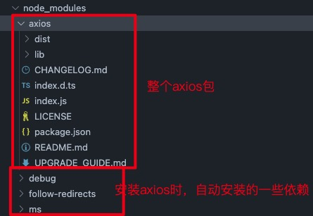

## axios包结构说明



```bash
├── /dist/          # 项目输出目录
├── /lib/           # 项目源码目录
│     ├── /adapters/          # 定义请求的适配器 xhr、http
│     │       ├── http.js     # 实现 http 适配器(包装 http 包)
│     │       └── xhr.js      # 实现 xhr 适配器(包装 xhr 对象)
│     ├── /cancel/  # 定义取消功能
│     ├── /core/    # 一些核心功能
│     │      ├── Axios.js               # axios 的核心主类
│     │      ├── dispatchRequest.js     # 用来调用 http 请求适配器方法发送请求的函数
│     │      ├── InterceptorManager.js  # 拦截器的管理器
│     │      └── settle.js              # 根据 http 响应状态，改变 Promise 的状态
│     ├── /helpers/     # 一些辅助方法
│     ├── axios.js      # 对外暴露接口
│     ├── defaults.js   # axios 的默认配置
│     └── utils.js      # 公用工具
├── package.json    # 项目信息
├── index.d.ts      # 配置 TypeScript 的声明文件
└── index.js        # 入口文件
```