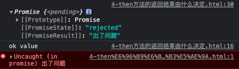
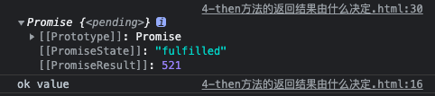
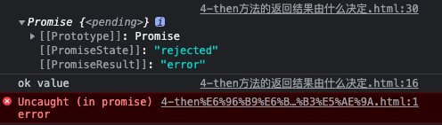

## 1. 如何改变 promise 的状态?

1. `resolve(value)`: 如果当前是 `pending` 就会变为 `resolved`
2. `reject(reason)`: 如果当前是 `pending` 就会变为 `rejected`
3. 抛出异常:如果当前是`pending`就会变为`rejected`
```js
 // 改变 Promise 对象状态的方式
let p = new Promise((resolve, reject) => {
    //1. resolve 函数
    // resolve('ok'); // pending   => fulfilled (resolved)
    //2. reject 函数
    // reject("error"); // pending  =>  rejected 
    //3. 抛出错误
    // throw '出问题了'; // pending  =>  rejected 
});

console.log(p);
```

## 2. 一个`promise`指定多个成功/失败回调函数, 都会调用吗? 
（理解题意：如果我们使用`then`方法，为一个`promise`对象去指定多个回调，这些回调是不是都会执行）

- 当 `promise` 改变为对应状态（比如`pending => rejected` 或 `pending => fulfilled`）时都会调用

```js
let p = new Promise((resolve, reject) => {
    resolve('OK');
});

// 调用两次then方法，指定两个成功回调函数
// 指定回调 - 1
p.then(value => {
    console.log(value);
});

// 指定回调 - 2
p.then(value => {
    alert(value);
});
```

## 3. 改变`promise`状态和指定回调函数谁先谁后执行?

(该题可以理解为，是`resolve`函数改变状态先执行，还是`then`方法指定回调先执行)

- 答：都有可能

### 第一种情况：先改变状态再指定回调
1. 当执行器中的函数是一个**同步任务**时，直接去调`resolve/reject`)时，是**先改变状态再指定回调**
```js
let p = new Promise((resolve, reject) => {
    resolve('OK');
});

p.then(value => {
    console.log(value);
},reason=>{
    
})
```

2. 虽然是异步任务，但是延长更长的时间才调用`then`方法，也能**先改状态再指定回调**
```js
let p = new Promise((resolve, reject) => {
    setTimeout(() => {
        resolve('OK');
    }, 1000);
});

setTimeout(() => {
    p.then(value => {
        console.log(value);
    },reason=>{
        
    })
}, 2000);
```

### 第二种情况：先指定回调再改状态
- 执行器中是**异步任务**时（这种情况是居多的），就是`then()`先执行，`resolve()/reject()`后执行
```js
let p = new Promise((resolve, reject) => {
    setTimeout(() => {
        resolve('OK');
    }, 1000);
});

p.then(value => {
    console.log(value);
},reason=>{
    
})
```

### 什么时候才能得到数据? 

本题可以理解为：`then`回调函数什么时候执行。
- 如果先改变状态, 那当指定回调`then`时, 回调函数就会调用, 得到数据
- 如果是异步任务，先指定回调了后改变状态了，是当状态发生改变时（`resolve`改变状态执行完了）, 再去调用`then`里的回调函数, 才得到数据 

## 4. `promise.then()`返回的新`promise`的结果状态由什么决定?
1. 简单表达:由`then()`指定的回调函数执行的结果决定
2. 详细表达:
    - 如果抛出异常, 新`promise` 变为`rejected`, `reason`为抛出的异常
        ```js
        let p = new Promise((resolve, reject) => {
            resolve('ok');
        });
        // 执行 then 方法, then 方法返回一个新的 Promise 对象
        // result 就是这个新 Promise 对象
        let result = p.then( value => {
            console.log(value,"value");
            //1. 抛出错误
            throw '出了问题';
        }, reason => {
            console.warn(reason,"reason");
        });

        console.log(result);
        ```
        控制台执行结果：
        

    - 如果返回的是非 promise 的任意值, 新 promise 变为 resolved, value 为返回的值 
        ```js
        let p = new Promise((resolve, reject) => {
            resolve('ok');
        });

        let result = p.then( value => {
            console.log(value,"value");
            //2. 返回结果是非 Promise 类型的对象
            return 521;
        }, reason => {
            console.warn(reason,"reason");
        });

        console.log(result);
        ```
        控制台执行结果：
        

    - 如果返回的是另一个新promise, 此promise的结果就会成为新promise的结果
        ```js
        let p = new Promise((resolve, reject) => {
            resolve('ok');
        });

        let result = p.then( value => {
            console.log(value,"value");
            // 3. 返回结果是 Promise 类型的对象
            return new Promise((resolve, reject) => {
                // resolve('success');
                reject('error');
            });
        }, reason => {
            console.warn(reason,"reason");
        });

        console.log(result);
        ```
        控制台执行结果：
        

## 5. `promise` 如何串连多个操作任务?
1. `promise`的`then()`方法会返回一个新的`promise`, 可以继续`then()`的链式调用
2. 通过`then()`的链式调用串连多个同步/异步任务
```js
let p = new Promise((resolve, reject) => {
    setTimeout(() => {
        resolve('OK');
    }, 1000);
});

p.then(value => {
    return new Promise((resolve, reject) => {
        resolve("success");
    });
}).then(value => {
    console.log("value1",value); // success
}).then(value => {
    console.log("value2",value); // undefined
    /* 思考一下为什么是 undefined
        * 我们知道，then的返回结果是一个新的promise对象，并且这个新的promise对象的状态是由当前then方法指定的回调函数的返回值决定
        * 很明显，
        * value => {
        *     console.log("value1",value); // success
        * }这个回调函数的返回就是undefined，undefined也并不是promise对象，所以这第二个then方法返回的新的promise对象的状态是resolved，value是undefined 
        * 既然第二个then成功了，那么第三个then就会输出第二个then的回调函数的返回值，也就是undefined
        * *
    */
})
```

## 6. promise 异常传透?
1. 当使用promise的then链式调用时,可以在最后指定失败的回调
2. 前面任何操作出了异常, 都会传到最后失败的回调中处理
### 情形一
```js
let p = new Promise((resolve, reject) => {
    setTimeout(() => {
        reject('Err');
    }, 1000);
});

p.then(value => {
    console.log(111);
}).then(value => {
    console.log(222);
}).then(value => {
    console.log(333);
}).catch(reason => {
    console.warn(reason);  // 这个会输出Err，前面任何操作出了异常，都会传到最后失败的回调中处理
});
```
### 情形二
```js
let p = new Promise((resolve, reject) => {
    setTimeout(() => {
        resolve('OK');
    }, 1000);
});

p.then(value => {
    throw '失败啦!';
}).then(value => {
    console.log(222);
}).then(value => {
    console.log(333);
}).catch(reason => {
    console.warn(reason);  // 输出“失败啦!”
});
```

## 7. 如何中断`promise`链
- 什么叫中断`promise`链：指当使用`promise`的`then`链式调用时, 在中间中断,不再调用后面的回调函数。
- 有且只有一个方式：在回调函数中返回一个`pendding`状态的`promise`对象
```js
let p = new Promise((resolve, reject) => {
    setTimeout(() => {
        resolve('OK');
    }, 1000);
});

p.then(value => {
    console.log(111);
    //有且只有一个方式
    return new Promise(() => {});
}).then(value => {
    console.log(222);
}).then(value => {
    console.log(333);
}).catch(reason => {
    console.warn(reason);
});
```

上述代码中，`return new Promise(() => {});`这个`promise`对象的状态是`pendding`，所以后面的`then`方法的回调函数都不会执行了。
所以，控制台中只会输出`111`。
