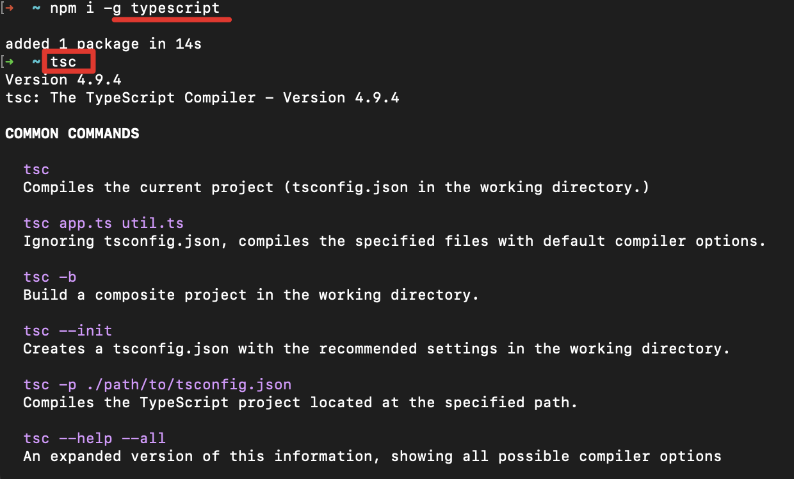
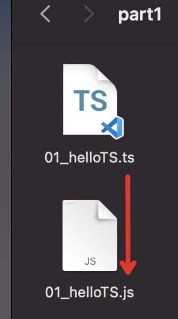

建议使用nvm工具来下载node。
可以参考[学习笔记/NodeJS/初始NodeJS](https://fancy911.github.io/vuepress-docs/docs/nodejs/intro.html)

1. 使用npm全局安装typescript(这一步就是在安装Ts的编译器)
   - 进入命令行
   - 输入：npm i -g typescript
   - 安装完成后，输入命令行tsc，看是否打印一堆信息，标志安装成功。
   

2. 创建一个ts文件

3. 使用tsc对ts文件进行编译
   - 进入命令行
   - 进入ts文件所在目录
   - 执行命令：tsc 01_helloTS.ts 
   - 能看到通过tsc编译后，产生了一个同名的js文件01_helloTS.js 

