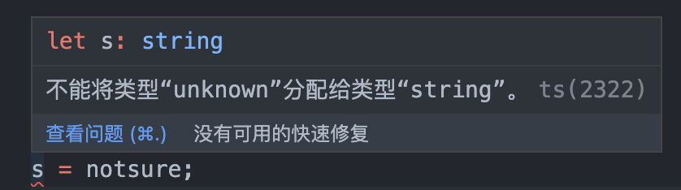

## 类型声明

- 类型声明是TS非常重要的一个特点
- 通过类型声明可以指定TS中变量（参数、形参）的类型
- 指定类型后，当为变量赋值时，TS编译器会自动检查值是否符合类型声明，符合则赋值，否则报错
- 简而言之，类型声明给变量设置了类型，使得变量只能存储某种类型的值

### 基本语法

1. `let 变量: 类型`

```typescript
// 声明一个变量a，同时指定它的类型为number
let a: number;
// a 的类型设置为了number，在以后的使用过程中a的值只能是数字
a = 10;
a = 33;
a = 'hello'; // 此行代码会报错，因为变量a的类型是number，不能赋值字符串
```

2. `let 变量: 类型 = 值`: 声明完变量直接进行赋值

```typescript
let b: boolean = false;
```


3. 函数声明

- 在JS中，函数是**不考虑参数的类型和个数的**
```js
function sum(a, b){
    return a + b;
}

// console.log(sum(123, 456)); // 579
// console.log(sum(123, "456")); // "123456"：变成字符串拼接了
```
- ts定义函数的语法如下：
```typescript
function fn(参数: 类型, 参数: 类型): 类型{
    ...
}

function sum(a: number, b: number): number{
    return a + b;
}
let result = sum(123, 456);
```

## 自动类型判断
- TS拥有自动的类型判断机制
- 当对变量的声明和赋值是同时进行的，TS编译器会自动判断变量的类型
- 所以如果你的变量的声明和赋值时同时进行的，可以省略掉类型声明

```typescript
// 如果变量的声明和赋值是同时进行的，TS可以自动对变量进行类型检测，即使没有写：指定类型
let c = false;

c = 123; // 报错
c = true; //✅
```

## 类型汇总

  |  类型   |       例子        |              描述              |
  | :-----: | :---------------: | :----------------------------: |
  | number  |    1, -33, 2.5    |            任意数字            |
  | string  | 'hi', "hi", `hi`  |           任意字符串           |
  | boolean |    true、false    |       布尔值true或false        |
  | 字面量  |      其本身       |  限制变量的值就是该字面量的值  |
  |   any   |         *         |            任意类型            |
  | unknown |         *         |         类型安全的any          |
  |  void   | 空值（undefined） |     没有值（或undefined）      |
  |  never  |      没有值       |          不能是任何值          |
  | object  |  {name:'孙悟空'}  |          任意的JS对象          |
  |  array  |      [1,2,3]      |           任意JS数组           |
  |  tuple  |       [4,5]       | 元素，TS新增类型，固定长度数组 |
  |  enum   |    enum{A, B}     |       枚举，TS中新增类型       |

### number

```typescript
let decimal: number = 6;
let hex: number = 0xf00d;
let binary: number = 0b1010;
let octal: number = 0o744;
let big: bigint = 100n;
```

### boolean

```typescript
let isDone: boolean = false;
```

### string

```typescript
let color: string = "blue";
color = 'red';

let fullName: string = `Bob Bobbington`;
let age: number = 37;
let sentence: string = `Hello, my name is ${fullName}.

I'll be ${age + 1} years old next month.`;
```

### 字面量
- `let 变量: 字面量`: 使用字面量进行类型声明

- 也可以使用字面量去指定变量的类型，通过字面量可以确定变量的取值范围

```typescript
let b: 'hello'; //声明b只能是'hello'
b = 'yes'; //报错，所以这种用法不常见

// 常见用法示例：female和male 或｜链接
let color: 'red' | 'blue' | 'black';
let num: 1 | 2 | 3 | 4 | 5;
let b: 'male' | 'female';
// 以上这种声明叫联合类型声明

b = 'male';
b = 'female';

let c: boolean | string;
c = true;
c = 'hello';
```

### any
- 表示任意类型，可以赋任何类型的值：一个变量设置类型为any后相当于对该变量关闭了TS的类型检测
- 使用TS时，不建议使用any类型。
- 不管是显式还是隐式的any，都尽量避免。
- 但当你不知道这个变量的类型时怎么办呢？有比any更好的选择——unknown

```typescript
let d: any = 4; // 显式any
// let d; (隐式any：声明变量如果不指定类型，则TS解析器会自动判断变量的类型为any)
d = 'hello';
d = true;
d = 10;
```

### unknown 与 类型断言


```typescript
// unknown 表示未知类型的值
let notsure: unknown;
notsure = 10;
notsure = "hello";
notsure = true;

let str:string;

// d的类型是any，它可以赋值给任意变量
str = d;

notsure = 'hello';
// unknown类型的变量，不能直接赋值给其他变量
str = notsure; // 报错❌

// unknown 实际上就是一个类型安全的any
if(typeof notsure === "string"){
  str = notsure;
}
```
- 类型断言，可以用来告诉解析器变量的实际类型

```typescript
/*
* 语法：
*   写法1: 变量 as 类型
*   写法2: <类型>变量
* */
// 直接告诉解析器，这个notsure变量它就是string类型
str = notsure as string; 
str = <string>notsure;
```

### void
- 常用于设置函数返回值。

```typescript
// void 用来表示空，以函数为例，就表示没有返回值的函数
function fn(): void{
  ...
}
```

### never

```typescript
// never 表示永远不会返回结果
function fn2(): never{
  throw new Error('报错了！');
}
```

### object（没啥用）
- 由于js中，太多都是对象，所以限制的非常不细致，一个{}是对象，函数是对象等等……
```typescript
// object表示一个js对象
let obj: object;
obj = {};
obj = function () {
};
```

- 更多时候，我们希望能够去指定，对象里面的属性的类型。

1. 对象属性类型指定

```typescript
// {} 用来指定对象中可以包含哪些属性
// 语法：{属性名:属性值,属性名:属性值}
// 在属性名后边加上?，?表示属性是可选的
let per: {name: string, age?: number};
per = {name: '孙悟空', age: 18};

// 存在一个问题：当我们只想指定一个属性的类型时，其他属性可有可无时，就会有一点问题
// let per2: {name: string}; //这种声明方式，表示per2对象有且只能有name一个属性，且这个属性的类型为string
// per2 = {name: '猪八戒', age: 18, gender: '男'}; // 这样就会报错的，采用以下[propName: string]: any方式解决

// [propName: string]: any
// propName: string——表示属性名是string（ts/js里属性名都是string）
// :any——表示属性的类型是any
// 故：整个就表示任意类型的属性，可以往name后加，不限制。
let per2: {name: string, [propName: string]: any};
per2 = {name: '猪八戒', age: 18, gender: '男'};
```

2. 函数参数和返回值类型指定

```typescript
/*
*   设置函数结构的类型声明：
*       语法：(形参:类型, 形参:类型 ...) => 返回值
* */
let d: (a: number ,b: number)=>number;  // d 这个函数的a、b两个参数的类型为number，返回值类型为number
func = function (n1, n2): number{  //n1,n2即使不指定类型，也会被直接识别成number类型
  return 10;
}
```

### array

```typescript
/*
*   数组的类型声明：
*       类型[]
*       Array<类型>
* */
// string[] 表示字符串数组
let arr1: string[];
arr1 = ['a', 'b', 'c'];

let arr2: Array<number>;
arr2 = [1, 2, 3];
```

### 新增：tuple——元组
- 元祖，就是固定长度的数组。

```typescript
/*
*   元组，元组就是固定长度的数组
*       语法：[类型, 类型, 类型]
* */
let h: [string, number];
h = ['hello', 123];
```

### 新增：enum——枚举类型

```typescript
/*
* enum 枚举
*
* */
enum Gender{ //枚举声明一个Gender类型
  Male,
  Female
}

let person: {name: string, gender: Gender};
person = {
  name: '孙悟空',
  gender: Gender.Male // 'male'
}
```
### 延伸：介绍&符号的用法
- 知道有这个东西就行，实际用处很小很小。
```typescript
// &表示同时
let j: string & number; // 表示即是string又是number，但这样写没意义，因为不可能有个类型即是string又是number

// 那到底如何用呢？
let per: { name: string } & { age: number }; //这样就表示，per这个对象，即要有{ name: string }，又要有{ age: number }这两个对象
// per = { name: '孙悟空'}; // 报错
per = {name: '孙悟空', age: 18}; //正确
```

### 延伸：类型的别名
```typescript
type myType = 1 | 2 | 3 | 4 | 5; //就是为1 | 2 | 3 | 4 | 5 这个类型，取了一个myType这样的别名。

let k: myType;
let l: myType;
let m: myType;

k = 2;
// k = 6; //报错
```