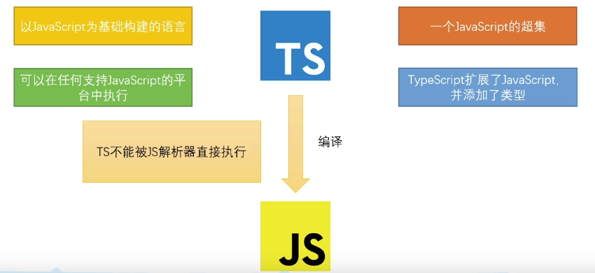

## Ts是什么？

简介：TypeScript是微软开发的一个开源的编程语言，通过在JavaScript的基础上添加静态类型定义构建而成。TypeScript通过TypeScript编译器或Babel转译为JavaScript代码，可运行在任何浏览器，任何操作系统（换句话说，虽然Ts经编译器或Babel后能在任何浏览器执行，但ts代码是不能直接杯js解析起执行的，即xxx.ts是不能直接在浏览器中执行的）。

1. TypeScript是以JavaScript为基础构建的语言，是JavaScript的超集。
2. 它对JS进行了扩展，向JS中引入了类型的概念，并添加了许多新的特性。
3. TS代码需要通过编译器编译为JS，然后再交由JS解析器执行（**Ts——>Js，然后本质浏览器还是执行的是Ts转化而成的Js**）。
4. TS完全兼容JS，换言之，**任何的JS代码都可以直接当成JS使用**。
5. 相较于JS而言，TS拥有了静态类型，更加严格的语法，更强大的功能；TS可以在代码执行前就完成代码的检查，减小了运行时异常的出现的几率；TS代码可以编译为任意版本的JS代码，可有效解决不同JS运行环境的兼容问题；同样的功能，TS的代码量要大于JS，但由于TS的代码结构更加清晰，变量类型更加明确，在后期代码的维护中TS却远远胜于JS。

## Ts增加了什么？

- 类型（保留了Js的类型，并新增了一些类型）
- 支持ES的新特性
- 添加了一些ES不具备的新特性
- 丰富的配置选项
- 强大的开发工具（代码提示等）
