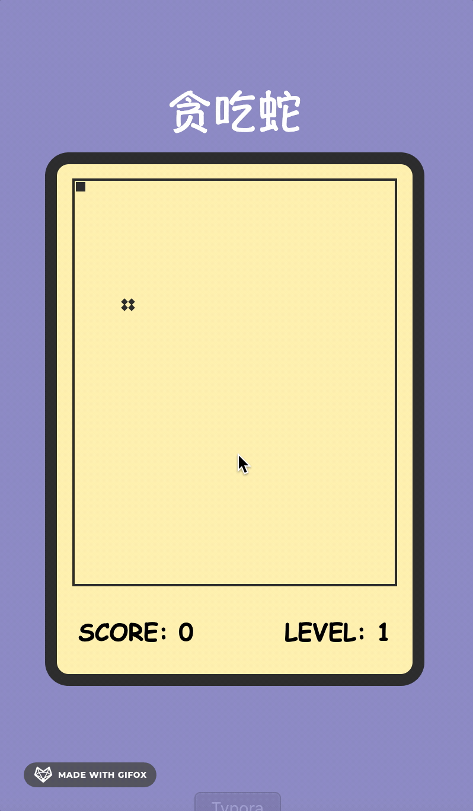

我们将所有的类都放在`src`目录下的`module`目录中，于是，当前我们的项目结构变成了这样：
```bash
├── snake
│   ├── src
│   │    ├── modules
│   │    │     └── Food.ts
│   │    │     └── ScorePanel.ts
│   │    │     └── Snake.ts
│   │    │     └── GameControl.ts
│   │    ├── index.html
│   │    ├── index.ts
│   │    └── style
│   │          └── index.less
│   ├── webpack.config.js
│   ├── tsconfig.json
│   └── package.json
```


## 实现食物类-`Food.ts`

::: tip
Food类的设计注意点：
- 对于食物来说，一个食物就是一个`div`，所以我们需要定义一个`element`属性来表示食物对应的`div`。
- 修改食物的位置，需要随机修改`element`的`left`和`top`属性。但食物的随机坐标范围是有范围的。
- 蛇的 上偏移量`top` 和 左偏移量`left` 与食物的 上偏移量`top` 和 左偏移量`left`相等时，即蛇吃到食物。
:::

::: tip
知识点：
- `element`是一个`div`，所以该属性的类型是`HTMLElement`
    - `HTMLElement`是一个接口，表示一个`html`元素
- `Math.round()`——四舍五入取整
- `Math.random()`——生成0-1之间的随机数
:::

```ts
// 定义食物类Food：对于一个类来说，要定义它的属性和方法
class Food {
    // 对于食物来说，每一个食物，就是一个id=food的div
    // 定义一个属性表示食物所对应的元素
    element: HTMLElement;
    
    constructor() {
        // 获取页面中的food元素， 并将其赋值给element
        this.element = document.getElementById("food")!; // !表示不会为空
    }
     
    // 定义获取食物X轴坐标的方法
    get X() {
        return this.element.offsetLeft;
    }
    
    // 定义获取食物Y轴坐标的方法
    get Y() {
        return this.element.offsetTop;
    }
    
    // 修改食物位置的方法
    changeFoodPosition() {
        // 生成一个随机的位置
        // 食物上top偏移：位置最小是0，最大是stage宽340 - 食物的宽10 = 330
        // 食物左left偏移：位置最小是0，最大是stage宽270 - 食物的宽10 = 260
        // 蛇移动一次就是一格，一格的大小就是10，所以食物的坐标必须是整10
        let topY = Math.round(Math.random() * 33) * 10;
        let leftX = Math.round(Math.random() * 26) * 10;
        
        this.element.style.top = topY + "px";
        this.element.style.left = leftX + "px";
    }
}

export default Food;
```

## 2. 实现积分面板类-`ScorePanel.ts`
::: tip
ScorePanel类的设计注意点：
- 对于等级和分数来说，都是一个`div`，所以我们需要定义一个`element`属性来表示分数对应的`div`。
- 修改分数和等级，需要修改`element`的`innerHTML`属性。
- 分数和等级的变化是有规律的，分数每增加10，等级就增加1。而由于等级的变化会影响到蛇的移动速度，所以我们的等级不能没有上限，我们设置等级的上限为10。
- 但是在写代码时，我们尽量少使用10这种数字字面量，而是使用传参的方式，这样可以使代码更加灵活。
:::

::: tip
知识点：
- `innerHTML`是一个属性，几乎所有的元素都有`innerHTML`属性，它是一个字符串，用来设置或获取位于对象起始和结束标签内的HTML。
    - `innerHTML`和`innerText`的区别：`innerText`只能设置元素的文本内容，不能设置元素的标签内容.
:::

```ts
// 定义积分面板类ScorePanel
class ScorePanel {
    // 定义一个属性：表示分数，初始值为0
    score = 0;
    // 定义一个属性：表示等级，初始值为1
    level = 1;

    // 分数和等级所在的元素，在构造函数中进行初始化
    // 定义一个属性：表示分数所在的div元素
    scoreEle: HTMLElement; 
    // 定义一个属性，表示等级所在的div元素
    levelEle: HTMLElement;

    // 在写代码时，我们尽量少使用字面量，而是使用传参的方式，这样可以使代码更加灵活。
    maxLevel: number; // 最大等级
    upScore: number; // 每多少分会升一级

    constructor(maxLevel: number = 10, upScore: number = 10) {
        // 初始化分数和等级所在的元素
        this.scoreEle = document.getElementById("score")!;
        this.levelEle = document.getElementById("level")!;

        this.maxLevel = maxLevel;
        this.upScore = upScore;
    }

    // 定义一个加分的方法
    addScore() {
        // 使score自增
        this.score++;
        // 将score的值显示在页面中
        this.scoreEle.innerHTML = this.score + ''; // 为了保证类型一致，这里要加一个空字符串拼成字符串
        // 判断分数是否达到升级的条件：每upScore分升一级
        if (this.score % this.upScore === 0 ) {
            this.levelUp();
        }
    }

    // 定义一个升级的方法
    levelUp() {
        // 设置一个等级的最大值为maxLevel
        if (this.level < this.maxLevel) {
            this.level++; 
            this.levelEle.innerHTML = this.level + '';
        }
    }
}

export default ScorePanel;
```

## 3. 实现蛇类-`Snake.ts`
::: tip
Snake类的设计注意点：
- `id=snake`这个元素只是蛇的容器，它包括了每一节`div`表示的蛇的每一节身体
- 在蛇中，蛇需要会长长，所以我们需要定义增加蛇身体方法，每多一个div标签，就是多一节蛇身。
- 蛇身长长的规则也需要定义：后一节身体，要到前一节身体的位置，改身体位置的时候，一定要从后往前改：即先把最后一节的位置放到倒数第二节位置上。否则会出现覆盖的问题，导致身体位置不对
- 除了实现蛇、蛇身的增加之外，在蛇移动的过程中，不允许蛇穿墙而出，不允许蛇撞自身，不允许蛇直接掉头。
:::

::: tip
知识点：
- `insertAdjacentHTML()`方法：向指定元素中插入指定的HTML代码:
    第一个参数表示插入的位置，有四个值：
        - `beforebegin`：在元素之前插入
        - `afterbegin`：在元素内部的第一个子元素之前插入
        - `beforeend`：在元素内部的最后一个子元素之后插入
        - `afterend`：在元素之后插入
    第二个参数表示插入的`HTML`代码
- `querySelector()`方法返回的是一个`HTMLElement`类型的对象: 表示只能获取一个元素，即获取`id=snake`元素下的第一个div元素
- `HTMLCollection`类型：表示获取的元素是一个集合，是会实时刷新的，比如当我们往`id=snake`元素下新加`div`时，这个集合会实时更新到。
- `getElementsByTagName()`方法表示返回的是一个`HTMLCollection`类型的对象
:::

```ts
// 定义一个蛇类
class Snake {
    // 定义一个蛇头
    head: HTMLElement;
    // 定义一个蛇的身体（包括蛇头）
    bodies: HTMLCollection;

    // 获取蛇的容器id=snake的div元素
    element: HTMLElement;

    constructor() {
        // 获取蛇的容器id=snake的div元素
        this.element = document.getElementById("snake")!;

        // 获取蛇头：id=snake下面的div表示蛇头
        this.head = document.querySelector("#snake > div") as HTMLElement; // as类型断言：将其转换为HTMLElement类型
        
        // 获取蛇的身体（包括蛇头）
        this.bodies = this.element.getElementsByTagName("div");
    }

    // 获取蛇的坐标（蛇头坐标）
    get X() {
        return this.head.offsetLeft;
    }
    get Y() {
        return this.head.offsetTop;
    }

    // 设置蛇头的坐标
    set X(value) {
        // 如果X方向的值没有发生变化，直接return
        if(this.X === value) { 
            return;
        }

        // 设置蛇的X坐标的合法范围（即不允许撞墙）
        if (value < 0 || value > 260) {
            // 抛出一个异常
            throw new Error("蛇撞墙了！");
        }

        // 修改x时，是在修改水平坐标，蛇在左右移动，蛇在向左移动时，不能向右掉头，反之亦然
        // 如果第二节身体存在，且要设置的这个值和第二节身体的水平坐标相同，说明蛇在掉头
        if(this.bodies[1] && (this.bodies[1] as HTMLElement).offsetLeft === value){
            console.log('水平方向发生了掉头');
            // 如果发生了掉头，让蛇向原方向继续移动
            if (value > this.X) {
                // 如果新值value大于旧值X，则说明蛇在向右走，此时发生掉头，应该使蛇继续向左走
                value = this.X - 10;
            } else {
                // 向左走
                value = this.X + 10;
            }
        }

        this.moveBody(); // 调用moveBody()方法，使蛇身体跟着移动

        this.head.style.left = value + "px";

        this.checkHeadBodyBang(); // 检查蛇头是否撞到身体
    }
    set Y(value) {
        // 如果Y方向的值没有发生变化，直接return
        if(this.Y === value) { 
            return;
        }

        // 设置蛇的X坐标的合法范围（即不允许撞墙）
        if (value < 0 || value > 330) {
            // 抛出一个异常
            throw new Error("蛇撞墙了！");
        }

        // 修改y时，是在修改垂直坐标，蛇在上下移动，蛇在向上移动时，不能向下掉头，反之亦然
        if(this.bodies[1] && (this.bodies[1] as HTMLElement).offsetTop === value){
            if(value > this.Y){
                value = this.Y - 10;
            }else{
                value = this.Y + 10;
            }
        }
        this.moveBody(); // 调用moveBody()方法，使蛇身体跟着移动

        this.head.style.top = value + "px";

        this.checkHeadBodyBang(); // 检查蛇头是否撞到身体
    }

    // 蛇增加身体的方法: 增加蛇的身体就是在id=snake元素中新增div
    addBody() {
        // 向element中的最后一个子元素后添加一个<div></div>
        this.element.insertAdjacentHTML("beforeend", "<div></div>"); 
    }

    // 蛇身体移动的方法
    moveBody() {
        /**
         * 将后面身体的位置设置为前面身体的位置
         * 举例子：
         *   第4节 = 第3节的位置
         *   第3节 = 第2节的位置
         *   第2节 = 蛇头的位置
         *   蛇头的位置是set X()和set Y()方法中设置的，不需要在这个方法里面设置
         */
        // 遍历获取所有的身体：从后往前遍历
        for (let i = this.bodies.length - 1; i > 0; i--) {
            // 获取前边身体的位置 i-1
            let X = (this.bodies[i - 1] as HTMLElement).offsetLeft;
            let Y = (this.bodies[i - 1] as HTMLElement).offsetTop;

            // 将值设置到当前身体上 i
            (this.bodies[i] as HTMLElement).style.left = X + "px";
            (this.bodies[i] as HTMLElement).style.top = Y + "px";
        }
    }

    // 蛇有没有撞到自己：检查蛇头的坐标，和某一节身体的坐标是否重合，重合就是撞到自己了
    // 这一步需要在蛇头坐标改变后，坐标值变了之后，再检查
    checkHeadBodyBang() {
        // 获取所有的身体，检查其是否和蛇头的坐标重合
        for (let i = 1; i < this.bodies.length; i++) {
            let bd = this.bodies[i] as HTMLElement; // 获取第i节身体
            // 判断蛇头的坐标和第i节身体的坐标是否重合
            if (this.X === bd.offsetLeft && this.Y === bd.offsetTop) {
                // 进入判断说明撞到自己了，游戏结束
                throw new Error("撞到自己了！");
            }
        }
    }
}

export default Snake;
```

## 4. 实现游戏控制类-GameControl.ts

定义好了上面三个类之后，我们需要一个类，来控制蛇、食物、分数等的逻辑，这个类就是GameControl类。
- 游戏的初始化
- 蛇的移动
    - 监听键盘按键
    - 判断蛇是否吃到食物
    - 修改蛇的坐标
    - 抛出蛇撞墙死亡的异常
    - 通过setTimeOut()方法不断循环蛇移动的方法，并控制蛇的移动速度
- 蛇是否吃到食物
这个类稍微有点复杂，但我在每一步都做了详细的批注，可以仔细看看

```ts
// 引入其他类
import Food from './Food';
import ScorePanel from './ScorePanel';
import Snake from './Snake';

// 定义游戏控制器类：用于控制其他所有类
class GameControl {
    // 定义三个属性：蛇、食物、记分牌
    // 蛇
    snake: Snake;
    // 食物
    food: Food;
    // 记分牌
    scorePanel: ScorePanel;

    // 创建一个属性来存储蛇的移动方向（也就是按键的值）
    direction: string = "";

    // 创建一个属性用来记录游戏是否结束
    isLive = true; // 默认为true，表示游戏还没结束

    constructor() {
        this.snake = new Snake();
        this.food = new Food();
        this.scorePanel = new ScorePanel();

        this.init();
    }

    // 游戏初始化方法：调用后，游戏即开始
    init() {
        // 绑定键盘按下的事件：当keydown事件发生时，调用keydownHandler方法
        document.addEventListener("keydown", this.keydownHandler.bind(this)); 
        this.snakeMove(); // 调用蛇移动的方法
    }

    // 创建一个键盘按下的响应函数
    keydownHandler(event: KeyboardEvent) {
        // console.log(this); // 这里的this是document，不是GameControl：事件绑定到document上，所以this是document
        // 需要检查event.key的值是否合法（用户是否按了正确的按键）
        // 修改蛇的移动方向
        // event.key用于获取键盘按下的键值是什么，值有：上下左右ArrowUp、ArrowDown、ArrowLeft、ArrowRight，还有其他乱七八糟的afbwkqhreigu这些键等等
        // 但是在IE中，event.key的值是上下左右Up、Down、Left、Right，还有其他乱七八糟的afbwkqhreigu这些键等等

        // 但我们希望能修改GameControl里的direction属性，那我们怎么才能把this指到GameControl呢？
        // 所以需要在调用this.keydownHandler方法时，通过bind方法把this指向GameControl
        
        // 此外，我们需要监听到的只有方向键，如果用户按了其他的键，不应该有反应
        // 需要检查event.key的值是否合法（用户是否按了正确的按键）
        this.direction = event.key; // 这里的this是GameControl，令方向 = 键盘按下的键值
    }

    // 创建一个控制蛇移动的方法：让蛇根据用户按下的方向键移动
    snakeMove() {
        /*
        *   根据方向（this.direction）来使蛇的位置改变
        *      向上（this.direction === ArrowUp || Up）：top 减少
        *      向下 (this.direction === ArrowDown || Down)：top 增加
        *      向左 (this.direction === ArrowLeft || Left)：left 减少
        *      向右 (this.direction === ArrowRight || Right)：left 增加
        */

        // 获取蛇现在坐标
        let X = this.snake.X;
        let Y = this.snake.Y;

        // 根据按键的方向修改X值和Y值
        switch (this.direction) {
            case "ArrowUp":
            case "Up":
                // 向上移动 top 减少
                Y -= 10;
                break;
            case "ArrowDown":
            case "Down":
                // 向下移动 top 增加
                Y += 10;
                break;
            case "ArrowLeft":
            case "Left":
                // 向左移动 left 减少
                X -= 10;
                break;
            case "ArrowRight":
            case "Right":
                // 向右移动 left 增加
                X += 10;
                break;
        }

        // 检查是否吃到了食物
        this.checkEat(X, Y);

        // 修改蛇的X和Y值：给蛇的坐标重新赋值，蛇就会按照上面的判断逻辑对应移动
        try {
            this.snake.X = X;
            this.snake.Y = Y;
        } catch(e: any) {
            // 进入到catch，说明出现了异常-游戏结束，弹出一个提示信息
            alert(e.message + " GAME OVER!");
            // 将isLive设置为false，这游戏就死了
            this.isLive = false;
        }

        // 开启一个定时调用，为了能让蛇不断移动起来
        // 每隔（ 300 - (this.scorePanel.level - 1) * 30 ）毫秒 调用一次snakeMove方法
        // 随着scorePanel类中记分板中等级的提升，移动速度越来越快
        // 当游戏没有结束的时候，才能继续调用snakeMove方法
        this.isLive && setTimeout(this.snakeMove.bind(this), 300 - (this.scorePanel.level - 1) * 30);
    }

    // 定义一个方法检查蛇是否吃到了食物
    checkEat (X: number, Y: number) {
        // 检查蛇头的坐标是否和食物的坐标重合
        if (X === this.food.X && Y === this.food.Y) {
            // 食物的位置要进行重置
            this.food.changeFoodPosition();
            // 分数增加
            this.scorePanel.addScore();
            // 蛇要增加一节
            this.snake.addBody();
        }
    }
}

export default GameControl;
```

## 在`src/index.ts`中创建`GameControl`对象，使游戏开始

```ts
// 引入样式
import "./style/index.less";

// 引入GameControl类
import GameControl from "./modules/GameControl";
new GameControl();
```

## 最终游戏效果展示


## 项目Github地址

