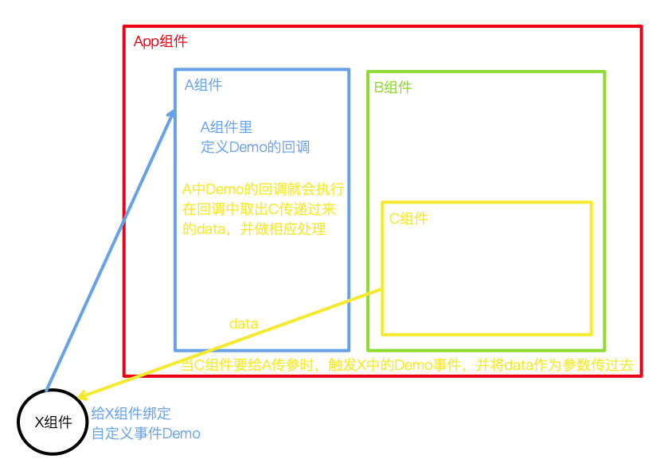

全局事件总线：一种组件间通信的方式，适用于<span style="color:red">任意组件间通信</span>。

## 为什么Vue.prototype.$bus能成为全局事件总线

下图是全局事件总线的基本原理图：如果A组件想收到C组件传递过来的数据

1. 在A组件里，给X组件绑定自定义事件，比如叫Demo
2. 在A组件里，写Demo自定义事件的回调
3. 当C想给A传数据时，就去触发给X身上绑定好的的 Demo自定义事件，并携带数据data
4. 此时，Demo的回调就会执行，并能够接收到data

> A组件和C组件之间没有任何关系，但是通过这个X组件，可以实现A组件和C组件之间的通信。



分析1: X组件能实现以上能力需要具备什么条件？
1. X组件能够被任意组件访问到，即X组件是全局的。
2. X组件能够绑定任意组件想要的自定义事件，即X组件能够绑定自定义事件。即以下方法能够被调用：
    - ```$on()```
    - ```$emit()```
    - ```$off()```

分析2: 什么样的组件才能被任意组件访问到？
1. 首先想到了window对象，但是在框架里，尤其是组件化的框架里，不推荐直接操作window对象。
2. 任意组件，可以说是任意一个vc，即VueComponent的实例对象。那么如果往VueComponent上添加一个X，那么所有的vc不就都能访问到X了嘛？
    - 但是，此处需要严重注意！VueComponent是一个构造函数，并且不是我们自己写的，而是由Vue.extend()生成的。而每次调用Vue.extend()都会生成一个新的VueComponent构造函数，那么我们往VueComponent上添加的X，就只能被这个构造函数的实例对象访问到，而不能被其他构造函数的实例对象访问到。也并不是全局的。（即，我们在template中写不同的组件标签：`<Student/>  <School/>`，其实他们都是由不同的VueComponent构造函数new出来的）

分析3: 那究竟是哪个地方的属性和方法vc都能访问到呢？
1. 我们之前学过一个重要的内置关系：`VueComponent.prototype.__proto__ === Vue.prototype`
2. 由此可知，vc能访问到Vue.prototype上的所有属性和方法，那么我们就可以往Vue.prototype上添加X属性，那么所有的vc就都能访问到X组件了
3. 叫X组件没什么意义，Vue给它取了一个形象的名字：$bus

分析4: 我们现在具有Vue.prototype.$bus了，所有组件都能访问到这个$bus了，那么这个$bus又如何具备`$on()`、`$emit()`、`$off()`这些方法呢？
1. 我们知道，`$on()`、`$emit()`、`$off()`是存在于Vue的原型对象上的，即Vue.prototype上的（ vm - new Vue()) 和 vc - new VueComponent() ) 都拥有这些方法）。那么将vm赋值给Vue.prototype.$bus，即main.js中这样操作：
    ```js
    import Vue from 'vue'
    import App from './App.vue'
    new Vue({
        el:'#app',
        render: h => h(App),
        // 将vm赋值给Vue.prototype.$bus
        // new Vue()就是vm，vm中的this就是vm自己
        // 如果不放在beforeCreate中，App组件已经创建好了，都还没创建好$bus，各个组件中就无法使用$bus，就会报错
        beforeCreate() { // beforeCreate在创建App之前执行，此时vm还没有创建好，数据监测和数据代理都还没创建好，此时就可以将vm赋值给Vue.prototype.$bus，这样等到App创建好了，就可以使用$bus了
            Vue.prototype.$bus = this //安装全局事件总线，$bus就是当前应用的vm
        },
    })
    ```
## 使用全局事件总线

1. main.js安装

```js
new Vue({
    ......
    beforeCreate() {
        Vue.prototype.$bus = this //安装全局事件总线，$bus就是当前应用的vm
    },
    ......
}) 
```

2. 组件A：接收数据：A组件想接收数据，则在A组件中给$bus绑定自定义事件，事件的<span style="color:red">回调留在A组件自身。</span>

```js
methods(){
    demo(data){
        console.log('我是School组件，收到了数据', data)
    }
}
......
mounted() {
    this.$bus.$on('hello',this.demo)
}

mounted() {
    // 第二种写法，直接在$on中写回调
    // this.$bus.$on('hello',(data)=>{
    //     console.log('我是School组件，收到了数据',data)
    // })
},
beforeDestroy() {
    // 最好在`beforeDestroy`钩子中，用`$off`去解绑 当前组件所用到 的事件。
    this.$bus.$off('hello')
},
```

3. 组件B：提供数据

```js
<button @click="sendStudentName">把学生名给School组件</button>

data() {
    return {
        name:'张三',
        sex:'男',
    }
},
methods: {
    sendStudentName(){
        this.$bus.$emit('hello', this.name)
    }
},
```
