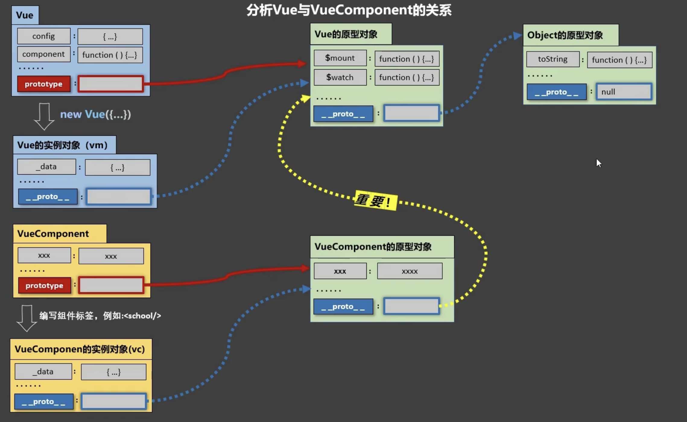

## 模块与组件、模块化与组件化

### 模块
1. 理解: 向外提供特定功能的js程序, 一般就是一个js文件
2. 为什么: js文件很多很复杂
3. 作用: 复用js, 简化js的编写, 提高js运行效率

::: tip
模块化 : 当应用中的js都以模块来编写的, 那这个应用就是一个模块化的应用。
:::

### 组件
1. 理解: 用来实现局部(特定)功能效果的代码集合(html/css/js/image.....)
2. 为什么: 一个界面的功能很复杂
3. 作用: 复用编码, 简化项目编码, 提高运行效率

::: tip
组件化 : 当应用中的功能都是多组件的方式来编写的, 那这个应用就是一个组件化的应用。
:::

## 单文件与非单文件组件

### 非单文件组件
- 一个文件中包含有n个组件
- 缺点：
    - 模板编写没有提示
    - 没有构建过程, 无法将 ES6 转换成 ES5

#### 基本使用

Vue中使用组件的三大步骤：
1. 定义组件(创建组件)
2. 注册组件
3. 使用组件(写组件标签)
---
如何定义一个组件？
- 使用`Vue.extend(options)`创建，其中`options`和`new Vue(options)`时传入的那个`options`几乎一样，但也有点区别；
    - 区别如下：
        1. `el`不要写，为什么？ ——— 最终所有的组件都要经过一个vm的管理，由vm中的el决定服务哪个容器。
        2. `data`必须写成函数，为什么？ ———— 避免组件被复用时，数据存在引用关系。
    - 备注：使用`template`可以配置组件结构。
---
如何注册组件？
1. 局部注册：靠 `new Vue` 的时候传入`components`选项
2. 全局注册：靠`Vue.component('组件名',组件)`
---
编写组件标签：
- `<school></school>`
---
几个注意点：
1. 关于组件名:
    - 若由一个单词组成：
        - 第一种写法(首字母小写)：school
        - 第二种写法(首字母大写)：School
    - 若由多个单词组成：
        - 第一种写法(kebab-case命名)：my-school
        - 第二种写法(CamelCase命名)：MySchool (但必需要Vue脚手架支持)
    - 备注：
        - 组件名尽可能回避HTML中已有的元素名称，例如：h2、H2都不行。
        - 可以使用name配置项指定组件在开发者工具中呈现的名字。
2. 关于组件标签:
    - 第一种写法：<school></school>
    - 第二种写法：<school/>
    - 备注：不使用脚手架时，<school/> 会导致后续组件不能渲染。
3. 一个简写方式：
    - `const school = Vue.extend(options)` 可简写为：`const school = options`
---
示例代码：
```html
<!DOCTYPE html>
<html>
	<head>
		<meta charset="UTF-8" />
		<title>基本使用</title>
		<script type="text/javascript" src="../js/vue.js"></script>
	</head>
	<body>
		<!-- 准备好一个容器-->
		<div id="root">
			<hello></hello>
			<hr>
			<h1>{{msg}}</h1>
			<hr>
			<!-- 第三步：编写组件标签 -->
			<school></school>
			<hr>
			<!-- 第三步：编写组件标签 -->
			<student></student>
		</div>

		<div id="root2">
			<hello></hello>
		</div>
	</body>

	<script type="text/javascript">
		Vue.config.productionTip = false

		//第一步：创建school组件
		const school = Vue.extend({
            name:'atguigu',
			template:`
				<div class="demo">
					<h2>学校名称：{{schoolName}}</h2>
					<h2>学校地址：{{address}}</h2>
					<button @click="showName">点我提示学校名</button>	
				</div>
			`,
			// el:'#root', 
            // 组件定义时，一定不要写el配置项，因为最终所有的组件都要被一个vm管理，由vm决定服务于哪个容器。
			data(){
				return {
					schoolName:'尚硅谷',
					address:'北京昌平'
				}
			},
			methods: {
				showName(){
					alert(this.schoolName)
				}
			},
		})

		//第一步：创建student组件
		const student = Vue.extend({
			template:`
				<div>
					<h2>学生姓名：{{studentName}}</h2>
					<h2>学生年龄：{{age}}</h2>
				</div>
			`,
			data(){
				return {
					studentName:'张三',
					age:18
				}
			}
		})
		
		//第一步：创建hello组件
		const hello = Vue.extend({
			template:`
				<div>	
					<h2>你好啊！{{name}}</h2>
				</div>
			`,
			data(){
				return {
					name:'Tom'
				}
			}
		})
		
		// 第二步：全局注册组件
		Vue.component('hello',hello)

		// 创建vm
		new Vue({
			el:'#root',
			data:{
				msg:'你好啊！'
			},
			// 第二步：（局部注册）注册组件
			components:{
				school,
				student
			}
		})

		new Vue({
			el:'#root2',
		})
	</script>
</html>
```

### 关于VueComponent

1. `school`组件本质是一个名为`VueComponent`的构造函数，且不是程序员定义的，是`Vue.extend`生成的。
	- 即，当我们`console`打印`school`时，会打出`VueComponent`的构造函数。

2. 我们只需要写 `<school/> ` 或 `<school></school>`，Vue解析时会帮我们创建school组件的实例对象，
	即Vue帮我们执行的：`new VueComponent(options)`。

3. 特别注意：每次调用`Vue.extend`，返回的都是一个全新的`VueComponent`！！！！

4. 关于this指向：
	- (1). 组件配置中：
		- `data`函数、`methods`中的函数、`watch`中的函数、`computed`中的函数 它们的`this`均是 【 `VueComponent`实例对象 】。
	- (2). `new Vue(options)`配置中：
		- `data`函数、`methods`中的函数、`watch`中的函数、`computed`中的函数 它们的`this`均是【 Vue实例对象 】。

5. `VueComponent`的实例对象，以后简称`vc`（也可称之为：组件实例对象）。
	- Vue的实例对象，以后简称vm。

### 一个重要的内置关系！
1. 一个重要的内置关系：`VueComponent.prototype.__proto__ === Vue.prototype`
2. 为什么要有这个关系：让组件实例对象（vc）可以访问到 Vue原型上的属性、方法。


### 单文件组件
- 一个文件中只包含1个组件，一个文件就是一个组件
- vue中的单文件组件，后缀名为`.vue`

1. 模板页面

```html
<template>
    页面模板
</template>
```

2. JS 模块对象

```js
<script> 
    export default {
        data() {return {}},
        methods: {},
        computed: {},
        components: {}
    }
</script>
```

3. 样式

```js
<style>
    样式定义
</style>
```
