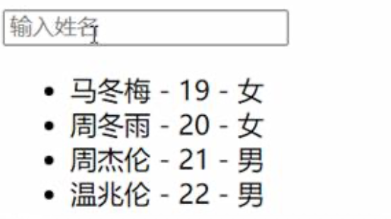

面试题：react、vue中的key有什么作用？（key的内部原理）
						
1. 虚拟DOM中key的作用：
    - key是虚拟DOM对象的标识，当数据发生变化时，Vue会根据【新数据】生成【新的虚拟DOM】, 随后Vue进行【新虚拟DOM】与【旧虚拟DOM】的差异比较，比较规则如下：
                
2. 对比规则：
    - (1).旧虚拟DOM中找到了与新虚拟DOM相同的key：
        - ①.若虚拟DOM中内容没变, 直接使用之前的真实DOM！
        - ②.若虚拟DOM中内容变了, 则生成新的真实DOM，随后替换掉页面中之前的真实DOM。

    - (2).旧虚拟DOM中未找到与新虚拟DOM相同的key
        - 创建新的真实DOM，随后渲染到到页面。
                        
3. 用index作为key可能会引发的问题：
    - 若对数据进行：逆序添加、逆序删除等破坏顺序操作:
        - 会产生没有必要的真实DOM更新 ==> 界面效果没问题, 但效率低。
    - 如果结构中还包含输入类的DOM：
        - 会产生错误DOM更新 ==> 界面有问题。

4. 开发中如何选择key?:
    - 最好使用每条数据的唯一标识作为key, 比如id、手机号、身份证号、学号等唯一值。
    - 如果不存在对数据的逆序添加、逆序删除等破坏顺序操作，仅用于渲染列表用于展示，使用index作为key是没有问题的。

## Demo

列表过滤-模糊搜索功能



### 实现方式1: watch

```html
<!DOCTYPE html>
<html>
	<head>
		<meta charset="UTF-8" />
		<title>列表过滤</title>
		<script type="text/javascript" src="../js/vue.js"></script>
	</head>
	<body>
		<!-- 准备好一个容器-->
		<div id="root">
			<h2>人员列表</h2>
			<input type="text" placeholder="请输入名字" v-model="keyWord">
			<ul>
				<li v-for="(p,index) of filPerons" :key="index">
					{{p.name}}-{{p.age}}-{{p.sex}}
				</li>
			</ul>
		</div>

		<script type="text/javascript">
			Vue.config.productionTip = false
			
		    new Vue({
				el:'#root',
				data:{
					keyWord:'',
					persons:[
						{id:'001',name:'马冬梅',age:19,sex:'女'},
						{id:'002',name:'周冬雨',age:20,sex:'女'},
						{id:'003',name:'周杰伦',age:21,sex:'男'},
						{id:'004',name:'温兆伦',age:22,sex:'男'}
					],
					filPerons:[]
				},
				watch:{
					keyWord:{
						immediate:true,
						handler(val){
							this.filPerons = this.persons.filter((p)=>{
								return p.name.indexOf(val) !== -1
							})
						}
					}
				}
			})
		</script>
</html>
```

### 实现方式2: computed

再加上排序功能：升序、降序、原顺序

```html
<!DOCTYPE html>
<html>
	<head>
		<meta charset="UTF-8" />
		<title>列表排序</title>
		<script type="text/javascript" src="../js/vue.js"></script>
	</head>
	<body>
		<!-- 准备好一个容器-->
		<div id="root">
			<h2>人员列表</h2>
			<input type="text" placeholder="请输入名字" v-model="keyWord">
			<button @click="sortType = 2">年龄升序</button>
			<button @click="sortType = 1">年龄降序</button>
			<button @click="sortType = 0">原顺序</button>
			<ul>
				<li v-for="(p,index) of filPerons" :key="p.id">
					{{p.name}}-{{p.age}}-{{p.sex}}
					<input type="text">
				</li>
			</ul>
		</div>

		<script type="text/javascript">
			Vue.config.productionTip = false
			
			new Vue({
				el:'#root',
				data:{
					keyWord:'',
					sortType:0, // 0原顺序 1降序 2升序
					persons:[
						{id:'001',name:'马冬梅',age:30,sex:'女'},
						{id:'002',name:'周冬雨',age:31,sex:'女'},
						{id:'003',name:'周杰伦',age:18,sex:'男'},
						{id:'004',name:'温兆伦',age:19,sex:'男'}
					]
				},
				computed:{
					filPerons(){
						const arr = this.persons.filter((p)=>{
							return p.name.indexOf(this.keyWord) !== -1
						})
						// 判断一下是否需要排序
                        // 就是利用了computed属性，只要依赖项sortType发生变化，就会重新计算filPerons的特点，来进行排序
						if(this.sortType){
							arr.sort((p1,p2)=>{
								return this.sortType === 1 ? p2.age-p1.age : p1.age-p2.age
							})
						}
						return arr
					}
				}
			}) 

		</script>
</html>
```