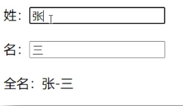
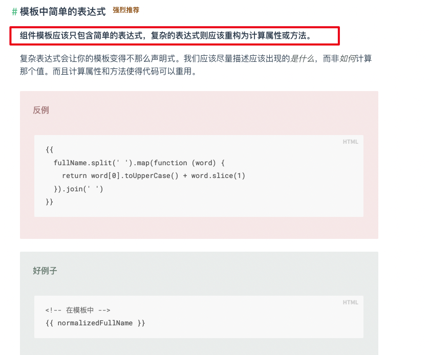

## computed计算属性

实现一个案例如下：



当输入框的姓或名改变时，下面拼起来的姓名也随之改变

### 实现方式一：插值语法形式

```html
<!DOCTYPE html>
<html>
	<head>
		<meta charset="UTF-8" />
		<title>姓名案例_插值语法实现</title>
		<!-- 引入Vue -->
		<script type="text/javascript" src="../js/vue.js"></script>
	</head>
	<body>
		<!-- 准备好一个容器-->
		<div id="root">
			姓：<input type="text" v-model="firstName"> <br/><br/>
			名：<input type="text" v-model="lastName"> <br/><br/>
			全名：<span>{{firstName}}-{{lastName}}</span>
		</div>
	</body>

	<script type="text/javascript">
		Vue.config.productionTip = false //阻止 vue 在启动时生成生产提示。

		new Vue({
			el:'#root',
			data:{
				firstName:'张',
				lastName:'三'
			}
		})
	</script>
</html>
```

::: tip
通过 `插值表达式 + v-model` 双向绑定的写法，完全可以实现功能，但是，如果我们想对输入框中的 `firstName` 做一些处理呢？

比如只截取前三位，又要转为大写等等，我们是不是就得在插值表达式中写一大堆的代码

```js
{{firstName.slice(0,3).toUpperCase()}}
```

这样的代码可读性和可维护性都很差，也违背了vue的理念。
:::



### 实现方式二：methods函数形式
```html{29-32}
<!DOCTYPE html>
<html>
	<head>
		<meta charset="UTF-8" />
		<title>姓名案例_methods实现</title>
		<!-- 引入Vue -->
		<script type="text/javascript" src="../js/vue.js"></script>
	</head>
	<body>
		<!-- 准备好一个容器-->
		<div id="root">
			姓：<input type="text" v-model="firstName"> <br/><br/>
			名：<input type="text" v-model="lastName"> <br/><br/>
			全名：<span>{{fullName()}}</span>
		</div>
	</body>

	<script type="text/javascript">
		Vue.config.productionTip = false //阻止 vue 在启动时生成生产提示。

		new Vue({
			el:'#root',
			data:{
				firstName:'张',
				lastName:'三'
			},
			methods: {
				fullName(){
                    // 只要data中的任何一个数据发生变化的时候（firstName或lastName改变）
                    // vue中的模板都会重新解析一遍，
                    // 又由于fullName函数是在模板中的插值表达式中调用的，那么这个方法也会重新被调用
                    // 所以fullName函数会重新执行，拿到最新的firstName和lastName，返回最新的全名
					console.log('@---fullName')
					return this.firstName + '-' + this.lastName
				}
			},
		})
	</script>
</html>
```

### 实现方式三：computed形式

计算属性：
1. 定义：要用的属性不存在，要通过已有属性计算得来。
2. 原理：底层借助了`Objcet.defineproperty`方法提供的`getter`和`setter`。
3. get函数什么时候执行？
    - (1). 初次读取时会执行一次。
    - (2). 当依赖的数据发生改变时会被再次调用。
4. 优势：与`methods`实现相比，内部有缓存机制（复用），效率更高，调试方便。
5. 备注：
    1. 计算属性**最终会出现在vm**上，直接读取使用即可。
    2. 如果**计算属性要被修改，那必须写set函数去响应修改**，且set中要引起计算时依赖的数据发生改变。
6. 当计算属性不需要被修改时（即不需要`setter`时），可以简写为函数形式。
    ```js
    fullName(){
        console.log('get被调用了')
        return this.firstName + '-' + this.lastName
    }
    ```

```html{49-53}
<!DOCTYPE html>
<html>
	<head>
		<meta charset="UTF-8" />
		<title>姓名案例_计算属性实现</title>
		<!-- 引入Vue -->
		<script type="text/javascript" src="../js/vue.js"></script>
	</head>
	<body>
		<!-- 准备好一个容器-->
		<div id="root">
			姓：<input type="text" v-model="firstName"> <br/><br/>
			名：<input type="text" v-model="lastName"> <br/><br/>
			测试：<input type="text" v-model="x"> <br/><br/>
			全名：<span>{{fullName}}</span> <br/><br/>
		</div>
	</body>

	<script type="text/javascript">
		Vue.config.productionTip = false //阻止 vue 在启动时生成生产提示。

		const vm = new Vue({
			el:'#root',
			data:{
				firstName:'张',
				lastName:'三',
				x:'你好'
			},
			computed:{
				fullName:{
					// get有什么作用？当有人 读取fullName 时，get就会被调用，且返回值就作为fullName的值
					// get什么时候调用？
                    //    1.初次读取fullName时
                    //    2.所依赖的数据发生变化时。
					get(){
						// console.log('get被调用了')
						// console.log(this) //此处的this是vm
						return this.firstName + '-' + this.lastName
					},
					// set什么时候调用? 当fullName被修改时。
					set(value) {
						console.log('set',value) // value就是fullName最新的值
						const arr = value.split('-')
						this.firstName = arr[0] // 通过修改firstName，间接修改fullName
						this.lastName = arr[1]  // 通过修改lastName，间接修改fullName
					}
				}

                // computed的简写形式
				// fullName(){
				// 	console.log('get被调用了')
				// 	return this.firstName + '-' + this.lastName
				// }
			}
		})
	</script>
</html>
```

## watch侦听属性
### 侦听属性实现天气切换

监视属性watch：
1. 当被监视的属性变化时, 回调函数自动调用, 进行相关操作
2. 监视的属性必须存在，才能进行监视！！
3. 监视的两种写法：
    - (1). `new Vue`时传入`watch`配置
    - (2). 通过`vm.$watch`监视
4. watch的三个配置项：
    - (1). `handler`：当监视的属性发生改变时，回调函数会被调用，且调用时，会将最新的值和旧的值当作参数传入。
    - (2). `immediate`：当`immediate`为`true`时，`handler`会在初始化时就调用一次，否则，`handler`会在监视开始后，当监视的属性发生改变时才调用。
    - (3). `deep`：深度监视，当`deep`为`true`时，监视器会一层一层的往下遍历，给对象的所有属性都加上这个监视器。当对象内部某个属性发生改变时，监视器才会被调用。
        - 深度监视：
            - (1).Vue中的watch默认不监测对象内部值的改变（一层）。
            - (2).配置deep:true可以监测对象内部值改变（多层）。
        - 备注：
            - (1).Vue自身可以监测对象内部值的改变，但Vue提供的watch默认不可以！
            - (2).使用watch时根据数据的具体结构，决定是否采用深度监视。
5. 如果使用watch属性时用不到`immediate`和`deep`，可以简写为：
    ```js
    watch:{
        isHot(newValue,oldValue){
            console.log('isHot被修改了',newValue,oldValue)
        }
    }
    ```

```html
<!DOCTYPE html>
<html>
	<head>
		<meta charset="UTF-8" />
		<title>天气案例_深度监视</title>
		<!-- 引入Vue -->
		<script type="text/javascript" src="../js/vue.js"></script>
	</head>
	<body>
		<!-- 
            深度监视：
                    (1).Vue中的watch默认不监测对象内部值的改变（一层）。
                    (2).配置deep:true可以监测对象内部值改变（多层）。
            备注：
                    (1).Vue自身可以监测对象内部值的改变，但Vue提供的watch默认不可以！
                    (2).使用watch时根据数据的具体结构，决定是否采用深度监视。
		 -->
		<!-- 准备好一个容器-->
		<div id="root">
			<h2>今天天气很{{info}}</h2>
			<button @click="changeWeather">切换天气</button>
			<hr/>
			<h3>a的值是:{{numbers.a}}</h3>
			<button @click="numbers.a++">点我让a+1</button>
			<h3>b的值是:{{numbers.b}}</h3>
			<button @click="numbers.b++">点我让b+1</button>
			<button @click="numbers = {a:666,b:888}">彻底替换掉numbers</button>
			{{numbers.c.d.e}}
		</div>
	</body>

	<script type="text/javascript">
		Vue.config.productionTip = false //阻止 vue 在启动时生成生产提示。
		
		const vm = new Vue({
			el:'#root',
			data:{
				isHot:true,
				numbers:{
					a:1,
					b:1,
					c:{
						d:{
							e:100
						}
					}
				}
			},
			computed:{
				info(){
					return this.isHot ? '炎热' : '凉爽'
				}
			},
			methods: {
				changeWeather(){
					this.isHot = !this.isHot
				}
			},
			watch:{
				isHot:{
					// immediate:true, //初始化时让handler调用一下
					//handler什么时候调用？当isHot发生改变时。
					handler(newValue,oldValue){
						console.log('isHot被修改了',newValue,oldValue)
					}
				},
				//监视多级结构中某个属性的变化
				/* 'numbers.a':{
					handler(){
						console.log('a被改变了')
					}
				} */
				//监视多级结构中所有属性的变化
				numbers:{
					deep:true,
					handler(){
						console.log('numbers改变了')
					}
				}
			}
		})

	</script>
</html>
```

## watch和computed的区别

1. computed能完成的功能，watch都可以完成。
2. watch能完成的功能，computed不一定能完成，例如：watch可以进行异步操作。
    - 以姓名案例为例，如果我们想在firstName改变后1s再修改fullName，那么就必须使用watch。
    ```html
    <!DOCTYPE html>
    <html>
        <head>
            <meta charset="UTF-8" />
            <title>姓名案例_watch实现</title>
            <!-- 引入Vue -->
            <script type="text/javascript" src="../js/vue.js"></script>
        </head>
        <body>
            <!-- 准备好一个容器-->
            <div id="root">
                姓：<input type="text" v-model="firstName"> <br/><br/>
                名：<input type="text" v-model="lastName"> <br/><br/>
                全名：<span>{{fullName}}</span> <br/><br/>
            </div>
        </body>

        <script type="text/javascript">
            Vue.config.productionTip = false //阻止 vue 在启动时生成生产提示。

            const vm = new Vue({
                el:'#root',
                data:{
                    firstName:'张',
                    lastName:'三',
                    fullName:'张-三'
                },
                watch:{
                    firstName(val){
                        setTimeout(()=>{
                            console.log(this)
                            this.fullName = val + '-' + this.lastName
                        },1000);
                    },
                    lastName(val){
                        this.fullName = this.firstName + '-' + val
                    }
                }
            })
        </script>
    </html>
    ```

## 两个重要的小原则
1. 所被Vue管理的函数，最好写成普通函数，这样this的指向才是vm 或 组件实例对象。
2. 所有不被Vue所管理的函数（定时器的回调函数、ajax的回调函数等、Promise的回调函数），最好写成箭头函数，
    - 这样this的指向才是vm 或 组件实例对象。


