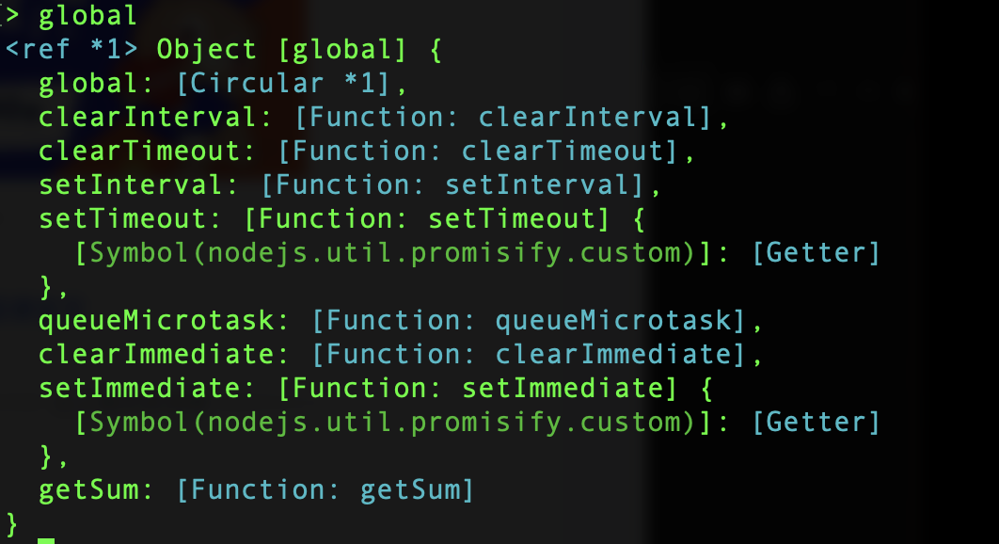

## 导出 `exports`

- `m1.js`文件——用于导出模块

```js
let a = 10;
function getSum (a, b) {
    return a + b;
}

// 导出方式一
// export.a = a;
// export.getSum = getSum;

// 导出方式二
// 通过module.exports = {}，来导出数据
module.exports = {
    a,
    getSum,
}
```
### `exports`和`module.export`的区别
- `exports`：
    - 对于本身来讲是一个变量（对象）
    - 它不是`module`的引用，它是`{}`的引用
    - 它指向**`module.exports`的`{}`**模块
    - 它只能使用`.`语法 向外暴露变量。eg: `export.a = a;`
- `module.exports`：
    - `module`是一个**变量**，指向一块内存。
    - `exports`是`module`中的一个**属性**，存储在内存中，然后 **`exports`属性** 指向 **`{}`模块** 。
    - 既可以使用`.`语法，也可以使用`=`直接赋值。

## 导入 require

- `demo.js`

```js
// 导入数据
// 导出的模块一般需要一个变量来接收，一般把我们接收的变量定义为常量
const m1 = require('./m1.js');

console.log(m1); // 打印结果：{ a:10, getSum: [Function: getSum] }
console.log(m1.a); // 打印结果：10
console.log(m1.getSum(1,2)); // 打印结果：3

console.log(this); // {}
console.log(exports); // {}
console.log(exports === this); // true

console.log(window); // undefined,node里面没有window对象，浏览器里面是有window对象的
//nodejs里面声明这个变量，不会被添加到global全局对象中
let b = 10;
console.log(global.b); // undefined
//可以给global添加成员
global.c = 30;
console.log(global.c); // 30

console.log(global===this);//false
```

::: tip
#### 模块里的this指向问题
- 在node里面，this代表当前模块，也就是exports对象
- node里面是没有window对象的
:::

::: tip
#### 全局对象global
虽然node里面没有window对象，但是有全局对象global
- nodejs里面直接声明的变量，是不会被添加到global全局对象中的
- 但可以给global对象添加全局成员 global.c = 10
:::

