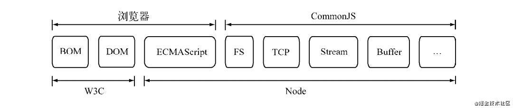

在 JS 发展前期，它主要是在浏览器环境发光发热，由于 ES规范 规范化的时间比较早，所以涵盖的范畴比较小。

但是在实际应用中， JS 的表现取决于宿主环境对 ES规范 的支持程度，随着web2.0的推进，HTML5崭露头角，它将web从网页时代带进了应用时代，并且在ES标准中出现了更多、更强大的api，在浏览器中也出现了更多、更强大的api供 JS 调用，这需要感谢各大浏览器厂商对规范的大力支持。

然而，浏览器的更新迭代和 api 的升级只出现在前端，后端的 Js 规范却远远落后，**对于 Js 自身而言，它的规范依然是十分薄弱的，还存在一些严重的缺陷，比如：没有模块标准。**

CommonJs规范的提出，**主要是为了弥补当初 JS 没有模块标准的缺点**，以达到像其它语言（例如Java、Python）那样具备开发大型应用的基础能力，而不是停留在脚本程序的阶段。

他们期望用CommonJs规范写出的应用具备**跨宿主环境（浏览器环境）执行**的能力，这样不仅可以利用 Js 编写web程序，而且也可以编写服务器、命令行工具、甚至桌面应用程序。

理论和实践总是相互影响和促进的，Node能以一种比较成熟的姿态出现，离不开CommonJs规范的影响。同样，在服务端，CommonJs能以一种寻常的姿态写进各个公司的项目中，也离不开Node优异的表现，下图是Node与W3C、还有浏览器，Commonjs组件、ES规范之间的关系：

Node借鉴了CommonJs的模块化规范实现了一套非常易用的模块。