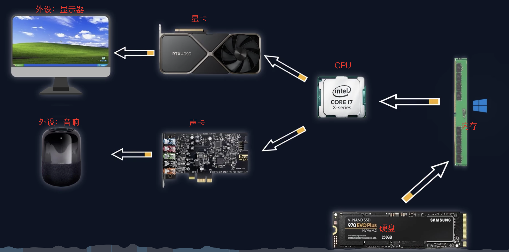

## 硬件

1. CPU
2. 内存：读写速度较快，断电丢失数据
3. 硬盘：读写速度较慢，断电不会丢失数据
4. 主板
5. 显卡
6. 散热器
7. 风扇等

## 操作系统

操作系统是一种应用程序，用来管理和调度硬件资源，主流的有：windows、linux、macOS

## 计算机启动的基本过程

操作系统是装在硬盘里的，开机时会载入内存，然后cpu去内存里面读取指令进行执行，执行过程中，如果遇到视频信号需要处理则交给显卡，显卡把信号传递给显示器显示。如果遇到音频，交给声卡，然后给音响播放。

## 程序运行的基本过成

软件也是安装在硬盘里的，双击打开这个软件后，会先载入内存，然后cpu去内存里面读取指令进行执行，执行过程中，如果遇到视频信号需要处理则交给显卡，显卡把信号传递给显示器显示。如果遇到音频，交给声卡，然后给音响播放。

## 总结

程序一般都保存在硬盘里，软件安装的过程就是将程序写入硬盘的过程。

程序在运行时会加载进入内存，然后由CPU读取并执行程序。