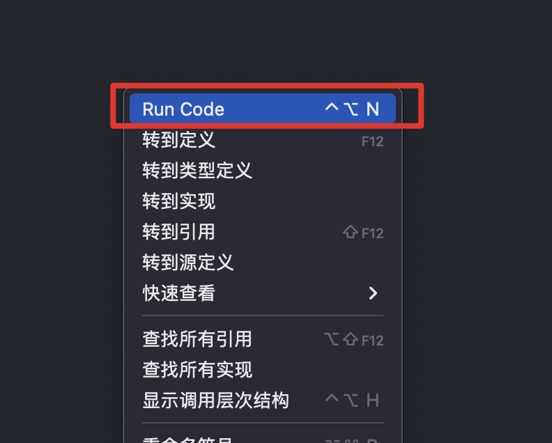
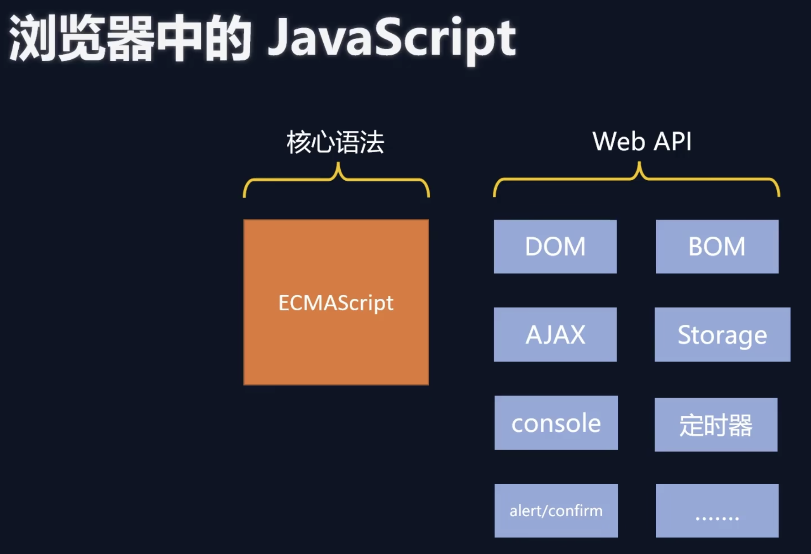
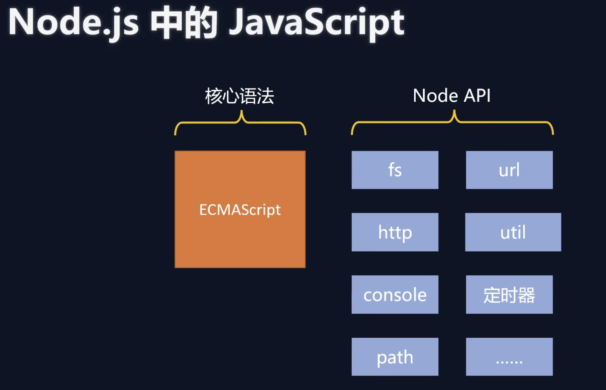

## Node.JS是什么

[Node官网](https://nodejs.org/zh-cn/)


::: warning

官网是很重要的学习文档。

:::

- Node.js是一个基于Chrome V8引擎的、开源的、跨平台的JavaScript运行环境
- 通俗来讲： Node.js就是<strong style="color: red">一款应用程序</strong>，是一款软件，它可以运行JavaScript

## Node.JS有什么用

1. 用来开发服务器端的应用程序
2. 用来开发工具类的应用程序：如：Webpack、Vite、Babel等，还可以开发自己的工具
3. 用来开发桌面应用程序：Electron，而市面上很常见的VsCode、Figma、Postman就都是基于Electron开发的

## Node.JS怎么安装

::: warning
安装nvm之前，先删除原下载的node
:::

- nvm管理node版本（略）
- 常用命令
  - `nvm install/uninstall 版本号 ` 下载/卸载某版本
  - `nvm use 版本号` 使用某版本
  - `nvm list` 查看当前已安装的所有node的版本

## Node.JS怎么用
- 方法一：命令行交互模式，进入命令行，输入`node`，回车，进入交互模式
- 方法二：在命令行中使用node命令解释js文件`node hello.js` ✅（常用）
### VSCode插件配置
- Code Runner

安装该插件之后，就可以直接通过VSCode来运行Js代码了。（右键编辑器，可以看到Run Code项）


## Node.JS编码的注意事项
首先，抛出一个问题，JS是由哪三部分组成的？

```
- ECMAscript（核心语法）
- DOM
- BOM
```
::: warning
**Node.Js中是不能使用Dom和Bom的API的**
:::



比如，如下代码，node都是无法正常运行的

```js
// bom
console.log(window); ❌
console.log(navigator); ❌
console.log(location); ❌
console.log(history); ❌
// dom
console.log(document); ❌
// Ajax
let xhr = new XMLHttpRequest(); ❌
```

但比如普通的Js语法:

```js
// console输出
console.log("hello node");
// 定时器
setTimeout(() => {
  console.log("hello node");
}, 1000);
```
执行是完全没问题的。

Node.js中的顶级对象为global，也可以用globalThis访问顶级对象
```js
console.log(global);
console.log(globalThis); // ES2020提出的，指向global对象的对象
console.log(globalThis === global); // true 
```