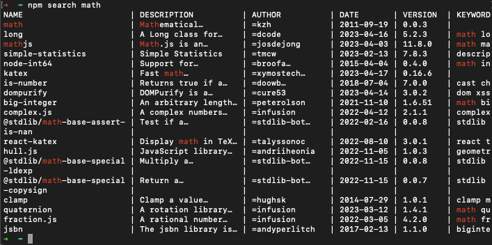
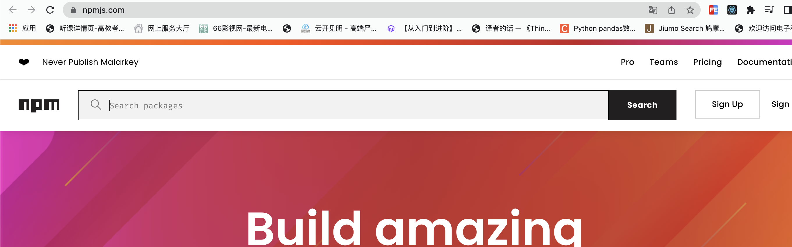

npm，全称<span style="color:red">Node Package Manager</span> ，翻译为中文意思是<strong style="color:red">"Node 的包管理工具"</strong> 

> npm是Node.js官方内置的包管理工具，是**必须要掌握住的工具**

## 1.npm的安装

略

## 2.npm的基本使用

### 初始化

创建一个空目录，然后**以此目录作为工作目录**启动命令行工具 ，执行`npm init`


- `npm init`命令的作用是将文件夹初始化为一个『包』，**交互式**创建`package.json`文件。
- `package.json`是包的配置文件，每个包都必须要有`package.json`
- `package.json`内容示例:
    ```bash
    {
        "name": "01_npm",
        "version": "1.0.0",
        "description": "",
        "main": "index.js",
        "scripts": {
            "test": "echo \"Error: no test specified\" && exit 1"
        },
        "author": "",
        "license": "ISC"
    }
    ======属性翻译=======
    {
        "name": "01_npm",      #包的名字
        "version": "1.0.0",    #包的版本
        "description": "",     #包的描述
        "main": "index.js",    #包的入口文件
        "scripts": {           #脚本配置
            "test": "echo \"Error: no test specified\" && exit 1"
        },
        "author": "",          #作者
        "license": "ISC"       #开源证书
    }
    ```
::: tip
初始化的过程中还有一些注意事项:
1. <span style="color:red">package name</span>(包名)**不能使用中文、大写**
    - 默认值是文件夹的名称，所以文件夹名称也不能使用中文和大写
2. <span style="color:red">version</span> (版本号)要求 x.x.x 的形式定义， x 必须是数字，默认值是 1.0.0
3. ISC证书与MIT证书功能上是相同的，关于开源证书扩展阅读 http://www.ruanyifeng.com/blog/2011/05/how_to_choose_free_software_licenses.html
4. `package.json`可以手动创建与修改
5. 使用`npm init -y`或者`npm init --yes`能极速创建`package.json`
:::

### 搜索包

搜索包的方式有两种:
1. 命令行<span style="color:red">npm s/search</span>关键字


2. 网站搜索, 网址是[https://www.npmjs.com/](https://www.npmjs.com/)


::: tip
只有在在实践中不断的积累，通过看文章，看项目去学习去积累，才能知道如何精准找到我需要的包
:::

### 下载安装包

我们可以通过`npm install <包名>`和`npm i <包名>`命令安装包

运行之后文件夹下会增加两个资源：
- `node_modules`文件夹，存放下载的包的资源
- `package-lock.json` 包的锁文件，记录包的版本信息，锁定包的版本
```bash
npm install uniq # 安装uniq包
```
::: tip
安装`uniq`去重之后， `uniq`就是当前这个包的一个**依赖包** ，有时会简称为**依赖**
:::

### 使用包

在`index.js`文件中引入`uniq`包，然后使用`uniq`包的功能
```js
const uniq = require('uniq')
const arr = [1, 2, 3, 4, 5, 1, 2, 3, 4, 5]
console.log(uniq(arr))
```
运行`node index.js`，可以看到去重后的结果
```bash
[ 1, 2, 3, 4, 5 ]
```

::: tip
`require`导入`npm`包基本流程:
1. 在当前文件夹下`node_modules`中寻找同名的文件夹
2. 在上级目录中下的`node_modules`中寻找同名的文件夹，直至找到磁盘根目录
:::

### 安装指定版本的包
项目中可能会遇到版本不匹配的情况，有时就需要安装指定版本的包，可以使用下面的命令的
```bash
## 格式
npm i <包名@版本号> 

## 示例
npm i jquery@1.11.2
```

### 安装包依赖

在项目协作中有一个常用的命令就是`npm i / install`，通过该命令可以依据`package.json`和`package-lock.json`的依赖声明安装项目依赖

```bash
npm i
npm install
```
::: warning
如果要上传到git仓库，一定要把`node_modules`文件夹加入到`.gitignore`文件中，不然会导致项目过大
:::
### 全局安装

我们可以执行安装选项 `-g` 进行全局安装

```bash
npm i -g <包名>

# 例如安装nodemon
npm i -g nodemon  # nodemon是一个可以监视node文件变化并自动重启服务器的包

# 查看全局安装的包
npm list -g

# 查看全局安装包的位置
npm root -g
```
全局安装完成之后就可以在命令行的任何位置运行`nodemon`命令
::: tip
- 全局安装的命令不受工作目录位置影响
- 并非所有的包都适合全局安装， 只有全局类的工具才适合，可以通过**查看包的官方文档来确定安装方式**，这里先不必太纠结
:::

### 卸载包

项目中可能需要删除某些不需要的包，可以使用下面的命令

```bash
npm uninstall <包名>
## 示例
npm uninstall jquery
```
或
```bash
## 局部删除
npm remove uniq
npm r uniq
## 全局删除
npm remove -g nodemon
```

## 3.生产环境与开发环境
- 开发环境是程序员<span style="color:red">专门用来写代码</span>的环境，一般是指程序员的电脑，开发环境的项目一般<span style="color:red">只能程序员自己访问</span>
- 生产环境是项目<span style="color:red">代码正式运行</span>的环境，一般是指正式的服务器电脑，生产环境的项目一般<span style="color:red">每个客户都可以访问</span>

## 4.生产依赖与开发依赖

我们可以在安装时设置选项来区分<span style="color:red">依赖的类型</span>，目前分为两类：

| 类型 | 命令 | 补充 |
| :---: | :---: | :---: |
| 生产依赖 | `npm i -S <包名>` <br /> <br /> 或 `npm i --save <包名>` | 默认安装的就是生产依赖，-S等效于 --save  <br /> <br /> 包信息保存在`packaga.json`中的`dependencies`属性中 |
| 开发依赖 | `npm i --save-dev <包名>` <br /> <br /> `npm i -D <包名>` | -D 等效于 --save-dev <br /> <br />  包信息保存在`package.json`中的`devDependencies`属性 |

::: tip
**开发依赖**是只在**开发阶段**使用的依赖包，而**生产依赖**是**开发阶段和最终上线运行阶段**都用到的依赖包
:::

## 5.配置npm命令别名

通过配置`package.json`中的`scripts`属性可以更简单的执行命令

```json
{
    .
    .
    .
    "scripts": {
        "server": "node server.js",
        "start": "node index.js",
    },
    .
. 

}
```

配置完成之后，可以使用别名执行命令

```bash
npm run server
npm run start
```
不过 `start` 别名比较特别，使用时可以省略 `run`

```bash
npm start
```

::: tip
补充说明:
- `npm start`是项目中常用的一个命令，一般用来启动项目
- `npm run`有自动向上级目录查找的特性，跟`require`函数一样
- 对于陌生的项目，我们可以通过查看`scripts`属性来参考项目的一些操作
:::

## 6.cnpm

### (1)简介

**`cnpm`**是一个淘宝构建的 `npmjs.com` 的完整镜像，也称为『**淘宝镜像**』，网址[https://npmmirror.com/](https://npmmirror.com/) 

`cnpm` 服务部署在国内阿里云服务器上， 可以提高包的下载速度

官方也提供了一个全局工具包 `cnpm` ，操作命令与npm大体相同

### (2)安装

我们可以通过 npm 来安装 cnpm 工具
```bash
npm install -g cnpm --registry=https://registry.npmmirror.com
```

### (3)操作命令

和npm命令一致，可以通过`cnpm -h`查看

### (4)配置淘宝镜像

1. 直接配置

我们可以通过配置`npm`的`registry`属性来使用淘宝镜像

```bash
npm config set registry https://registry.npmmirror.com
```

2. 工具配置

使用`nrm`配置`npm`的镜像地址`npm registry manager`

- 安装nrm

```bash
npm i -g nrm
```

- 修改镜像

```bash
nrm use taobao
```

- 检查是否配置成功

```bash
npm config list
# 检查 registry 地址是否为 https://registry.npmmirror.com/ , 如果是，则表明成功
```

::: tip
- 建议使用第二种方式 进行镜像配置，因为后续修改起来会比较方便
- 虽然cnpm可以提高速度，但是npm也可以通过淘宝镜像进行加速，所以**npm的使用率还是高于cnpm**
:::