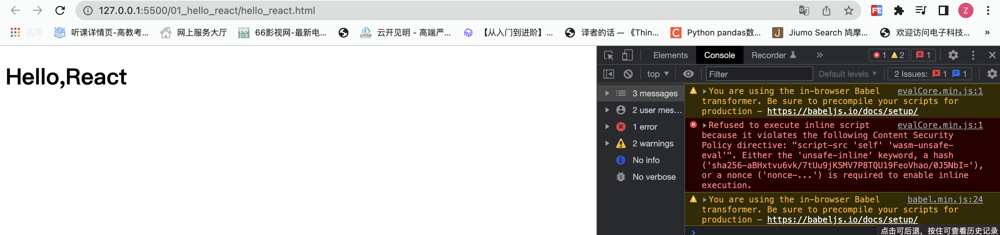

 
## 相关js库

1. react.development.js：React核心库。
2. react-dom.development.js：提供操作DOM的react扩展库。
3. babel.min.js：解析JSX语法代码转为JS代码的库。

## 基本使用

- 创建一个html文件
- 在这个html文件中引入react相关的js库

```html
<!DOCTYPE html>
<html lang="en">
<head>
	<meta charset="UTF-8">
	<title>hello_react</title>
</head>
<body>
	<!-- 准备好一个“容器” -->
	<div id="test"></div>

	<!-- 引入react核心库 -->
	<script type="text/javascript" src="../js/react.development.js"></script>
	<!-- 引入react-dom，用于支持react操作DOM -->
	<script type="text/javascript" src="../js/react-dom.development.js"></script>
	<!-- 引入babel，用于将jsx转为js -->
	<script type="text/javascript" src="../js/babel.min.js"></script>

    <!--  注意：此处一定要写babel,表示我这里面写的不是js代码而是jsx，并且通过babel编译  -->
	<script type="text/babel" > 
		// TODO
	</script>
</body>
</html>
```

### hello-react示例

```html
<script type="text/babel" >
    //1.创建虚拟DOM
    const VDOM = <h1>Hello,React</h1> /* 此处一定不要写引号，因为不是字符串，而是虚拟dom的写法 */
    //2.渲染虚拟DOM到页面
    // ReactDOM.render的参数
    //    1：要渲染的虚拟DOM
    //    2：指定页面上的容器
    ReactDOM.render(VDOM, document.getElementById('test'))
</script>
```


 
### 虚拟DOM的两种创建方式

- 解释为什么我们在React中不使用纯JS语法，而是使用JSX语法

1. JS方式

```html
<script type="text/javascript" > 
    //1.创建虚拟DOM
    // React.createElement(标签名, 标签的属性对象, 子节点) 然后无限嵌套……
    const VDOM = React.createElement('h1', {id:'title'}, React.createElement('span', {class:"text"}, 'Hello,React'))
    //2.渲染虚拟DOM到页面
    ReactDOM.render(VDOM,document.getElementById('test'))
</script>
```
2.	JSX方式

```html
<script type="text/babel" > /* 此处一定要写babel */
    //1.创建虚拟DOM
    const VDOM = (  /* 此处一定不要写引号，因为不是字符串 */
        <h1 id="title">
            <span class="text">Hello,React</span>
        </h1>
    )
    //2.渲染虚拟DOM到页面
    ReactDOM.render(VDOM,document.getElementById('test'))
</script>
```

> 浏览器最终运行的还是js代码，jsx代码其实是一种语法糖，最终会被babel转为js代码

### 虚拟DOM与真实DOM

```html
<script type="text/babel" >
    // 1.创建虚拟DOM
    const VDOM = ( 
        <h1 id="title">
            <span>Hello,React</span>
        </h1>
    )
    // 2.渲染虚拟DOM到页面
    ReactDOM.render(VDOM, document.getElementById('test'))
    // 定义一个真实dom
    const TDOM = document.getElementById('demo')

    console.log('虚拟DOM', VDOM);  // 类型是一个Object, 打断点查看后，可以看到里面有很多属性，但较少
    console.log('真实DOM', TDOM);  // 类型是一个HTMLHeadingElement, 打断点查看后，可以看到里面有很多属性，但较多
    debugger;
</script>
```


总结一些结论：

1. 虚拟DOM的本质是Object类型的对象（一般对象）
2. 虚拟DOM比较“轻”，真实DOM比较“重”，因为虚拟DOM是React内部在用，无需真实DOM上那么多的属性。
3. 虚拟DOM最终会被React转化为真实DOM，呈现在页面上。我们编码时基本只需要操作react的虚拟DOM相关数据, react会转换为真实DOM变化而更新界面。