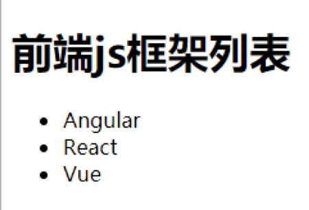

## JSX简介

- 全称:  JavaScript XML：
- 是react定义的一种类似于 XML 的JS扩展语法: JS + XML。本质是`React.createElement(component, props, ...children)`方法的语法糖。

> XML: 是一种标记语言，用来定义数据的结构和内容
> ```xml
> <book>
>     <title>React</title>
>     <price>99</price>
> </book>
> ```
> 后来，人们发现，XML语法太过繁琐，于是，出现了JSON语法，用来定义数据的结构和内容
> ```json
> "book": {
>    "title": "React",
>    "price": 99
> }
> ```

- 作用: 用来简化创建虚拟DOM 
    - 基本写法：`var ele = <h1>Hello JSX!</h1>`
    - 注意1：它不是字符串, 也不是HTML/XML标签、
    - 注意2：它最终产生的就是一个JS对象


## JSX基本语法规则

1. 遇到以 `{` 开头的代码，以JS语法解析: **标签中混入js表达式时必须用`{ }`包含**

    - 错误❌写法示例：
    以下这种写法是大错特错的，不会渲染出来myTitle和myId对应的内容，渲染的就还是myId和myTitle字符串
    ```html
    <script type="text/babel">
        const myId = 'title';
        const myTitle = 'Hello JSX!';

        const VDOM = (
            <div>
                <h1 id="myId">myTitle</h1>
            </div>
        );
    </script>
    ```
    - 正确✅写法示例：
    ```html
    <script type="text/babel">
        const myId = 'title';
        const myTitle = 'Hello JSX!';

        const VDOM = (
            <div>
                {/* 变量的值要用{}包裹，并且可以正常调用对应的方法*/}
                <h1 id={myId}>{myTitle.toLowerCase()}</h1>
            </div>
        );
    </script>
    ```
2. `jsx` 中样式的类名不要用 `class` ，要用 `className` 
3. 内联样式(行内样式)要用以下这种形式写，不能用字符串的形式写
```css
style={{ key1: value1, key2: value2 }}
```
4. jsx中的注释: `{/* 注释内容 */}`
5. 虚拟DOM只能有一个根标签
6. 标签必须闭合
7. `jsx`中标签名任意: `HTML`标签或其它标签
    - 标签首字母若是小写字母开头，则将该标签转为`html`同名标签，若`html`中无此标签，则报错
    - 标签首字母若是大写字母开头，则将该标签转为自定义组件，React就去渲染这个自定义组件，若组件未定义，则报错 
8. `jsx`中标签属性任意: `HTML`标签属性或其它

## JSX小练习

需求: 动态展示如下列表



::: warning
一定注意区分：【js语句(代码)】与【js表达式】
    1.表达式：一个表达式会产生一个值，可以放在任何一个需要值的地方
        下面这些都是表达式：
            (1) `a`
            (2) `a+b`
            (3) `demoFun(1)` 函数调用表达式
            (4) `arr.map() `
            (5) `function test () {}`
    2.语句(代码)：
        下面这些都是语句(代码)：
            (1) `if(){}`
            (2) `for(){}`
            (3) `switch(){case:xxxx}`
:::

而在jsx中，不能写语句，只能写表达式。用`{}`包裹

```html
<script type="text/babel" >
    //模拟一些数据
    const data = ['Angular','React','Vue']
    //1.创建虚拟DOM
    const VDOM = (
        <div>
            <h1>前端js框架列表</h1>
            <ul>
                {
                    // 在data.map循环中，必须要绑定一个key值
                    data.map((item,index)=>{
                        return <li key={index}>{item}</li>
                    })
                }
                {/*// for (let i = 0; i < data.length; i++) {
                //     <li key={i}>{data[i]}</li>  // for循环会报错
                // }*/}
            </ul>
        </div> 
    )
    //2.渲染虚拟DOM到页面
    ReactDOM.render(VDOM,document.getElementById('test'))
</script>
```