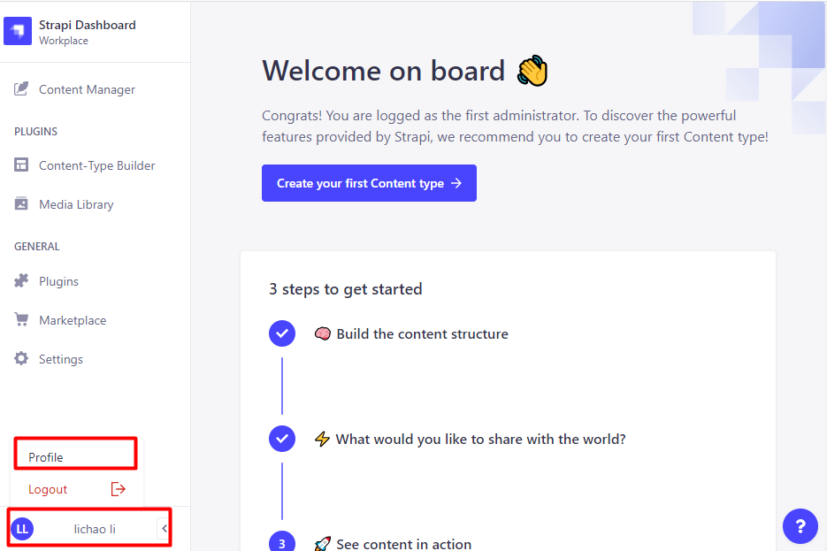
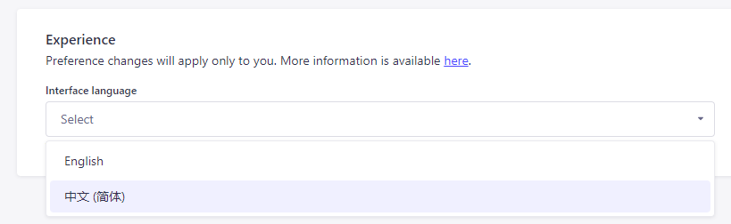
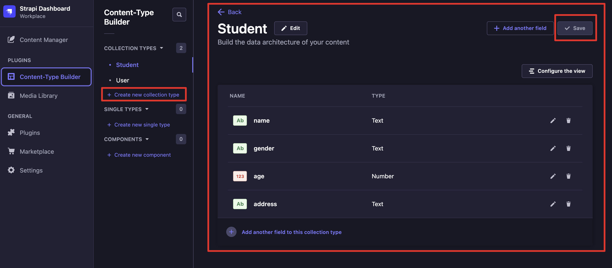
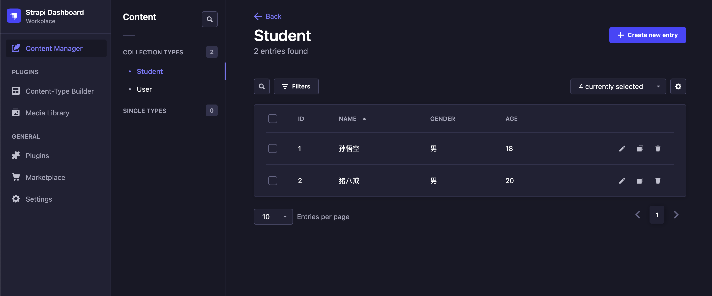
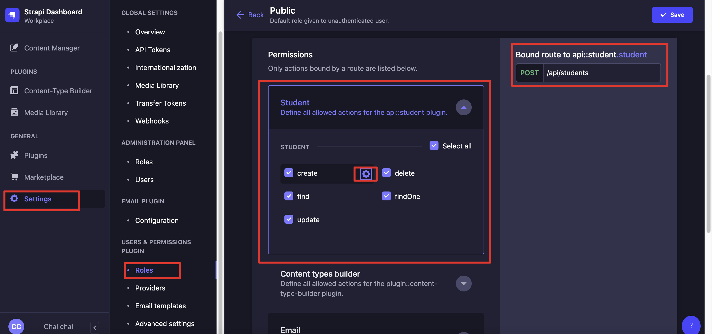

前边的《汉堡APP》项目中，React中的所有数据都是自己在代码中定义的静态数据。显然，真实开发中数据都需要从服务器中加载，所以在后续课程我们要开始学习如何在React中加载服务器中的数据。

于是问题出现了，我们还没有服务器啊？难道要现写一个吗？写一个也不是不可以，但却有一点点麻烦，所以这节课我们来介绍一个为我们一个工具——<strong style="color:#dd4d40">Strapi</strong>，它可以帮助我们方便快捷的搭建起一个供我们使用的**API服务器**。

## Strapi简介

官网是这么描述的: “Strapi是完全使用JavaScript开发的，开源无头内容管理系统”。
- 对于第一次接触它的人会感觉莫名其妙，“无头内容管理系统”，什么玩意？
- 简单来说，<strong style="color:#dd4d40">Strapi</strong>就是一个**API的管理系统**，通过<strong style="color:#dd4d40">Strapi</strong>我们可以直接**以网页的形式去定义自己的API、包括设置模型、权限等功能**。有了<strong style="color:#dd4d40">Strapi</strong>我们**无需编写代码**便可开发出功能强大的**API**。

## 创建项目

Strapi项目的创建和React项目类似，它也为我们提供了一个工具，可以快速的创建项目。首先进入到要存放项目的目录然后执行一下命令：

- npm
    ```bash
    npx create-strapi-app@latest my-project --quickstart
    ```

- yarn
    ```
    yarn create strapi-app my-project --quickstart
    ```

项目创建后会自动启动，浏览器会自动打开链接地址：http://localhost:1337/admin，由于是第一次启动项目，所以会弹出一个注册窗口，这里需要注册一个新的管理员账号。

## 配置语言

注册后，我们暂时先不急着查看项目的页面。因为项目的语言默认是英文的，我们需要先经过一些配置开启中文的支持。首先，在命令行中通过`ctrl+c`停止项目的运行，如果`ctrl+c`不能正常关闭服务器的话，你还需要在任务管理器中找到`node.js`的进程并将其结束。然后，在项目的根目录中找到`/src/admin/admin.example.js`。接着，在当前目录中对该文件进行复制名重命名为`admin.js`并修改其中代码：

```js
export default {
    config: {
        locales: [
            'zh-Hans',
        ],
    },
    bootstrap(app) {
        console.log(app);
    },
};
```
然后在命令行中，进入项目目录执行如下命令`npm run build`或`yarn build`，重新对项目就构建。

执行完毕后调用`npm start develop`或`yarn develop`启动项目。

再次进入项目后，点击管理界面的做下角，你的用户名的地方且选中`Profile选项`来进入配置页面：



在配置页面的最下方`Inteface language中选中“中文(简体)”`，点击save即可将语言设置为简体中文。



## 添加内容类型

`Strapi`是一个内容管理系统，何为内容呢？其实就是数据库中的数据类型。比如，一个用户信息就是一个内容、一件商品的信息也是一个内容，所以要想使用API需要先添加一个新的内容类型、然后再对齐添加对应的数据，最后才能够通过`API`访问到这些数据。下边我们尝试着添加一个新的类型`students`，用来存储学生的信息。

点击左侧导航栏中的`Content-Type Builder`，这是`Strapi`中的内容类型构建器，点击它可以进入类型定义的界面。



我们以定义一个`Student`类型为例，点击右上角的`Add Content Type`按钮，然后在弹出的窗口中输入`Student`，点击`Save`按钮，这样就定义好了一个新的类型`Student`。我们给`Student`类型添加一个字段，点击`Add New Field`按钮，然后在弹出的窗口中输入`name`，然后选择`Text`类型，点击`Save`按钮，这样就给`Student`类型添加了一个字段`name`，依次操作，添加`age`、`sex`、`address`字段，最后点击`Save`按钮，这样就定义好了一个`Student`类型。

这个类型，**其实就是一个数据库中的表**，然后我们回到`Content Manager`页面，点击`Student`类型，这个页面就是用来管理`Student`类型的数据的，我们可以在这个页面中添加数据，然后通过`API`来访问这些数据。



后续的使用可以自己摸索一下，自己创建好接口之后，可以用`postman`软件来测试。

接口的使用方法，也在Strapi里面有展示：



## Strapi项目地址

[Github地址-Server](https://github.com/Fancy911/React18-Hooks-LearningDemo/tree/main/server)