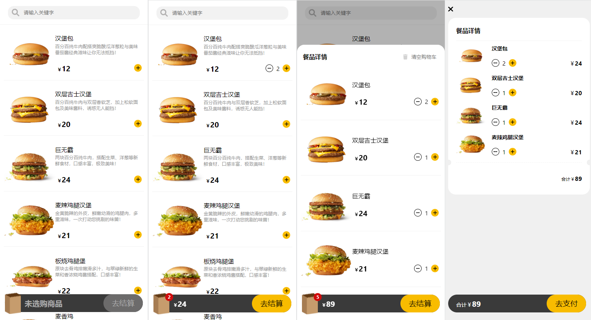
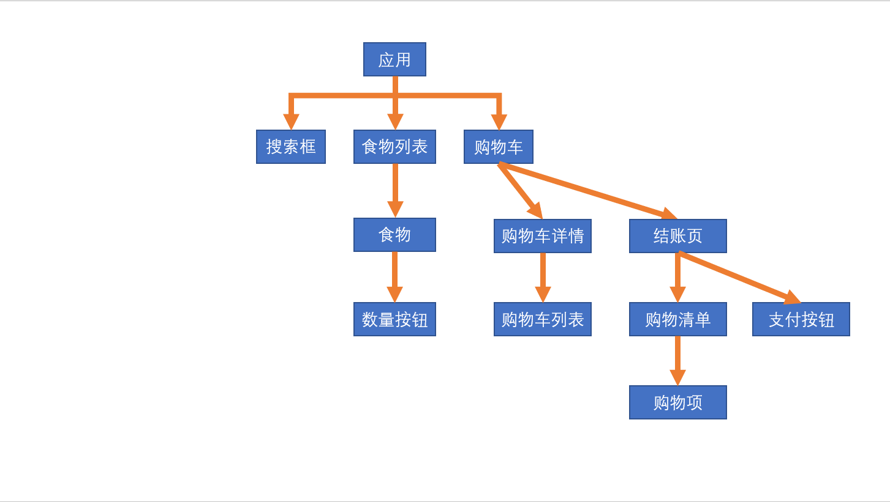
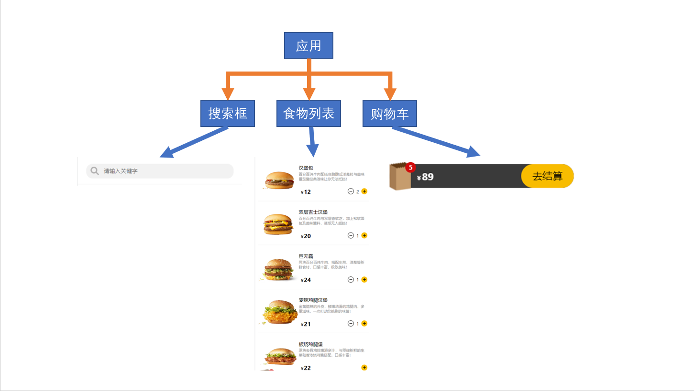
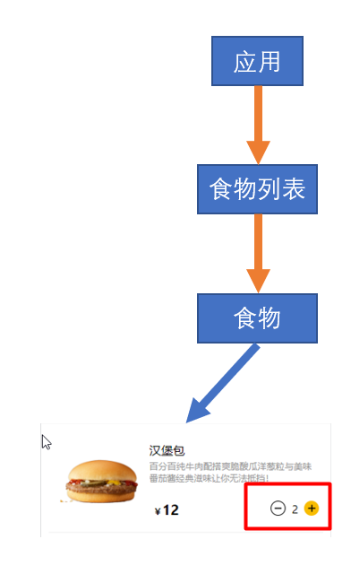
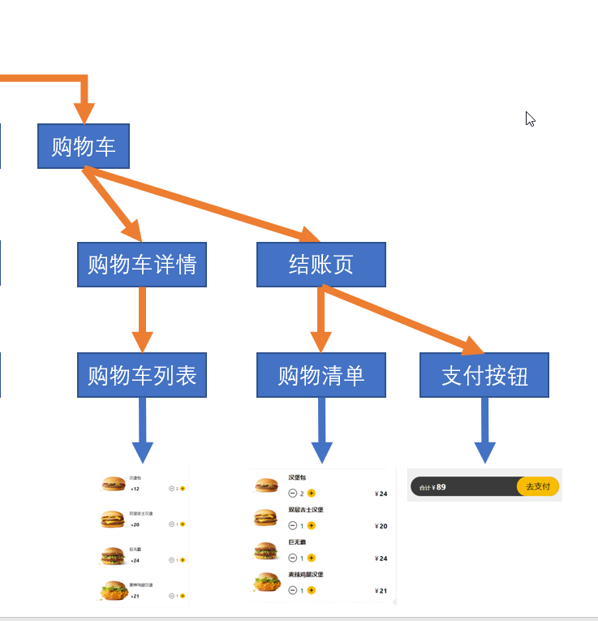

该实战项目选自李立超老师的[React18课程](https://www.bilibili.com/video/BV1bS4y1b7NV/?p=54&spm_id_from=pageDriver&vd_source=cc52decf310624efee2e10441cdc197c)。

我们来通过一个练习来熟悉巩固一下React，首先我们先来看看练习的UI界面：



这个练习是一个手机应用，本身并不十分复杂，但是开发之前也需要对项目的结构进行分析，分析的越清楚开发起来也就越轻松。

## 项目整体架构


---

需要在根应用中引入的模块主要有三个，搜索框、食物列表和购物车



### 搜索框

搜索框的结构比较简单，是一个input文本框，且需要固定定位到屏幕的上方，它主要的作用是通过关键字对食物列表进行过滤。

### 食物列表

食物列表主要是用来呈现用户可以够买的食品，结构略微复杂。列表中放置的是一个一个的列表项，列表项中还包含有一个可以增加减少食物的按钮。



### 购物车

购物车用来显示选中商品的数量和总价格，点击购物车后可以显示出购物清单，点击去结算后会显示结账页面。



项目结构的分析没有一定之规，不同的公司有不同的规范，不同的人有不同的开发经验，也许你对项目结构的分析和我不同，但这绝对不是什么太严重的问题，你可以按照自己的想法去实施，亦可紧紧跟随我的步伐，都不要紧。最重要的是你心里要有这么一个结构，结构有了开发起来便更加顺畅，出了问题也可以根据结构去定位问题发生的位置。

根据上述的分析，接下来我们可以确定一下项目的目录结构：

```
汉堡到家APP
    ├─ public
    │   ├─ index.html
    │   └─ img
    │       └─ meals
    └─ src
        ├─ index.js
        ├─ index.css
        ├─ App.js
        ├─ App.css
        └─ components
            ├─ Cart
            ├─ FilterMeals
            ├─ Meals
            │   └─ MealItem
            └─ UI
                ├─ Backdrop
                ├─ Confirm
                └─ Counter    
```

项目中最核心的功能就是食物的列表，所有的功能包括搜索、购物车和结账页面都是依赖于食物列表，接下来从食物列表开始一步一步的做起来吧。