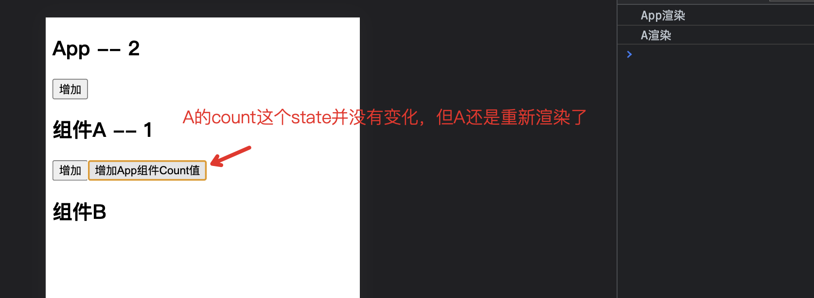

接着上一小节的案例，我们再来梳理一下`useCallback`的使用场景。我们知道，使用`memo`包裹的组件，只有当组件的`props`发生变化时，才会重新渲染。

但是，如果说，我们的`父组件App`，给`A组件`传递的`props`发生了变化，但是`A组件`本身的状态和`props`并没有发生变化，此时，尽管`A组件`被`memo`包裹，`A组件`还是会重新渲染，这显然是不合理的。



那么，我们如何能让A组件调用父组件方法，改变父组件状态的同时，但是不让A组件重新渲染呢？
思路就是，不让**父组件传递过来的`props`中的函数发生重新创建**，这样，即使`App父组件`的`state`发生变化，导致了`App父组件`的重新渲染，但是这个传递给`A组件`的`props`中的函数并没有重新创建，`A组件`就不会重新渲染。

实现这一功能，就需要用到`useCallback`钩子。下面就通过代码演示。

## App组件

```jsx{11-22,31-38}
import React, {useState, useCallback} from 'react';
import A from "./components/A";

const App = () => {
    console.log('App渲染');
    const [count, setCount] = useState(1);
    // const clickHandler = () => {
    //     setCount(prevState => prevState + 1);
    // };

    // useCallback 是一个钩子函数，用来创建React中的回调函数
    // useCallback 创建的回调函数不会总在组件重新渲染时重新创建
    /*
    *   useCallback()
    *       参数：
    *           1. 回调函数
    *           2. 依赖数组
    *               - 当依赖数组中的变量发生变化时，回调函数才会重新创建
    *               - 如果不指定依赖数组，回调函数每次都会重新创建
    *               - 一定要将回调函数中使用到的所有变量都设置到依赖数组中
    *                   除了（setState）
    * */
    const clickHandler = useCallback(() => {
        setCount(prevState => prevState + 1);
    }, []);

    return (
        <div>
            <h2>App -- {count}</h2>
            <button onClick={clickHandler}>增加</button>
            {/* 我们给A组件也传递这个增加App中count值的函数，使得A组件也能够增加App中的count值 */}
            {/* 这样，即使A组件也被React.memo()包裹，虽然A组件中没有自己的state变化，
                但是传给A组件的props有变化，所以A组件也还是会重新渲染 */}
            {/* 那么我们如何解决这个问题呢？—— 使用useCallback这个钩子函数 */}

            {/* 上述clickHandler函数使用useCallback钩子函数包裹后，A组件就不会重新渲染了，因为A组件中没有自己的state变化 */}
            {/* 而且这个clickHandler函数的依赖数组中没有变量，clickHandler只会在APP组件初始化时创建一次，之后不会再重新创建 */}
            {/* 不会重新创建，那么就意味着A组件中的props也不会发生变化，所以A组件也就不会重新渲染了 */}
            <A onAddAppCount={clickHandler}/>
        </div>
    );
};

export default App;
```

## A组件-(App组件的子组件)

```jsx
import React, {useState} from 'react';

const A = (props) => {
    console.log('A渲染');
    const [count, setCount] = useState(1);

    const clickHandler = () => {
      setCount(prevState => prevState + 1);
    };


    return (
        <div>
            <h2>组件A -- {count}</h2>
            <button onClick={clickHandler}>增加</button>
            {/* 接收到App父组件的函数： */}
            <button onClick={props.onAddAppCount}>增加App组件Count值</button>
        </div>
    );
};

export default React.memo(A);
```

## 总结

[Github完整代码示例-memo&callback](https://github.com/Fancy911/React18-Hooks-LearningDemo/tree/main/memo%26callback-demo)