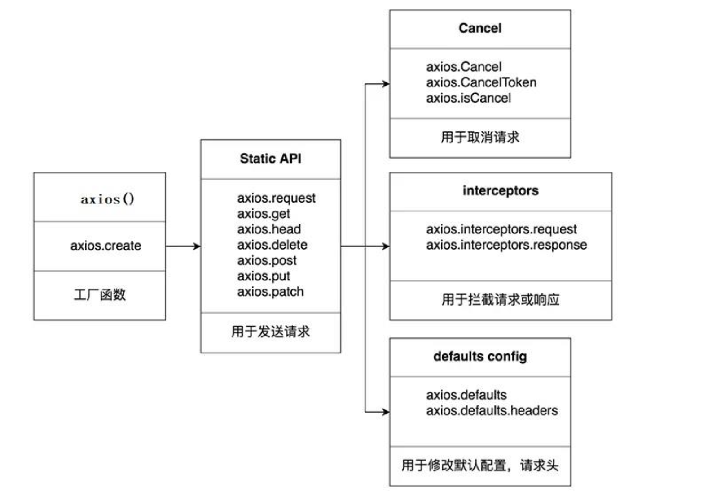

## axios配置
为了方便示例代码编写，我们直接在`html`代码中的`header`标签加一行`script`标签，引入`axios.js`文件，这样就可以直接使用`axios`了。
```html
<!DOCTYPE html>
<html lang="en">
<head>
    <meta charset="UTF-8">
    <meta name="viewport" content="width=device-width, initial-scale=1.0">
    <title>axios配置</title>
    <script src="https://cdn.bootcdn.net/ajax/libs/axios/0.21.1/axios.min.js"></script>
</head>
<body>
    <script>
        console.log(axios);
    </script>
</body>
</html>
```

## axios常用语法



### Part1: 最基本的方式

1. `axios(config)`: 通用/最本质的发任意类型请求的方式
    ::: details 点击查看示例代码
    ```js
    // 发送 GET 请求，传一个id，获取id为2的数据
    axios({
        //请求类型
        method: 'GET',
        //URL
        url: 'http://localhost:3000/posts/2',
    }).then(response => {
        console.log(response);
    });

    // 发送 POST 请求：不需要传id，因为服务器会自动分配id
    axios({
        //请求类型
        method: 'POST',
        //URL
        url: 'http://localhost:3000/posts',
        //设置请求体
        data: {
            title: "红楼梦",
            author: "曹雪芹"
        }
    }).then(response => {
        console.log(response);
    });

    //发送 PUT 请求，修改id为3的数据
    axios({
        //请求类型
        method: 'PUT',
        //URL
        url: 'http://localhost:3000/posts/3',
        //设置请求体
        data: {
            title: "水浒传",
            author: "施耐庵"
        }
    }).then(response => {
        console.log(response);
    });

    //发送 DELETE 请求：删除id为3的数据
    axios({
        //请求类型
        method: 'delete',
        //URL
        url: 'http://localhost:3000/posts/3',
    }).then(response => {
        console.log(response);
    });
    ```
    :::
### Part2: 用于发送请求的`Static Api`

2. `axios.request(config)`: 等同于`axios(config)`
3. `axios(url[, config])`: 可以只指定`url`发`get`请求
4. `axios.get(url[, config])`: 发 `get` 请求

   `axios.delete(url[, config])`: 发 `delete` 请求

   `axios.post(url[, data, config])`: 发 `post` 请求

   `axios.put(url[, data, config])`: 发 `put` 请求

   `axios.patch(url[, data, config])`: 发 `patch` 请求
    ::: details 点击查看示例代码
    ```js
    // axios.post()
    axios.post('http://localhost:3000/comments', 
        {
            "body": "喜大普奔",
            "postId": 2
        }
    ).then(response => {
        console.log(response);
    })
    ```
    :::
### Part3: `default config`-用于修改默认配置，请求头等

5. `axios.defaults.xxx`: 请求的默认全局配置
    ::: details 点击查看示例代码
    ```js
    // 获取按钮
    const btns = document.querySelectorAll('button');
    // 默认配置
    axios.defaults.method = 'GET';  // 设置默认的请求类型为 GET
    axios.defaults.baseURL = 'http://localhost:3000';   // 设置基础 URL
    axios.defaults.params = {id:100}; // 设置默认的请求参数
    axios.defaults.timeout = 3000; // 设置默认的超时时间为 3 秒

    btns[0].onclick = function(){
        axios({
            url: '/posts' 
        }).then(response => {
            console.log(response);
        })
    }
    ```
    :::
### Part4: `interceptors`拦截器

拦截器，是`axios`提供的一个功能，可以在请求或响应被`then`或`catch`处理前拦截它们。
其本质是函数，主要分为两大类，请求拦截器和响应拦截器。

- 请求拦截器
    - 求拦截器，就是在请求发出之前，借助一些回调，对请求进行拦截，可以对请求内容和参数进行一些处理或检测，比如添加token等，或是检测出来有问题时，直接返回一个错误信息，取消这个请求。
- 响应拦截器
    - 当服务器返回回来结果的时候，我们知道，可以通过then或者catch来获取结果，但是，我们也可以在这个时候，对结果进行一些预处理，比如对结果进行一些过滤，或者是对结果进行一些格式化等。

6. `axios.interceptors.request.use()`: 添加请求拦截器 

   `axios.interceptors.response.use()`: 添加响应拦截器
    ::: details 点击查看示例代码
    ```js
    // 拦截器的内部原理就是Promise的链式调用
    // 设置请求拦截器  config 配置对象
    axios.interceptors.request.use(function (config) {
        console.log('请求拦截器 成功 - 1号');
        // 在相应拦截器中，可以修改 config 中的参数
        config.params = {
            a:10
        };
        return config;
    }, function (error) {
        console.log('请求拦截器 失败 - 1号');
        return Promise.reject(error);
    });

    axios.interceptors.request.use(function (config) {
        console.log('请求拦截器 成功 - 2号');
        // 修改 config 中的参数
        config.timeout = 2000;
        return config;
    }, function (error) {
        console.log('请求拦截器 失败 - 2号');
        return Promise.reject(error);
    });

    // 设置响应拦截器
    axios.interceptors.response.use(function (response) {
        console.log('响应拦截器 成功 1号');
        // 在相应拦截器中，可以修改默认返回
        return response.data;
        // return response;
    }, function (error) {
        console.log('响应拦截器 失败 1号')
        return Promise.reject(error);
    });

    axios.interceptors.response.use(function (response) {
        console.log('响应拦截器 成功 2号')
        return response;
    }, function (error) {
        console.log('响应拦截器 失败 2号')
        return Promise.reject(error);
    });

    //发送请求
    axios({
        method: 'GET',
        url: 'http://localhost:3000/posts'
    }).then(response => {
        console.log('自定义回调处理成功的结果');
        console.log(response);
    }).catch(error => {
        console.log('自定义回调处理失败的结果');
        console.log(error);
    })
    ```
    上述代码的输出顺序为：
    ```js
    请求拦截器 成功 - 2号
    请求拦截器 成功 - 1号
    响应拦截器 成功 1号
    响应拦截器 成功 2号
    自定义回调处理成功的结果
    ```
    - 说明: 调用 axios()并不是立即发送 ajax 请求, 而是需要经历一个较长的流程
    - 流程：`请求拦截器2 => 请求拦截器1 => 发ajax请求 => 响应拦截器1 => 响应拦截器 2 => 请求的回调`
        - 我们会发现，这里输出的顺序是和我们添加拦截器的顺序是相反的
    - 注意: 此流程是通过`promise`串连起来的, 请求拦截器传递的是`config`, 响应拦截器传递的是`response`
    :::

### Part5: 工厂函数`axios.create([config])`

7. `axios.create([config])`: 根据指定配置创建一个新的 axios, 也就就每个新 axios 都有自己的配置
    - 新`axios`只是 **没有取消请求(`axios.Cancel`这些)和批量发请求(`axios.all`对应的俩)** 的方法, 其它所有语法都是一致的
    - 为什么要设计这个语法?
        - 需求: 项目中有部分接口需要的配置与另一部分接口需要的配置不太一样, 如何处理
        - 解决: 创建 2 个新 axios, 每个都有自己特有的配置, 分别应用到不同要求的接口请求中
    ::: details 点击查看示例代码
    ```js
    // 创建实例对象  
    // 此时，再用imgs发送请求，就有了imgs下面配置的默认配置
    const imgs = axios.create({
        baseURL: 'https://api.apiopen.top/api',
        timeout: 2000
    });
    // 这个地方的请求地址就是 https://api.apiopen.top/api/getImages
    imgs.get('/getImages').then(response => {
        console.log(response.data)
    })

    // another这个对象下就有了自己的默认配置
    const another = axios.create({
        baseURL: 'https://b.com',
        timeout: 2000
    });
    // 这个地方的请求地址就是 https://b.com/getImages
    another.get('/getImages').then(response => {
        console.log(response.data)
    })
    ```
    :::

### Part6: 取消请求
8. `axios.Cancel()`: 用于创建取消请求的错误对象
   `axios.CancelToken()`: 用于创建取消请求的 token 对象 
   `axios.isCancel()`: 是否是一个取消请求的错误

    ::: details 点击查看示例代码
    ```html
    <body>
        <div class="container">
            <h2 class="page-header">axios取消请求</h2>
            <button class="btn btn-primary"> 发送请求 </button>
            <button class="btn btn-warning" > 取消请求 </button>
        </div>
        <script>
            //获取按钮
            const btns = document.querySelectorAll('button');
            // 2.声明全局变量
            let cancel = null;
            //发送请求
            btns[0].onclick = function(){
                //检测上一次的请求是否已经完成
                if(cancel !== null){
                    //取消上一次的请求
                    cancel();
                }
                axios({
                    method: 'GET',
                    url: 'http://localhost:3000/posts',
                    //1. 配置 cancelToken 对象
                    cancelToken: new axios.CancelToken(function(c){
                        //3. 将 c 的值赋值给 cancel
                        cancel = c;
                    })
                }).then(response => {
                    console.log(response);
                    //将 cancel 的值初始化
                    cancel = null;
                })
            }

            //绑定第二个事件取消请求
            btns[1].onclick = function(){
                cancel();
            }
        </script>   
    </body>
    ```
    :::

### Part7: 其他

9. `axios.all(promises)`: 用于批量执行多个异步请求

   `axios.spread()`: 用来指定接收所有成功数据的回调函数的方法
    ::: details 点击查看示例代码
    ```js
    // 用于批量执行多个异步请求
    axios.all([
        axios.get('http://localhost:3000/posts'),
        axios.get('http://localhost:3000/comments')
    ]).then(axios.spread((posts, comments) => {
        console.log(posts); // 第一个请求的结果
        console.log(comments); // 第二个请求的结果
    })).catch(err => {
        console.log(err); // 如果有一个请求失败，就会进入这个catch
    })
    ```
    > 回顾一下Promise.all()的用法
    > ```js
    > // Promise.all()的用法
    > // 只有当数组中所有的 Promise 对象都成功时，all方法才会成功，如果数组中有一个 Promise 对象失> 败，那么all方法就会失败。
    > Promise.all([
    >     new Promise((resolve, reject) => {
    >         setTimeout(() => {
    >             resolve('hello')
    >         }, 1000)
    >     }),
    >     new Promise((resolve, reject) => {
    >         setTimeout(() => {
    >             reject('world')
    >         }, 2000)
    >     })
    > ]).then(result => {
    >     console.log(result) // 不会执行
    > }).catch(err => {
    >     console.log(err) // world
    > })
    > ```
    :::