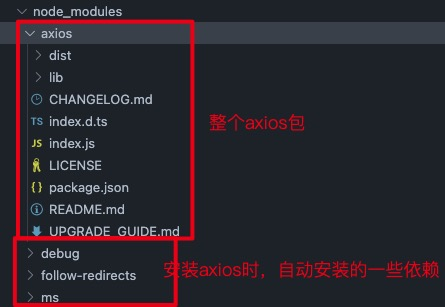

## 1.axios包结构说明



```bash
├── /dist/          # 项目输出目录
├── /lib/           # 项目源码目录
│     ├── /adapters/          # 定义请求的适配器 xhr、http
│     │      ├── http.js     # 实现 http 适配器(包装 http 包) 在nodejs中向远端发送http请求的
│     │      └── xhr.js      # 实现 xhr 适配器(包装 xhr 对象) 实现的是前端发起ajax请求的功能
│     ├── /cancel/  # 定义取消功能
│     │      ├── Cancel.js      # 用来生成取消对象
│     │      ├── CancelToken.js # 用来创建取消请求的构造函数
│     │      └── isCancel.js    # 用来判断是否是取消对象
│     ├── /core/    # 一些核心功能
│     │      ├── Axios.js               # axios 的构造函数
│     │      ├── buildFullPath.js       # 用来拼接完整的 url
│     │      ├── createError.js         # 用来创建错误对象
│     │      ├── dispatchRequest.js     # 用来调用 http 请求适配器方法发送请求的函数
│     │      ├── enhanceError.js        # 用来扩展错误对象
│     │      ├── InterceptorManager.js  # 拦截器的管理器的构造函数
│     │      ├── mergeConfig.js         # 用来合并配置
│     │      ├── transformData.js       # 用来转换请求和响应的数据
│     │      └── settle.js              # 根据 http 响应状态，改变 Promise 的状态
│     ├── /helpers/     # 一些辅助（功能性）方法
│     │      ├── bind.js                # 用来绑定 this
│     │      ├── buildURL.js            # 用来拼接 url，将 params 拼接到 url 上
│     │      ├── combineURLs.js         # 用来拼接 url，将 baseURL 和 url 拼接到一起
│     │      ├── cookies.js             # 用来操作 cookie
│     │      ├── isAbsoluteURL.js       # 用来判断 url 是否是绝对路径
│     │      ├── isURLSameOrigin.js     # 用来判断 url 是否是同源
│     │      ├── normalizeHeaderName.js # 用来规范化请求头的名称，将小写字母转换为大写
│     │      ├── parseHeaders.js        # 用来解析响应头
│     │      └── spread.js              # 对批量的请求结果进行处理
│     ├── axios.js      # 对外暴露接口
│     ├── defaults.js   # axios 的默认配置
│     └── utils.js      # 公用工具
├── package.json    # 项目信息
├── README.md       # 项目说明
├── LICENSE         # 项目许可证
├── CHANGELOG.md    # 项目更新日志
├── UPGRADE_GUIDE.md    # 升级指南
├── index.d.ts      # 配置 TypeScript 的声明文件
└── index.js        # 入口文件，引入 axios.js
```
## 2.`axios` 运行的整体流程


1. 整体流程: `request(config)` ==> `dispatchRequest(config)` ==> `xhrAdapter(config)`
2. request(config): 将 `请求拦截器` / `dispatchRequest()` / `响应拦截器`, 通过 `promise` 链串连起来, 返回`promise`
3. `dispatchRequest(config):` 转换请求数据 ===> 调用`xhrAdapter()`发请求 ===> 请求返回后转换响应数据. 返回 `promise`
4. `xhrAdapter(config):` 创建 `XHR` 对象, 根据 `config` 进行相应设置, 发送特定请求, 并接收响应数据, 返回 `promise`

## 3.axios的创建过程

`axios`是如何被创建出来的。
- 它是通过`createInstance()`方法创建而来的
- `createInstance()`方法接收一个`defaultConfig`参数
- `createInstance()`方法返回一个`instance`函数
- `instance`函数是通过`bind()`方法返回的
- `bind()`方法接收两个参数, 第一个参数是`Axios.prototype.request`函数, 第二个参数是`context`对象
- `context`对象是`Axios`的实例
- `Axios`是`axios`的构造函数
- `axios`是`Axios.prototype.request`函数`bind()`返回的函数

::: details 点击查看相关源码
```js
// axios.js
function createInstance(defaultConfig) {
    var context = new Axios(defaultConfig);
    var instance = bind(Axios.prototype.request, context);

    // Copy axios.prototype to instance
    utils.extend(instance, Axios.prototype, context);

    // Copy context to instance
    utils.extend(instance, context);

    return instance;
}

// Create the default instance to be exported
var axios = createInstance(defaults);

// Expose Axios class to allow class inheritance
axios.Axios = Axios;

// Factory for creating new instances
axios.create = function create(instanceConfig) {
    return createInstance(mergeConfig(axios.defaults, instanceConfig));
};

// Expose Cancel & CancelToken
axios.Cancel = require('./cancel/Cancel');
axios.CancelToken = require('./cancel/CancelToken');
axios.isCancel = require('./cancel/isCancel');

// Expose all/spread
axios.all = function all(promises) {
    return Promise.all(promises);
};
axios.spread = require('./helpers/spread');

module.exports = axios;
```
:::

### `axios`与`Axios`的关系？

1. 从语法上来说: `axios` 不是 `Axios` 的实例
2. 从功能上来说: `axios` 是 `Axios` 的实例
3. `axios` 是 `Axios.prototype.request` 函数 `bind()`返回的函数
4. `axios` 作为对象有 `Axios` 原型对象上的所有方法, 有 `Axios` 对象上所有属性

### `instance`与`axios`的区别

1. 相同:
    - 都是一个能发任意请求的函数: `request(config)`
    - 都有发特定请求的各种方法: `get()/post()/put()/delete()`
    - 都有默认配置和拦截器的属性: `defaults/interceptors`
2. 不同:
    - 默认配置很可能不一样
    - `instance` 没有 `axios` 后面添加的一些方法: `create()/CancelToken()/all()`

### 模拟实现`axios`对象创建过程

我们先来看看[BootCND-axios](https://cdn.bootcdn.net/ajax/libs/axios/0.21.1/axios.min.js)库里打印出来的`axios`对象长什么样子


```js
// Axios构造函数
function Axios(config) {
    // 初始化
    this.defaults = config; // 默认配置：为了能够使用axios.defaults.xxx来设置默认配置
    this.interceptor = {
        request: {}, // 请求拦截器
        response: {} // 响应拦截器
    }
}

// 给Axios原型对象添加request方法
Axios.prototype.request = function(config) {
    console.log('发送 AJAX 请求，请求的类型为' + config.method);
}

// 给Axios原型对象添加get/post/put/delete方法
Axios.prototype.get = function(url, config) {
    return this.request({
        method: 'get',
        url,
        ...config
    })
}
Axios.prototype.post = function(url, config) {
    return this.request({
        method: 'post',
        url,
        ...config
    })
}
Axios.prototype.put = function(url, config) {
    return this.request({
        method: 'put',
        url,
        ...config
    })
}
Axios.prototype.delete = function(url, config) {
    return this.request({
        method: 'delete',
        url,
        ...config
    })
}

// 声明createInstance函数，用来创建axios对象
function createInstance(config) {
    // 创建一个Axios实例
    let context = new Axios(config); // context就是Axios的实例，它有Axios构造函数中的所有属性和方法。可以context.get()、context.post()等，但是不能当做函数使用 【context() ❌】
    
    // 创建axios函数，可以 instance({}) 但是instance不能【instance.get ❌】
    let instance = Axios.prototype.request.bind(context); 
    
    // 将Axios原型对象上的方法和属性拷贝到axios函数上
    Object.keys(Axios.prototype).forEach(key => {
        instance[key] = Axios.prototype[key];
    })
    // 将Axios实例上的属性拷贝到axios函数上
    Object.keys(context).forEach(key => {
        instance[key] = context[key];
    })

    // 返回axios函数
    return instance;
}

// axios就是createInstance函数返回的函数，所以axios就是由createInstance函数创建出来的
let axios = createInstance({ 
    // 默认配置
    baseURL: 'http://localhost:3000', 
    timeout: 1000
})

// 测试发送请求看一下
axios.get({}) // 发送 AJAX 请求，请求的类型为get
axios.post({}) // 发送 AJAX 请求，请求的类型为post

// 打印一下我们自己手写的axios对象
console.log(axios);
```


## 4.`axios`的发送请求的过程
`axios` 发送请求，其本质是 `Axios.prototype.request` 方法，

`axios` <=> `Axios.prototype.request`，这两者是等效的，通过 `bind` 一起，其实相当于是一样的东西。

### 模拟实现`axios`发送请求
```js
// 一、Axios构造函数
function Axios(config) {
    // 初始化
    this.config = config; 
}

// 二、给Axios原型对象添加request方法
Axios.prototype.request = function(config) {
    // 发送请求
    // 1. 创建一个promise对象
    let promise = Promise.resolve(config);
    // 2. 声明一个数组： dispatchRequest是真正的请求函数，undefined 占位
    let chain = [dispatchRequest, undefined]; 
    // 3. 调用then方法指定回调。 result就是promise对象, 也就是dispatchRequest函数的返回值,
    let result = promise.then(chain[0], chain[1]); 
    // 4. 返回promise对象
    return result;
}

// 三、真正的请求函数
function dispatchRequest(config) { 
    console.log('真正的请求函数');
    // 调用xhr适配器发送请求
    return xhrAdapter(config).then(response => {
        return response;
    }, error => {
        throw err;
    })
}

// 四、 声明xhr适配器
function xhrAdapter(config) {
    console.log('xhrAdapter 函数执行');
    return new Promise((resolve, reject) => {
        // 1. 创建xhr对象
        let xhr = new XMLHttpRequest();
        // 2. 打开请求
        xhr.open(config.method, config.url);
        // 3. 发送请求
        xhr.send();
        // 4. 监听响应
        xhr.onreadystatechange = function() {
            // 5. 判断响应是否成功
            if (xhr.readyState === 4) {
                if (xhr.status === 200 && xhr.status < 300) {
                    resolve({
                        config: config,   //配置对象
                        data: xhr.response, //响应数据
                        status: xhr.status, //响应状态码
                        statusText: xhr.statusText, //响应状态信息
                        headers: xhr.getAllResponseHeaders(), //响应头
                        request: xhr //xhr 请求对象
                    });
                } else {
                    reject(new Error('请求失败 失败的状态码为' + xhr.status));
                }
            }
        }
    })
}

// ==========================
// 五、测试我们写的axios发请求
// ==========================
let axios = Axios.prototype.request.bind(null); // axios就是Axios.prototype.request函数
// 发送请求
axios({
    method:'get',
    url: 'http://localhost:3000/posts'
}).then(response => {
    console.log(response)
}).catch(error => {
    console.log(error)
})
```

## 5.`axios`的拦截器

### `axios`的请求/响应拦截器是什么


> 1. 请求拦截器:
> - 在真正发送请求前执行的回调函数
> - 可以对请求进行检查或配置进行特定处理
> - 成功的回调函数传递的默认是 `config`(也必须是) 
> - 失败的回调函数传递的默认是 `error`
> 
> 2. 响应拦截器
> - 在请求得到响应后执行的回调函数
> - 可以对响应数据进行特定处理
> - 成功的回调函数, 传递的默认是 `response`
> - 失败的回调函数, 传递的默认是 `error`

### `axios`的请求/响应数据转换器是什么

1. 请求转换器: 对请求头和请求体数据进行特定处理的函数 
```js
if (utils.isObject(data)) {
    setContentTypeIfUnset(headers, 'application/json;charset=utf-8'); // 设置请求头
    return JSON.stringify(data);  // 将请求体转换为json字符串
}
```
2. 响应转换器: 将响应体 `json` 字符串解析为 `js` 对象或数组的函数 

```js
response.data = JSON.parse(response.data) // 将响应体转换为js对象或数组
```

### response 的整体结构 
```json
{
    data, 
    status, 
    statusText, 
    headers, 
    config, 
    request
}
```

### error 的整体结构 
```json
{
    message,
    request,
    response,
}
```
### 模拟实现`axios`的请求/响应拦截器

```js
// 一、Axios构造函数
function Axios(config) {
    // 初始化
    this.config = config; 
    this.interceptors = {
        request: new InterceptorManager(),
        response: new InterceptorManager()
    }
}

// 三、给Axios原型对象添加request方法 ： 难点与重点
Axios.prototype.request = function(config) {
    //创建一个 promise 对象
    let promise = Promise.resolve(config);
    //创建一个数组
    const chains = [dispatchRequest, undefined];
    //处理拦截器
    //请求拦截器 将请求拦截器的回调 压入到 chains 的前面  request.handles = []
    this.interceptors.request.handlers.forEach(item => {
        chains.unshift(item.fulfilled, item.rejected);
    });
    //响应拦截器
    this.interceptors.response.handlers.forEach(item => {
        chains.push(item.fulfilled, item.rejected);
    });

    // console.log(chains);
    //遍历
    while(chains.length > 0){
        promise = promise.then(chains.shift(), chains.shift());
    }

    return promise;
}

// 发送请求
function dispatchRequest(config){
    //返回一个promise 队形
    return new Promise((resolve, reject) => {
        resolve({
            status: 200,
            statusText: 'OK'
        });
    });
}

// 创建实例
let context = new Axios({});
// 创建axios函数
let axios = Axios.prototype.request.bind(context);
// 将 context 属性 config interceptors 添加至 axios 函数对象身上
Object.keys(context).forEach(key => {
    axios[key] = context[key];
});

// 二、拦截器构造函数
function InterceptorManager() {
    this.handlers = []; // 用于保存拦截器的数组，在实例化的时候必须有这个空数组
}
InterceptorManager.prototype.use = function (fulfilled, rejected) {
    this.handlers.push({
        fulfilled,
        rejected
    })
}


// ==========================
// 测试我们写的axios拦截器
// ==========================
// 设置请求拦截器  config 配置对象
axios.interceptors.request.use(function one(config) {
    console.log('请求拦截器 成功 - 1号');
    return config;
}, function one(error) {
    console.log('请求拦截器 失败 - 1号');
    return Promise.reject(error);
});

axios.interceptors.request.use(function two(config) {
    console.log('请求拦截器 成功 - 2号');
    return config;
}, function two(error) {
    console.log('请求拦截器 失败 - 2号');
    return Promise.reject(error);
});

// 设置响应拦截器
axios.interceptors.response.use(function (response) {
    console.log('响应拦截器 成功 1号');
    return response;
}, function (error) {
    console.log('响应拦截器 失败 1号')
    return Promise.reject(error);
});

axios.interceptors.response.use(function (response) {
    console.log('响应拦截器 成功 2号')
    return response;
}, function (error) {
    console.log('响应拦截器 失败 2号')
    return Promise.reject(error);
});


//发送请求
axios({
    method: 'GET',
    url: 'http://localhost:3000/posts'
}).then(response => {
    console.log(response);
});
```

## 6.`axios`的取消请求

### 如何取消未完成的请求?
1. 当配置了`cancelToken`对象时, 保存`cancel`函数 
- (1) 创建一个用于将来中断请求的`cancelPromise`
- (2) 并定义了一个用于取消请求的`cancel`函数 
- (3) 将`cancel`函数传递出来

2. 调用`cancel()`取消请求
- (1) 执行`cacel`函数, 传入错误信息`message`
- (2) 内部会让`cancelPromise`变为成功, 且成功的值为一个`Cancel`对象
- (3) 在`cancelPromise`的成功回调中中断请求, 并让发请求的`proimse`失败, 失败的`reason`为 `Cancel`对象

### 模拟实现`axios`的取消请求功能

```js
// 构造函数
function Axios(config){
    this.config = config;
}

//原型 request 方法
Axios.prototype.request = function(config){
    return dispatchRequest(config);
}

//dispatchRequest 函数
function dispatchRequest(config){
    return xhrAdapter(config);
}

//xhr适配器
function xhrAdapter(config){
    //发送 AJAX 请求
    return new Promise((resolve, reject) => {
        //实例化对象
        const xhr = new XMLHttpRequest();
        //初始化
        xhr.open(config.method, config.url);
        //发送
        xhr.send();
        //处理结果
        xhr.onreadystatechange = function(){
            if(xhr.readyState === 4){
                //判断结果
                if(xhr.status >= 200 && xhr.status < 300){
                    //设置为成功的状态
                    resolve({
                        status: xhr.status,
                        statusText: xhr.statusText
                    });
                }else{
                    reject(new Error('请求失败'));
                }
            }
        }
        //关于取消请求的处理
        if(config.cancelToken){
            //对 cancelToken 对象身上的 promise 对象指定成功的回调
            config.cancelToken.promise.then(value => {
                xhr.abort();
                //将整体结果设置为失败
                reject(new Error('请求已经被取消'))
            });
        }
    })
}

//创建 axios 函数
const context = new Axios({});
const axios = Axios.prototype.request.bind(context);

//CancelToken 构造函数
function CancelToken(executor){
    //声明一个变量
    var resolvePromise;
    //为实例对象添加属性
    this.promise = new Promise((resolve) => {
        //将 resolve 赋值给 resolvePromise
        resolvePromise = resolve
    });
    //调用 executor 函数
    executor(function(){
        //执行 resolvePromise 函数
        resolvePromise();
    });
}

// ==========================
// 测试我们写的axios取消请求
// ==========================
// 完整测试代码查看github库中的项目
```
[Github-Axios源码手写](https://github.com/Fancy911/Axios-Learning/tree/main/3-axios%E6%BA%90%E7%A0%81%E5%88%86%E6%9E%90)