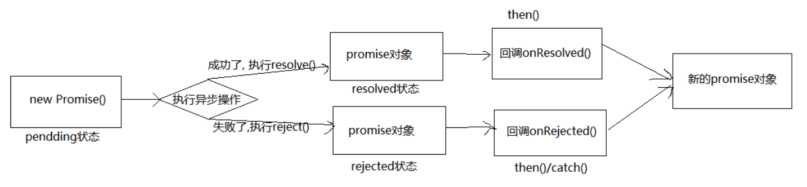

## Promise的状态——PromiseState

Promise实例对象中的一个属性 『`PromiseState`』

* `pending`  未决定的
* `resolved` / `fullfilled`  成功
* `rejected`  失败

### promise 的状态改变
1. `pending` 变为 `resolved`
2. `pending` 变为 `rejected`
说明: 只有这 2 种, 且一个 `promise` 对象只能改变一次
无论变为成功还是失败, 都会有一个结果数据 成功的结果数据一般称为 `value`, 失败的结果数据一般称为 `reason`

## Promise的结果数据——PromiseResult

Promise实例对象中的另一个属性 『`PromiseResult`』

PromiseResult属性中保存的是异步任务『成功或失败』的结果。

* 成功的结果数据一般称为 `value`
* 失败的结果数据一般称为 `reason`

谁可以来修改这个属性的值呢？有两个函数可以修改这个属性的值。
* resolve
* reject 
这两个函数是可以对 `promise` 实例对象的结果数据进行赋值修改的。

## promise 的基本流程
