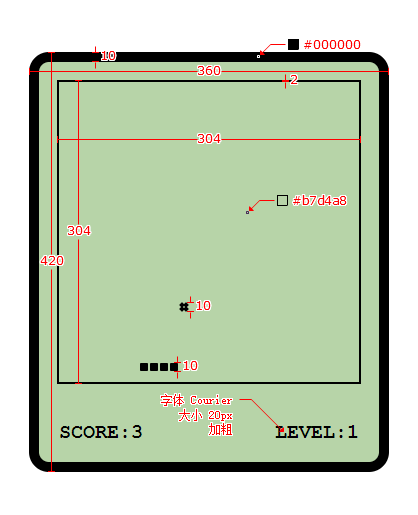

## 初始化项目结构
```bash
├── snake
│   ├── src
│   │    ├── index.html
│   │    ├── index.ts
│   │    └── style
│   │          └── index.less
│   ├── webpack.config.js
│   ├── tsconfig.json
│   └── package.json
```
### webpack.config.js
```js
const path = require('path'); // 引入path模块
const HTMLWebpackPlugin = require('html-webpack-plugin'); // 引入html-webpack-plugin：用来打包html文件
const {CleanWebpackPlugin} = require('clean-webpack-plugin'); // 引入clean-webpack-plugin：用来清除dist目录

const isProduction = process.env.NODE_ENV === "production";

// webpack中的所有的配置信息都应该写在module.exports中
module.exports = {
    entry: './src/index.ts', // 指定入口文件
    // 指定打包文件所在目录
    output: {
        // 指定打包文件的目录
        path: path.resolve(__dirname, 'dist'),
        // 打包后文件的文件
        filename: 'bundle.js',
        // webpack打包出来的文件会自动生成这个箭头函数:(()=>{var t={巴拉巴拉的}}，这个最开头的箭头函数是不经过babel处理的
        // 但是ie11不支持箭头函数，所以会报错
        // 所以需要告诉webpack不使用箭头函数
        environment: {
            arrowFunction: false, // 不使用箭头函数，会使用es5的function函数
            const: false, // 不使用const，会使用var
        },
    },
    module: {
        // 指定要加载的规则:loader们
        rules: [
            {
                // test指定的是规则生效的文件：通过这个正则来匹配文件
                test: /\.ts$/,
                // 要使用的loader
                use: [
                    // 配置babel
                    {
                        loader: 'babel-loader',
                        // 设置babel
                        options: {
                            // 预设：指示babel做怎样的兼容性处理
                            presets: [
                                [
                                    '@babel/preset-env',
                                    {
                                        targets: {
                                            // 要兼容的目标浏览器
                                            chrome: '58',
                                            ie: '11',
                                        },
                                        corejs: '3', // 指定corejs的版本
                                        useBuiltIns: 'usage', // 使用corejs的方式: "usage" 表示按需加载
                                    },
                                ],
                            ],
                        },
                    },
                    'ts-loader', // 用来处理ts文件
                ],
                // 要排除的文件
                exclude: /node-modules/,
            },
            // 设置less文件的处理
            { 
                test: /\.less$/,
                use: [
                    'style-loader', // 创建style标签，将js中的样式资源插入进行，添加到head中生效
                    'css-loader', // 将css文件变成commonjs模块加载到js中，里面内容是样式字符串
                    // 需要下载postcss-loader和postcss
                    {
                        loader: 'postcss-loader',
                        options: {
                            postcssOptions: {
                                plugins: [
                                    [

                                        'postcss-preset-env',
                                        {
                                            // 兼容最新的两个版本
                                            browsers: 'last 2 versions',
                                        },
                                    ],
                                ],
                            },
                        },
                    },
                    // 将less文件编译成css文件
                    // 需要下载less-loader和less
                    'less-loader',
                ],
            },
        ],
    },
    // 配置Webpack插件
    plugins: [
        new CleanWebpackPlugin(), // 每次打包前清除dist目录
        new HTMLWebpackPlugin({
            // 用来打包html文件
            // title: "这是一个自定义的title"
            template: './src/index.html', // 指定模板文件
        }),
    ],
    // devtool: 'inline-source-map', // 用来设置调试模式，这里是内联模式，还有其他模式：https://www.webpackjs.com/configuration/devtool/
    resolve: {
        // 用来设置引入模块时的文件后缀名
        extensions: ['.ts', '.js'],
    },
    mode: isProduction ? "production" : "development", // 模式配置
    // 开发服务器配置
    devServer: {
        host: "localhost", // 服务器的ip地址
        port: 3001, // 服务器的端口号
        open: true, // 自动打开浏览器
        hot: true, // 开启热更新，需要注意的是，这里的热更新是指css的热更新，js的热更新需要在plugins中配置react-refresh-webpack-plugin这个插件
        historyApiFallback: true, // 解决单页应用路由刷新404问题
    },
};
```

### package.json
```json
{
  "name": "snake",
  "version": "1.0.0",
  "description": "",
  "main": "index.js",
  "scripts": {
    "test": "echo \"Error: no test specified\" && exit 1",
    "start": "npm run dev",
    "dev": "cross-env NODE_ENV=development webpack serve --config webpack.config.js",
    "build": "cross-env NODE_ENV=production webpack --config webpack.config.js"
  },
  "keywords": [],
  "author": "",
  "license": "ISC",
  "devDependencies": {
    "@babel/core": "^7.20.12",
    "@babel/preset-env": "^7.20.2",
    "babel-loader": "^9.1.2",
    "clean-webpack-plugin": "^4.0.0",
    "core-js": "^3.27.2",
    "cross-env": "^7.0.3",
    "css-loader": "^6.7.3",
    "less": "^4.1.3",
    "less-loader": "^11.1.0",
    "postcss-loader": "^7.0.2",
    "postcss-preset-env": "^8.0.1",
    "style-loader": "^3.3.1",
    "ts-loader": "^9.4.2",
    "typescript": "^4.9.5",
    "webpack": "^5.75.0",
    "webpack-cli": "^5.0.1",
    "webpack-dev-server": "^4.11.1"
  }
}
```

### tsConfig.json
```json
{
    "compilerOptions": {
      "target": "ES2015", // 指定编译后的版本
      "module": "ES2015", // 指定编译后的模块化方案
      "strict": true, // 开启严格模式
      "noEmitOnError": true // 编译错误时不生成js文件
    }
}
```

## 游戏整体设计图
