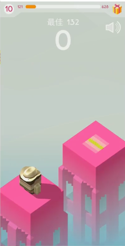

## 1. 架木板核心玩法介绍



有点类似于微信的跳一跳。

### a.独立开发者如何获取素材和资源
通过爬取别人apk里面的资源弄出来。

### b.如何找游戏

七麦数据：把各国畅销榜的游戏列出。
- .ipa（苹果）
- 谷歌商店：apk （安卓）

这个游戏是用什么游戏引擎做的？
- 大部分游戏是Unity做的
- AssetStudioGUI.exe ： 3D模型(fbx文件)、字体、声音、UI、Shader能抓出来

### c.架木板的逻辑
生成楼宇 ——> 按住屏幕 ——> 木板生长 ——> 手指离开屏幕后 ——> 木板倒下
- ——> 如果木板的长度够 ——> 就能走到下一个楼宇
- ——> 如果木板的长度不够 ——> 那么游戏结束

## 游戏引擎和项目代码框架介绍

### 1. 目录结构
```bash
├── assets
│    ├── Res     #存放资源
│    ├── Scenes  #存放场景文件
│    └── Scripts #脚本代码
├── internal     # 引擎内部的资源（只能使用，不能修改）
│    ├── webpack.config.js
│    ├── tsconfig.json
│    └── package.json
```

### 2. 开发思想

组件化代码开发：开发组件给引擎使用，使用引擎已经给我们写好的组件

1. 新建一个组件类，被引擎识别
2. new一个组件类的实例，给挂到节点上：**为什么我们要new到节点上呢？不单独new组件实例呢？**
3. 分析一下，游戏引擎如何调用我们写的代码，拿到写代码的入口，基于入口，插入我们的代码
    运行游戏场景 ——> 从游戏场景中找到我节点 ——> 从节点上找到每个组件的实例
    规定：
        - 开始运行之前：`组件实例.start`（start里的this指向谁？指向组件实例）
        - 每次页面刷新的时候：`组件实例.update`

### 3. Ts脚本代码说明

```ts
// _decorator类：注解集合
// Component类：组件类的基类
// Node类：节点类
// 三维向量：vec2
// 二维向量：vec3
// 四元数：Quat
// CanvasComponent类：画布组件类
import { _decorator, Component, Node, Vec2, Vec3, Quat, CanvasComponent } from 'cc'; // 从引擎里面导入你要用的类型

// ccclass: 注解了一个类，这个类就是一个组件类，可以挂载到节点上面去
// property: 注解了一个数据成员，这个数据成员就可以在编辑器里面进行编辑
// @表示注解开头，后面跟着注解的名字，后面跟着括号，括号里面是注解的参数
const { ccclass, property } = _decorator; // 从引擎里面导入你要用的注解

// 注解了GameMgr类，这个类就是一个组件类，可以挂载到节点上面去
@ccclass('GameMgr')

// 定义一个GameMgr类，这个类继承自Component基类
// export: 导出这个类，这样别的脚本就可以使用这个类了，其他类使用时，需要import导入
export class GameMgr extends Component {
    // 如何定义一个数据成员:Ts语法
    // 权限 变量名:变量类型 = 初始值;
    @property // 注解了isDebug这个数据成员，isDebug就会在编辑器里面可以进行勾选编辑
    private isDebug : boolean = true; // 是否是调试模式

    // 如何定义一个方法:Ts语法
    // 权限 方法名(参数名：参数类型, ...):返回值类型 { 方法体 }
    // 权限默认是public
    public foo(lhs: number, rhs: number): number {
        return lhs + rhs;
    }

    // 生命周期函数start：当这个组件第一次被激活的时候调用 
    start() { 
        console.log('GameMgr start');
        // this指向当前组件实例
        // this.node: 这个组件实例所挂载的节点
    }

    // 生命周期函数update：每帧(每次画面刷新的时候)调用一次
    // deltaTime: 每帧的时间间隔，单位是秒，这个时间间隔是引擎自动计算的
    // 可以利用这个时间间隔来迭代一些动画
    // 比如有一个物体，每秒钟移动100个单位，那么每帧移动100*deltaTime个单位
    update(deltaTime: number) { 
        console.log('GameMgr update');
    }
}
```