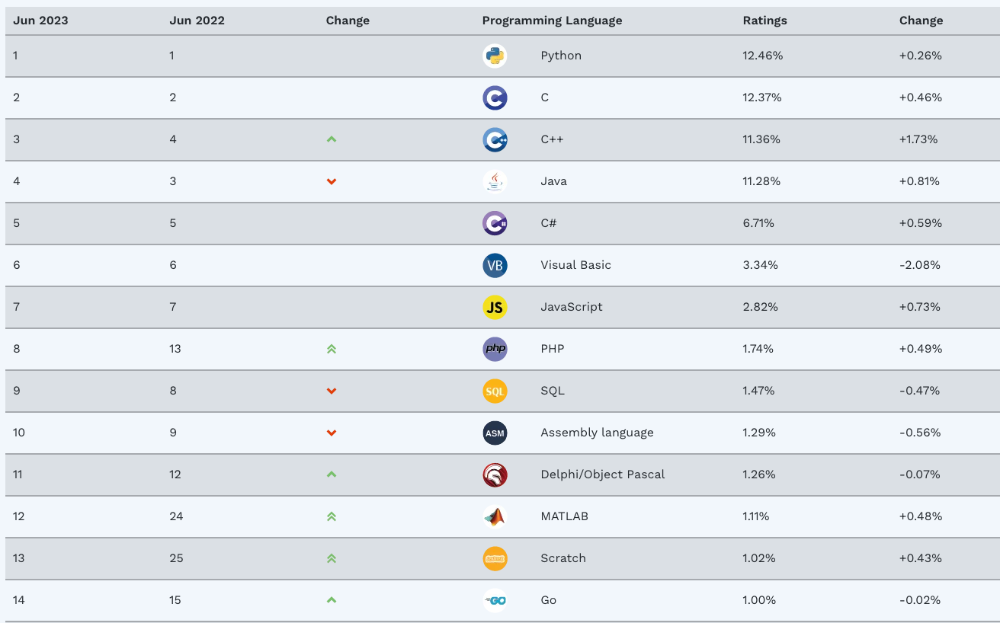

## 1. Python的热度

世界上的编程语⾔有600多种，但真正大家主流在使用的最多⼆三⼗种，不同的语言有⾃⼰的特点和擅长领域，随着计算机的不断发展，新语言在不断诞生，也同时有很多老旧的语⾔慢⽆人⽤了。有个权威的[语⾔言排名网站](https://www.tiobe.com/tiobe-index/)，可以看到主流的编程语⾔是哪些. 

> 上图是2023/06/16的数据

评判⼀个编程语言的优劣有多种维度， ⼀般包括“开发效率”、“学习曲线”、“⽣态圈”、"运⾏速度"等， Python在“开发效率”、“学习曲线”、“⽣态圈”这3个维度上可以说是稳拿第一了。

- 开发效率——由于语法简洁明了了，⼜又有丰富的、现成的各种模块库，开发什什么功能都不不⽤用重新造轮⼦子， 直接在前辈的写好的代码基础上扩展即可，⼤大⼤大提⾼高开发效率。
- 学习曲线——Python算是最适合⼩小⽩白上⼿手的语⾔言了了。 很多⼈人觉得计算机难学，是因为⼀一开始就没选对 语⾔言，你⼀一上来就搞C\C++\Java啥的，那指针呀、链表呀、⾯面向对象呀就够你喝喝⼀一壶的。 ⽽而学Python 符合⼈人性的学习曲线，由简⼊入繁，先易易后难。
- 生态圈——Python⾃自1989年年诞⽣生⾄至今30余年年，在IT技术的各个领域⽅方向都发展出强⼤大的⽣生态圈，在⼈人 ⼯工智能、数据分析、爬⾍虫开发、游戏开发、⾃自动化运维\测试、web开发、后端开发、科学运算、GUI编 程等⽅方⾯面均全⾯面开花，被称为编程界的瑞⼠士军⼑刀、万能语⾔言。
- 运行速度——Python 的运⾏行行速度相⽐比C语⾔言确实慢很多，跟JAVA相⽐比也要慢⼀一些，因此这也是很多所谓 的⼤大⽜牛不不屑于使⽤用Python的主要原因，但其实这⾥里里所指的运⾏行行速度慢在⼤大多数情况下⽤用户是⽆无法直接感 知到的，必须借助测试⼯工具才能体现出来，⽐比如你⽤用C运⼀一个程序花了了0.01s,⽤用Python是0.1s,这样C语 ⾔言直接⽐比Python快了了10倍,算是⾮非常夸张了了，但是你是⽆无法直接通过⾁肉眼感知的，因为⼀一个正常⼈人所能 感知的时间最⼩小单位是0.15-0.4s左右，哈哈。其实在⼤大多数情况下Python已经完全可以满⾜足你对程序速度的要求，除⾮非你要写对速度要求极⾼高的搜索引擎、⽹网络游戏等，这种情况下，当然还是建议你⽤用C 去实现的。

综上原因，导致Python必⽕火⽆无疑。

## 2. Python的应⽤领域

1. WEB开发——最⽕火的Python web框架Django, ⽀支持异步⾼高并发的Tornado框架，短⼩小精悍的 flask,bottle, Django官⽅方的标语把Django定义为the framework for perfectionist with deadlines(⼤大意是⼀一个为完全主义者开发的⾼高效率web框架)
2. ⽹网络编程——⽀支持⾼高并发的Twisted⽹网络框架， py3引⼊入的asyncio使异步编程变的⾮非常简单
3. 爬⾍虫——爬⾍虫领域，Python⼏几乎是霸主地位，Scrapy\Request\BeautifuSoap\urllib等，想爬啥就
爬啥
4. 云计算——⽬目前最⽕火最知名的云计算框架就是OpenStack,Python现在的⽕火，很⼤大⼀一部分就是因为
云计算
5. ⼈工智能、数据分析——Python是⽬前公认的⼈工智能和数据分析领域的必备语言
6. 自动化运维——运维人员必须会的语⾔是什么? 10个人相信会给你一个相同的答案，它的名字叫Python。知名的运维⼯具Ansible\Saltstack都是Python写的
7. ⾦融分析——我个⼈人之前在⾦金金融⾏行行业，10年年的时候，我们公司写的好多分析程序、⾼高频交易易软件
就是⽤用的Python,到⽬目前,Python是⾦金金融分析、量量化交易易领域⾥里里⽤用的最多的语⾔言
8. 科学运算——97年年开始，NASA就在⼤大量量使⽤用Python在进⾏行行各种复杂的科学运算，随着NumPy, SciPy, Matplotlib, Enthought librarys等众多程序库的开发，使的Python越来越适合于做科学计
算、绘制⾼高质量量的2D和3D图像。和科学计算领域最流⾏行行的商业软件Matlab相⽐比，Python是⼀一⻔门
通⽤用的程序设计语⾔言，⽐比Matlab所采⽤用的脚本语⾔言的应⽤用范围更更⼴广泛
9. 游戏开发——在⽹网络游戏开发中Python也有很多应⽤用。⽐比如知名的游戏<⽂文明>、⽹网易易公司的《⼤大
话⻄西游》 就是⽤用Python写的