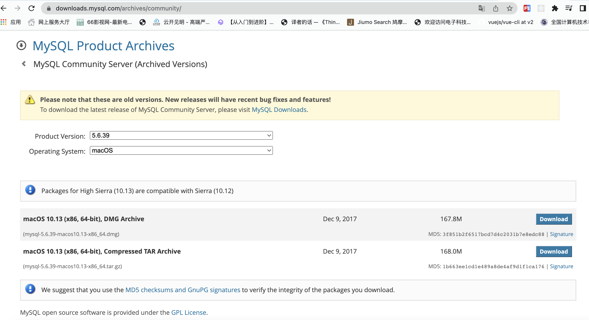
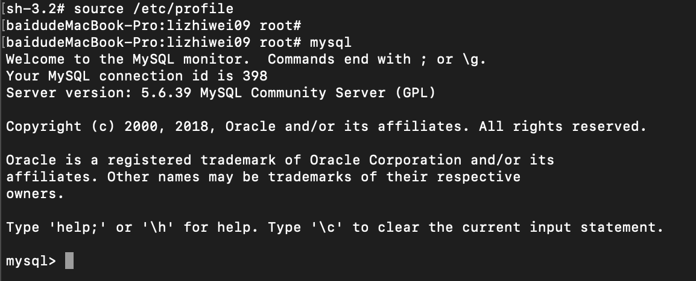
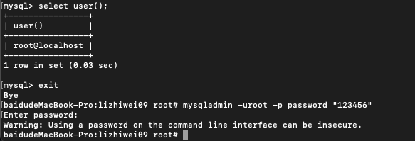
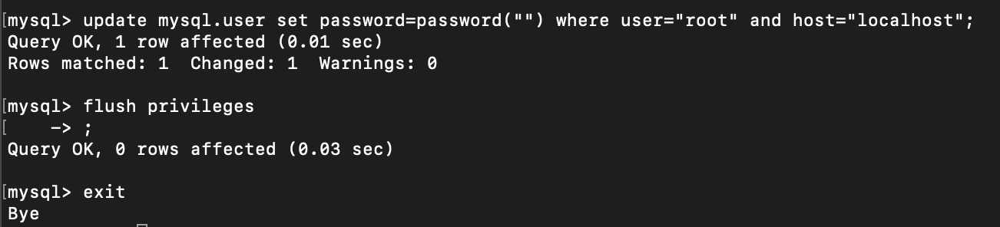
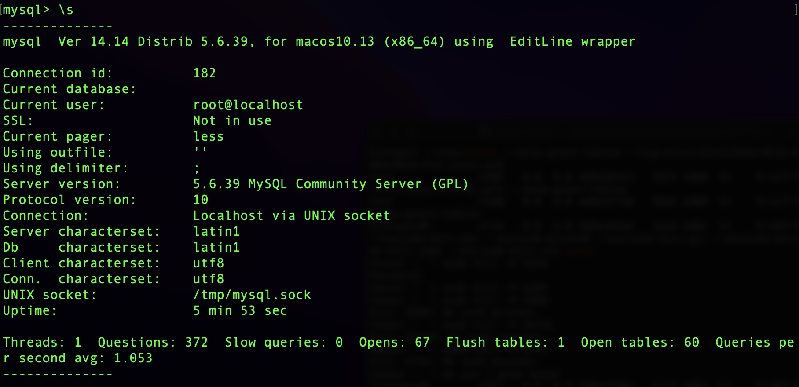
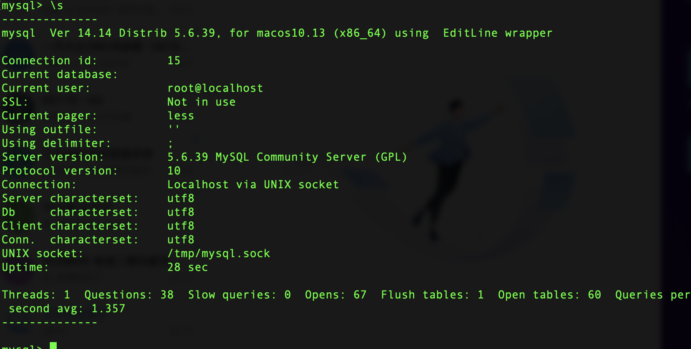

本文介绍Mac和Windows两种系统的安装方式

## Mac系统

1. 官网下载安装包：[MySQL :: Download MySQL Community Server](https://dev.mysql.com/downloads/mysql/)
> 备注：可以选择历史版本，这里选择5.6.39版本 
> 
2. 选择下载.dmg安装包，双击安装，傻瓜操作。
3. 配置环境变量：在命令行输入`export PATH=$PATH:/usr/local/mysql/bin` 即可，如果不成功，前面加上sudo再执行
4. 然后输入`mysql`即可进入mysql命令行
    - 
5. 输入`exit`退出mysql命令行

### Mac下为MySQL设置密码

初始状态时，我们在命令行输入`mysql`直接就进入了mysql命令行，这是因为我们的mysql是没有密码的。

在mysql命令行下，输入`select user()`查看当前是以什么用户登录的，我们可以看到是以root用户登录的。root用户没有密码是一件非常危险的事情，所以我们需要为其设置密码。

1. 退出mysql命令行
2. 输入`mysqladmin -uroot -p password "123456"`，其中123456是你要设置的密码
3. 之后，我们就需要输入密码才能进入mysql命令行了，输入`mysql -uroot -p`，然后输入密码即可进入mysql命令行



### 破解已设置密码的Mysql

当你忘记你本机的mysql-root用户的账号时，需要进行破解，就需要进行以下步骤：
1. 先去系统偏好设置——>mysql——>停掉mysql服务
2. 再用跳过授权表的方式，在命令行启动mysql：`mysqld_safe --skip-grant-tables`
3. 再开启一个终端，输入`mysql -uroot -p`，发现不用密码就可以进入了
4. 在mysql命令行才，输入`update mysql.user set password=password("") where user="root" and host="localhost";`
5. 再输入`flush privileges;`
6. 最后输入`exit`退出mysql命令行，即生效

7. 然后需要杀死这个通过跳过授权表的方式启动的mysql服务，输入`ps aux | grep mysql`，找到对应的进程号，然后输入`sudo kill -9 进程号`，即可杀死该进程
8. 然后再去系统偏好设置——>mysql——>启动mysql服务
9. 这个时候你在命令行里输入`mysql -uroot -p`，发现密码已经不需要了，因为刚刚已经设为了""空密码。

### 统一字符编码

1. 首先，我们进入mysql命令行下，输入`\s`，可以看到如下图：
    - 
    - 发现字符编码并不统一
2. 我们需要新建一个`/etc/my.cnf`文件，并添加如下内容：
    ```shell
    [mysqld]
    character-set-server=utf8
    collation-server=utf8_general_ci
    [client]
    default-character-set=utf8
    [mysql]
    default-character-set=utf8
    ```
    - 保存退出
    - 重启mysql服务, `sudo /usr/local/mysql/support-files/mysql.server restart`
    - 再进入mysql命令行，输入`\s`查看，可以看到字符编码已经统一
    - 

## Windows系统