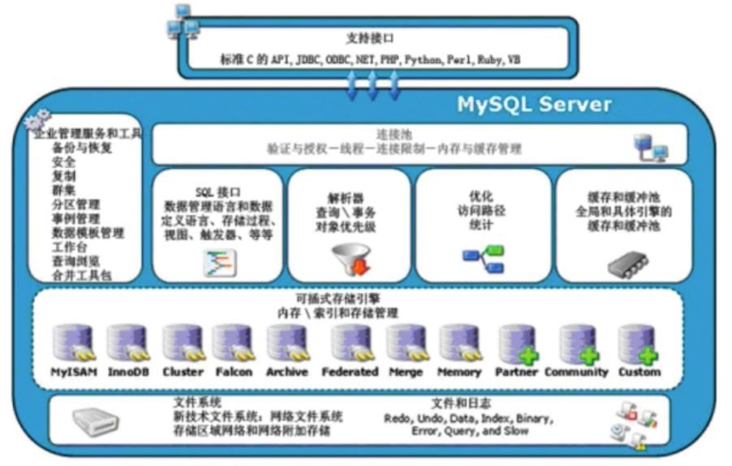
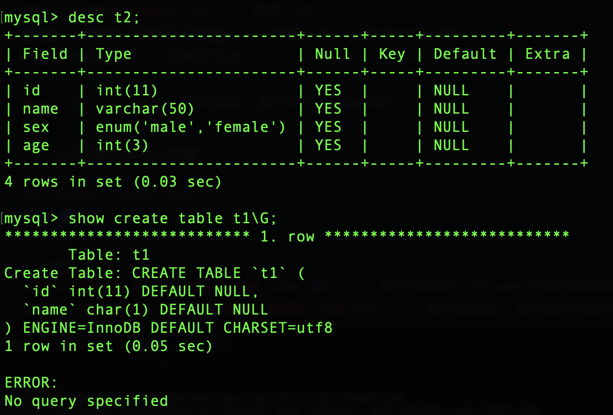
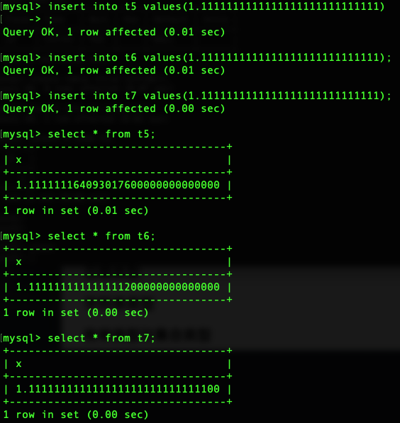

SQL语言主要用于存取数据、查询数据、更新数据和管理关系数据库系统，SQL语言由IBM开发。
SQL语言分为3种类型：
1. DDL（Data Definition Language）：数据定义语言，用于定义数据库对象：库、表、列等。关键字：create、drop、alter等。
2. DML（Data Manipulation Language）：数据操作语言，用于对数据库中表的数据进行增、删、改、查。关键字：insert、delete、update、select。
3. DCL（Data Control Language）：数据控制语言，用于定义数据库的访问权限和安全级别，及创建用户。关键字：grant、revoke等。

## 一、库
### 1.系统数据库
- information_schema：虚拟库，不占用磁盘空间，存储的是数据库启动后的一些参数，如用户表信息、列信息、权限信息、字符信息等。
- performance_schema：MySQL 5.5版本后新增的一个数据库：主要用于收集数据库服务器性能参数，记录处理查询请求时发生的各种事件、锁等现象
- mysql：授权库，主要存储系统用户的权限信息
- test：Mysql数据库系统自带的测试库，一般用于测试
### 2.库的操作
#### 增加库
1. 语法：`create database 库名 charset 字符集;`
2. 命名规则：
    - 可以由字母、数字、下划线、@、#、$
    - 区分大小写
    - 不能单独使用数字
    - 不能是MySQL的关键字：如select、insert、update等
    - 唯一性：库名不能重复
    - 最长128位
```sql
create database db1 charset utf8; -- 创建库：库名为db1，字符集为utf8
```
#### 查看库
```sql
show create database db1; -- 查看db1库,包括字符集/排序规则等
show databases; -- 查看所有库
```
#### 修改库
一般来说，对库的修改只是修改它的字符集。
```sql
alter database db1 charset gbk; -- 修改库的字符集为gbk
```
#### 删除库
```sql
drop database db1; -- 删除名为db1的库
```
## 二、表

### 1.存储引擎

mysql中建立的库——>文件夹
库中建立的表——>文件

现实生活中我们用来存储数据的文件有不同的类型，每种文件类型对应各自不同的处理机制：比如处理文本用txt类型、处理表格用excel、处理图片用png等。

数据库中的表也应该有不同的类型，表的类型不同，会对应mysql不同的存取机制，表类型又称为存储引擎。

存储引擎说白了就是如何存储数据、如何为存储的数据建立索引和如何更新、查询数据等技术的实现方法。因为在关系型数据库中数据的存储是以表的形式存储的，所以存储引擎也可以称为表类型（即存储和操作此表的类型）

在Oracle和SQL Server等数据库中只有一种存储引擎，所有数据存储管理机制都是一样的。而Mysql数据库提供了多种存储引擎。用户可以根据不同的需求为数据表选择不同的存储引擎，用户也可以根据自己的需要编写自己的存储引擎。



SQL解析器、SQL优化器、缓冲池、存储引擎等组件在每个数据库中都存在，但不是每个数据库都有那么多存储引擎。MySQL的插件式存储引擎可以让存储引擎层的开发人员设计他们希望的存储层，例如，有的应用需要满足事务的要求，有的应用则不需要对事务有这么强的要求；有的希望数据能持久存储，有的只希望放在内存中，临时并快速地提供对数据的查询。

### 2.Mysql支持的存储引擎

```sql
show engines; -- 查看mysql支持的存储引擎
show variables like 'storage_engine'; -- 查看mysql正在使用的存储引擎
```
对于MySQL来说，`show variables like 'storage_engine';`显示的就是InnoDB存储引擎。
> 所谓指定表的类型，就是指定表的存储引擎，默认是InnoDB。
```sql
create table t1(id int, name char); -- 创建表：表名为t1，字段有id(类型为int)和name(类型为char) --不写engine时，默认存储引擎为InnoDB
create table t2(id int, name char) engine=innodb; --指定存储引擎为InnoDB
create table t3(id int, name char) engine=memory; --指定存储引擎为memory，即内存，创建出的表数据不会放在磁盘上（文件夹中的db表目录里看不到这个表），而是放在内存中，当数据库重启后，表中的数据就会丢失
create table t4(id int, name char) engine=blackhole; --指定存储引擎为blackhole，blackhole存储引擎的特点是：写入的数据会被丢弃，但是select操作可以正常执行
create table t5(id int, name char) engine=myisam; --指定存储引擎为myisam，myisam存储引擎的特点是：不支持事务，但是支持全文索引
```
### 3.表的增删改查
#### 什么是表

表<=>文件，表中的一条记录就相当于文件的一行内容，不同的是，表中的一条记录有对应的标题，称为表的字段。

| id   | name | age  | sex    |
| ---- | ---- | ---- | ------ |
| 1    | egon | 28   | male   |
| 2    | alex | 23   | female |
| 3    | Jone | 18   | female |
| 4    | Tom  | 34   | male   |

- 进入db1这个库：`use db1;` (前提是db1这个库已经存在)
- 查看当前所在库：`select database();`
#### 创建表

```sql
create table 表名(
    字段名1 字段类型1[(宽度) 约束条件],
    字段名2 字段类型2[(宽度) 约束条件],
    ...
    字段名n 字段类型n[(宽度) 约束条件],
);

--注意：
-- 1. 在同一张表中，字段名不能相同
-- 2. 宽度和约束条件可选
-- 3. 字段名和类型是必须的
```

```sql
create table t1(
    id int,
    name varchar(50),
    sex enum('male', 'female'),
    age int(3),
);
```
#### 查看表

```sql
show create table t1; -- 查看t1表
  -- 查看t1表，以竖线的形式展示
show tables; -- 查看所有表

desc t1; -- 查看t1表的结构，展示形式是表格的形式
```


#### 修改表**结构**

```bash
0. 修改存储引擎
    alter table 表名
        engine=存储引擎名;

1. 修改表名
    alter table 表名 
        rename 新表名; -- 将表名的修改为新表名

2. 增加字段
    alter table 表名
        add 字段名  字段类型[(宽度) 完整性约束条件…],
        add 字段名2 字段类型[(宽度) 完整性约束条件…];
    alter table 表名
        add 字段名3  字段类型[(宽度) 完整性约束条件…] first; -- 将字段名3添加到表的第一列
    alter table 表名
        add 字段名4  字段类型[(宽度) 完整性约束条件…] after 字段名; -- 将字段名4添加到指定字段的后面

3. 删除字段
    alter table 表名
        drop 字段名;

4. 修改字段
    alter table 表名
        modify 字段名 字段类型[(宽度) 完整性约束条件…]; -- 修改字段名的字段类型
    alter table 表名
        change 旧字段名 新字段名 旧字段类型[(宽度) 完整性约束条件…];
    alter table 表名
        change 旧字段名 新字段名 新字段类型[(宽度) 完整性约束条件…]; 
```
#### 复制表

```bash
1. 复制表结构 + 表记录 （key不会复制：主键、外键和索引）
mysql > create table new_t1 select * from t1; 
mysql > create table new_t2 select id,user from t2;

2. 只复制表结构
mysql > create table new_t3 like t3;
或
mysql > create table new_t3 select * from t3 where 1=2;
```
#### 删除表

```sql
drop table 表名;
```
### 4.字段类型

#### 数值类型

##### 1. 整数类型

- 整数类型：`tinyint`、`smallint`、`mediumint`、`int`、`bigint`
- 作用：存储年龄，等级，id，各种号码等

| 类型      | 存储空间 | 范围（有符号） | 范围（无符号） |
| --------- | -------- | -------------- | -------------- |
| tinyint   | 1字节，小整数值  | -128～127       | 0～255          |
| smallint  | 2字节，大整数值  | -32,768～32,767   | 0～65,535        |
| mediumint | 3字节，大整数值  | -8,388,608～8,388,607 | 0～16,777,215     |
| int或integer | 4字节，大整数值  | -2,147,483,648～2,147,483,647 | 0～4,294,967,295  |
| bigint    | 8字节，极大整数值 | -9,223,372,036,854,775,808～9,223,372,036,854,775,807 | 0～18,446,744,073,709,551,615 |

```sql
create table t1(id tinyint); -- 创建表t1，字段id的类型为tinyint
insert into t1 values(-129), (128); -- 插入数据：插入的数据超出了tinyint的范围，所以当你 select * from t1; 查看t1表的数据时，发现插入的数据并没有超出范围的数据，而是插入了tinyint的最大值和最小值：-128和127

create table t2(id tinyint unsigned); -- 创建表t2，字段id的类型为无符号的tinyint
insert into t2 values(-1), (256); -- 插入数据：插入的数据超出了tinyint的范围，所以当你 select * from t2; 查看t2表的数据时，发现插入的数据并没有超出范围的数据，而是插入了tinyint的最大值和最小值：0和255
```

::: warning
在创建表的时候，整型数据类型，后面如果加了宽度，如：
```sql
create table t1(id int(1)); -- 这种写法❌
```
这个宽度是无效的，这种写法是不可取的，这样写会让别人觉得你根本不懂mysql

如果你真的写了宽度，它表明的也不是存储的数据的宽度，而是显示的宽度，如：
```sql
create table t1(id int(5)); 
insert into t1 values(1); -- 插入数据：1
```
然后通过`select * from t1;`查看t1表的数据，发现显示的是：`00001`，这就是宽度的作用，它是用来控制显示的宽度的，而不是存储的宽度。

以int类型为例，如果你只是`create table t1(id int unsigned);`，没有指定显示宽度，通过`desc t1;`去查看，发现int默认有一个显示宽度是10，这个10是怎么来的呢？
因为，当int是无符号时，最大的数字是4,294,967,295，这个数字有10位，所以int类型的默认显示宽度是10。

综上，真的没必要去指定整数类型后面的宽度。
:::

##### 2. 浮点数类型
- 定点数类型：DEC/DECIMAL
- 浮点类型：FLOAT、DOUBLE
- 作用：存储薪资、身高、体重、价格等

| 类型      | 存储空间 | 范围（有符号） | 范围（无符号） | 写法 ｜
| --------- | -------- | -------------- | -------------- | ----- |
| float   | 4字节，单精度浮点数(**非准确**小数值，随着小数的增多，精度变得不准确)  | (-3.402,823,466 E+38 ～ -1.175,494,351 E-38), 0, (1.175,494,351 E-38 ～ 3.402,823,466 E+38) | 0, (1.175,494,351 E-38 ～ 3.402,823,466 E+38) | `float[(M,D)] [unsigned] [zerofill]`，其中m是数字总个数，d是小数点后个数。m最大值为255，d最大值为30 |
| double  | 8字节，双精度浮点数(**非准确**小数值，随着小数的增多，虽然比float精度高，但也会逐渐变得不准确) | (-1.797,693,134,862,315,7 E+308 ～ -2.225,073,858,507,201,4 E-308), 0, (2.225,073,858,507,201,4 E-308 ～ 1.797,693,134,862,315,7 E+308) | 0, (2.225,073,858,507,201,4 E-308 ～ 1.797,693,134,862,315,7 E+308) | `double[(M,D)] [unsigned] [zerofill]`，其中m是数字总个数，d是小数点后个数。m最大值为255，d最大值为30 |
| decimal | 对 decimal(M,D)，如果M>D，为M+2，否则为D+2， **准确的**小数值，哪怕小数增多，一样精确，需要精确数值计算时就用此类型，它之所以精确是因为它是按字符串存储的 | 依赖于M和D的值 | 依赖于M和D的值 | `decimal[(M,D)] [unsigned] [zerofill]`，其中m是数字总个数（负号不算），d是小数点后个数。m最大值为65，d最大值为30。

::: tip
我们通过以上三种类型创建表t5、t6、t7:
```sql
create table t5(x float(255,30));
create table t6(x double(255,30));
create table t7(x decimal(65,30));
```
然后，向他们插入同一个数据`1.11111111111111111111111111`，观察下图，他们存储的区别：**double比float精度高，decimal完全精确**


:::

#### 日期类型

我们以一个需求引出日期类型的说明。你需要创建一张学生表，记录学号id、学生姓名、出生年、出生日期、上课时间、注册时间等信息。我们应这么写：

```sql
create table student(
    id int,
    name char(6),
    birth_year year,
    birth_date date,
    class_time time,
    register_time datetime
);
-- 为了让大家更好的看清楚year、date、time、datetime的区别，我们插入一条数据
insert into student values(1, 'egon', now(), now(), now(), now());
-- 通过 select * from student查看表情况
+------+------+------------+------------+------------+---------------------+
| id   | name | birth_year | birth_date | class_time | register_time       |
+------+------+------------+------------+------------+---------------------+
|    1 | egon |       2023 | 2023-08-01 | 17:00:44   | 2023-08-01 17:00:44 |
+------+------+------------+------------+------------+---------------------+
```
- year：YYYY
- date：YYYY-MM-DD
- time：HH:MM:SS
- datetime：YYYY-MM-DD HH:MM:SS
- timestamp：YYYY-MM-DD HH:MM:SS

::: tip
**datetime与timestamp的区别**

在实际应用的很多场景中，MySQL的这两种日期类型都能满足我们的需要，存储精度都为秒，但在某些情况下，会展现出各自的优劣。以下就是一些区别：
1. datatime的日期范围是`1000-01-01 00:00:00`到`9999-12-31 23:59:59`，timestamp的日期范围是`1970-01-01 00:00:01`到`2038-01-19 03:14:07`，所以timestamp的时间范围要小于datetime的时间范围。
2. datatime的存储时间与时区无关，timestamp存储时间与时区有关，显示的值也依赖于时区。在mysql服务器，操作系统以及客户端连接都有时区的设置。
3. datatime使用8字节的存储空间，timestamp使用4字节的存储空间。因此，timestamp比datetime的空间利用率更高。
4. datatime的默认值是`NULL`，timestamp的默认值是`CURRENT_TIMESTAMP`（当前时间），如果不做特殊处理，并且update语句中没有指定该列的更新值，则默认更新为当前时间。
:::

#### 字符串类型

#### 枚举类型与集合类型
## 三、表记录

> 首先需要有一张表，比如t1表，然后才能对表记录进行操作。

#### 新增表记录

```sql	
insert t1(id,name) values(1,'egon1'),(2,'egon2'),(3,'egon3');
-- 插入表记录：向t1表中插入3条记录，分别是：
--    id为1，name为egon1；
--    id为2，name为egon2；
--    id为3，name为egon3;
```

#### 查看表记录

```sql
select id,name from db1.t1; -- 查看t1表的id和name字段
select * from db1.t1; -- 查看t1表的所有字段
```

#### 修改表记录

```sql
update db1.t1 set name='EGON'; -- 将t1表中所有记录的name字段修改为EGON
update db1.t1 set name='ALEX' where id=2;
```

#### 删除表记录

```sql
delete from t1; -- 删除t1表中所有记录
delete from t1 where id=2; -- 删除t1表中id为2的记录
```