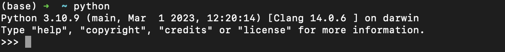
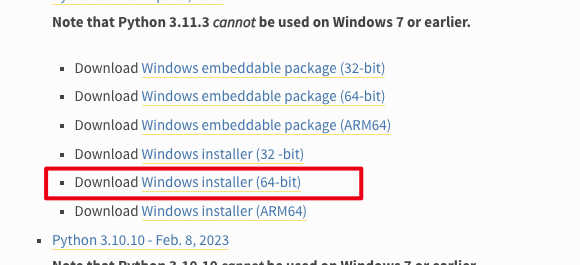
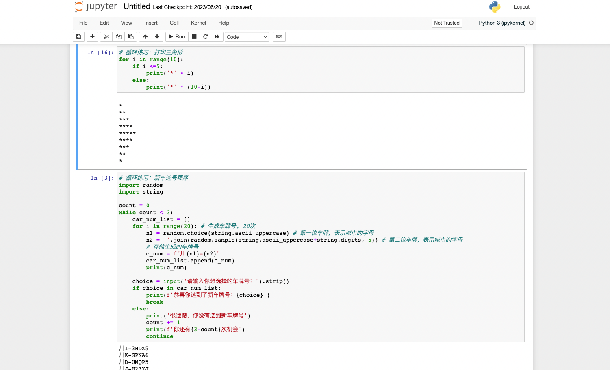
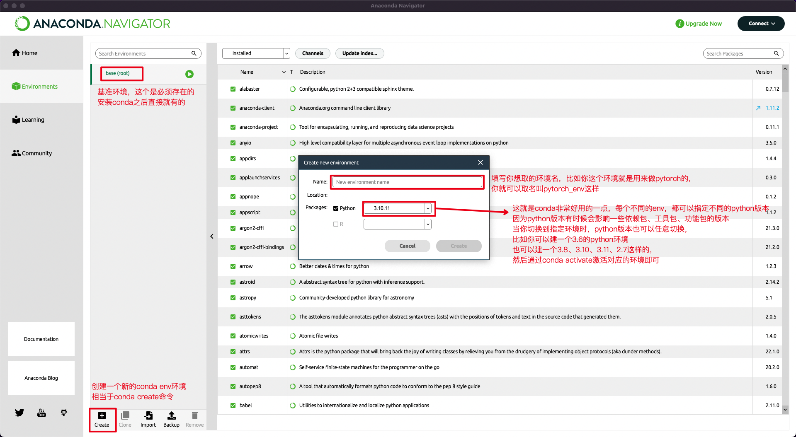
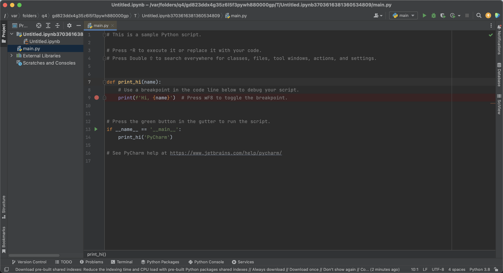
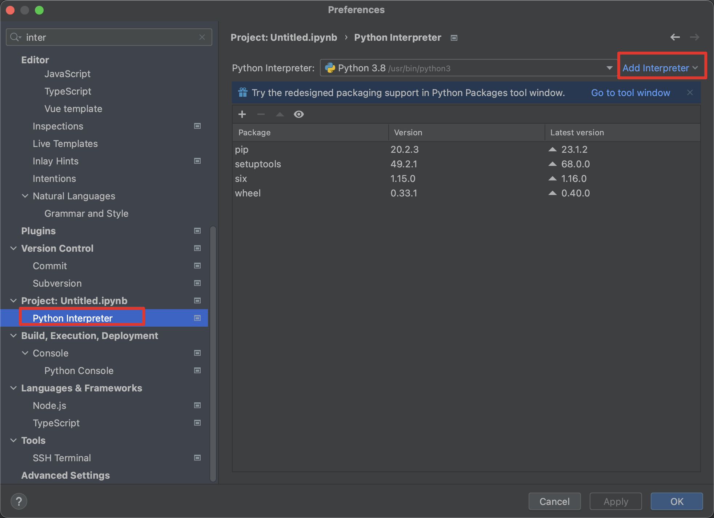
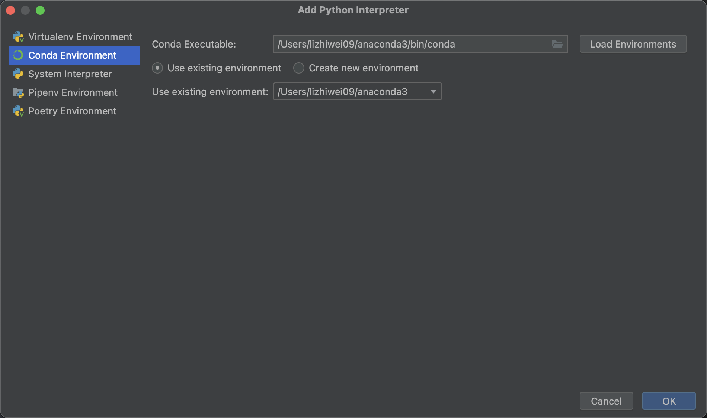
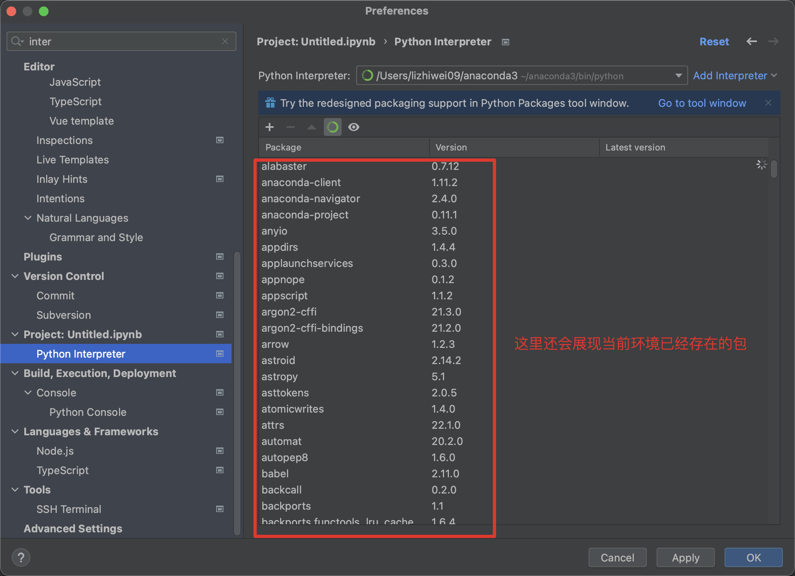

本文讲述最轻松、最好管理的Python环境搭建与开发工具科普！

## 一、Python环境

### Mac电脑

mac系统自带python环境，在命令行输入python或python3即可直接进入python命令行交互模式

1. 但往往自带的不是最新的python，你可以去[官网](https://www.python.org/downloads/macos/)下载你想要的版本
2. 下载之后，mac电脑也无需配置环境变量，命令行输入python，会发现已经更新成了你安装的版本。



### Windows电脑

Windows电脑必须要去[官网](https://www.python.org/downloads/windows/) 安装



根据你的电脑情况选择合适版本的Python包安装。安装后往往还需要配置环境变量。环境变量需要添加以下几个路径：

1. python安装的文件夹
2. python安装的文件夹/Scripts

------

但这只是最基础的Python环境配置方式，如果你是想用纯python去做一些简单的开发，这样就够了，然后最多再用python装一个pip包管理工具（一般来说装完python会有pip的）：

```bash
python -m ensurepip --default-pip

pip --version # 查看是否具有该工具，并查看版本，mac版本
pip -V # windows版本
```

接下来我们就隆重介绍Anaconda，一个软件搞定所有，也无需我们到Python官网去选择具体的Python版本安装。

## 二、Anaconda

### 简介

Anaconda是一个开源的Python和R编程语言的发行版，旨在提供一个简单且强大的工具集，用于科学计算、数据分析和机器学习。它是由Anaconda公司开发并维护的，是一个集成的软件包管理系统和环境管理器。

Anaconda的主要特点包括以下几个方面：

1. **包管理系统**：Anaconda使用名为**Conda**的包管理系统，它可以方便地安装、更新和管理数千个开源软件包。Conda具有解决依赖关系的能力，可以确保安装的软件包之间的兼容性，简化了环境配置和依赖管理的过程。
2. **虚拟环境**：Anaconda允许用户创建和管理虚拟环境，这样可以在不同的项目中隔离和管理不同的软件包和依赖关系。这对于确保项目之间的独立性和稳定性非常有用，使得不同项目可以使用不同版本的软件包而不会相互干扰。
3. **强大的工具生态系统**：Anaconda包含了众多流行的科学计算、数据分析和机器学习库，如NumPy、Pandas、Matplotlib、SciPy、scikit-learn等。这些库提供了丰富的功能和算法，可以满足从数据处理和分析到机器学习和深度学习的各种需求。
4. **交互式开发环境**：Anaconda集成了Jupyter Notebook，这是一个交互式的计算环境，允许用户编写和运行代码、展示数据可视化结果，并添加文本和图像等说明性内容。Jupyter Notebook使得数据分析和实验变得更加直观和可交互，有助于快速迭代和探索数据。这个Jupyter NoteBook我吹爆！！！



1. **跨平台支持**：Anaconda可在Windows、Mac和Linux等主要操作系统上运行，提供了跨平台的一致性体验。这使得用户可以在不同的操作系统上共享代码和项目，并方便地迁移和部署开发环境。

总体而言，Anaconda是一个功能丰富、易于使用和高度可定制的科学计算和数据分析平台。它的包管理系统、虚拟环境支持和强大的工具生态系统使得数据科学从业者能够更加高效地开展工作，并能够快速构建和部署复杂的分析和机器学习应用。

### Conda基本配置过程

1. **安装Anaconda**：首先，您需要下载并安装Anaconda发行版，可以从Anaconda官方网站（https://www.anaconda.com）下载适用于您操作系统的安装程序。
2. **配置环境变量（可选）**：在Windows系统上，安装完成后，默认情况下会自动将Anaconda添加到系统的环境变量中，这样您可以在命令行中直接使用Conda命令。在其他操作系统上，您可能需要手动配置环境变量，以便能够全局访问Conda。
3. **更新Conda**：在使用Conda之前，建议先更新Conda本身以及其基础组件。打开命令行终端（Windows下为Anaconda Prompt或PowerShell，Linux和Mac下为终端），运行以下命令：

```shell
conda update conda # 这将会更新Conda到最新版本。
```

1. **创建虚拟环境**（可选）：虚拟环境可以帮助您隔离不同项目的依赖关系。要创建一个新的虚拟环境，运行以下命令：

```shell
conda create --name myenv python=3.9 # 创建一个名为myenv的新环境。您可以将myenv替换为您喜欢的环境名称。并且这个环境的python版本是python3.9
```

1. **激活虚拟环境**：创建虚拟环境后，需要激活它才能使用其中的软件包。在命令行中运行以下命令：

```shell
# 激活名为myenv的虚拟环境

Windows：conda activate myenv
Linux和Mac：source activate myenv 
```

可以通过运行`conda info --envs`命令来查看当前可用的环境列表。

1. **安装软件包**：在激活虚拟环境后，您可以使用Conda来安装所需的软件包。例如，要安装NumPy：

```bash
conda install numpy
```

Conda将会自动解决依赖关系，并安装NumPy及其所需的其他软件包。

1. **退出虚拟环境**：在完成工作后，您可以退出当前的虚拟环境。在命令行中运行以下命令：

```shell
Windows：conda deactivate
Linux和Mac：source deactivate
```

- 这将使您返回到默认的基础环境(base)。

这些是Conda的基本配置过程，您可以根据需要创建和管理多个虚拟环境，并使用Conda来安装和管理所需的软件包。这样可以使您的开发环境更加整洁和可管理。除此之外，我们安装了Anaconda之后，除了conda环境，还会有一个Anaconda Navigator软件，我们可以通过它，可视化配置env环境列表。



## 三、Pycharm

PyCharm是一款由JetBrains开发的集成开发环境（IDE），专门用于Python开发。它提供了一套强大的工具和功能，旨在提高开发者的生产力和效率。该软件是Python开发者的首选开发工具之一，美中不足的就是它的专业版是收费的，但是非专业版只支持纯python。



并且在Setting—> Python Interpreter中非常方便的配置我们刚刚已经介绍过的conda环境



