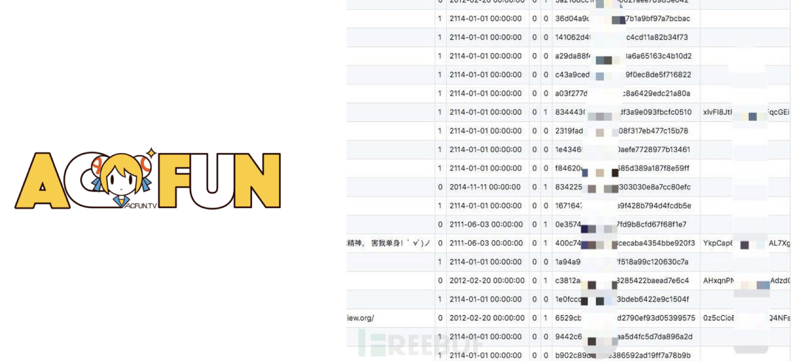
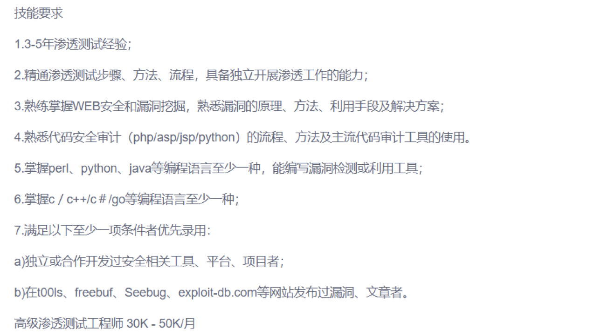
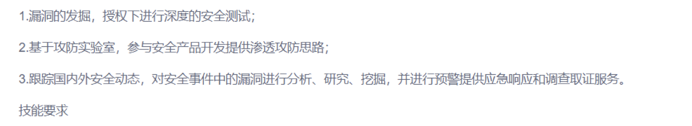
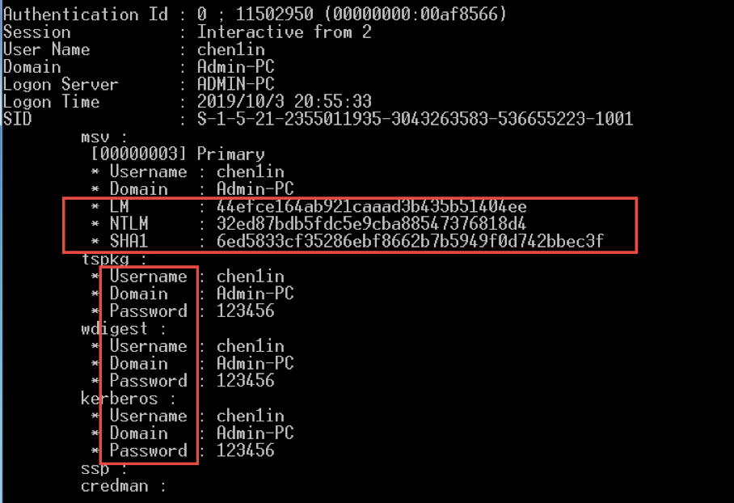
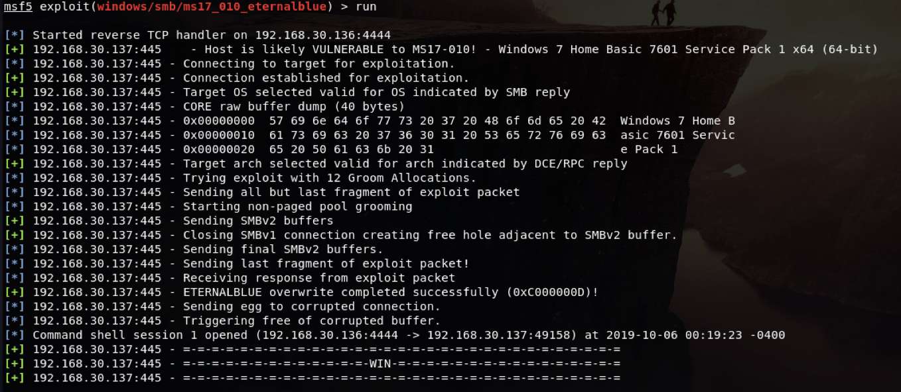
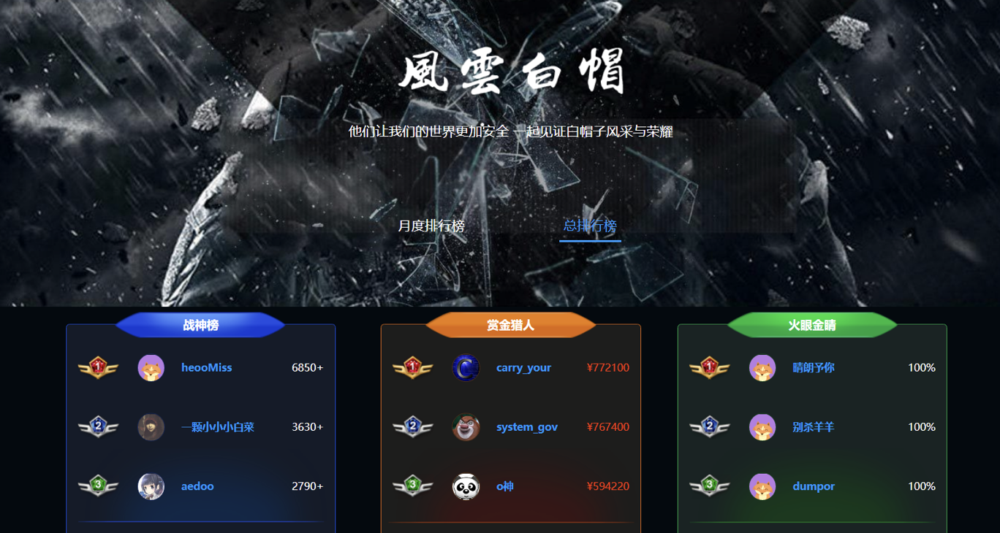
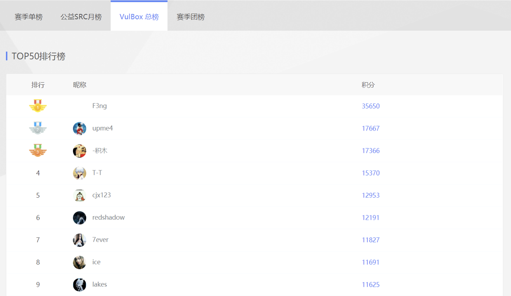
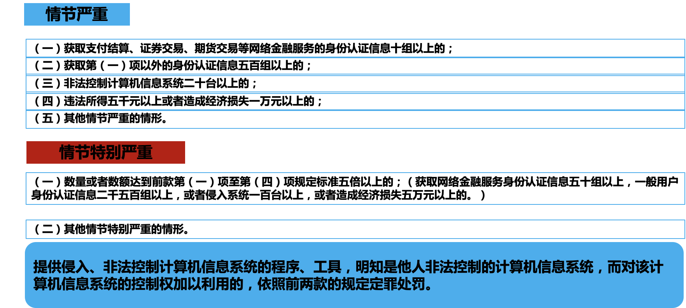

## 信息安全

信息安全是指信息网络的硬件、软件及其系统中的数据受到保护，不受偶然的或者恶意的原因而遭到破坏、更改、泄露，系统连续可靠正常地运行，信息服务不中断。

信息安全是一门涉及**计算机科学、网络技术、通信技术、密码技术、信息安全技术、应用数学、数论、信息论**等多种学科的综合性学科。

从广义来说，凡是涉及到网络上信息的**保密性、完整性、可用性、真实性和可控性**的相关技术和理论都是网络安全的研究领域。

## 一些事件

### WannaCry

WannaCry勒索病毒全球大爆发，至少150个国家、30万名用户中招，造成损失达80亿美元，已经影响到金融，能源，医疗等众多行业，造成严重的危机管理问题。

### AcFun泄露

北京时间 6 月 13 日凌晨，AcFun 发布公告称网站遭遇黑客攻击，近千万条用户数据外泄。呼吁 2017 年 7 月 7 日之后从未登陆过的用户以及密码强度低的用户及时更改密码。如果在其他网站使用与 A 站相同的密码，也应及时修改。    ——来源”reebuf.com”

## 白帽子

白帽子，描述的是**正面的黑客**，他可以识别计算机系统或网络系统中的安全漏洞，但并不会恶意去利用，而是公布其漏洞。这样，系统将可以在被其他人（例如黑帽子）利用之前来修补漏洞。

### 国内顶级白帽子——吴翰清

在23岁就成为了阿里最年轻的高级技术专家。

吴翰清领导的团队每天帮助阿里云抵御16亿次的黑客攻击。

## 前景

首先从国家层面出发，网络安全已上升到国家层面，随着等保2.0出台，相应的信息行业迎来蓬勃发展，当然作为渗透测试方向，可持续的发展力也不容质疑。

## 能力要求与职责

## 这套教程能学到什么

### 一些操作

### 补天

### 漏洞盒子

### SRC

# 网络安全法

中国与网络安全的相关法律法规

- **犯罪**——刑事处罚：**《刑法》**

  - 《刑法》第285条主要罪名

    - 非法**侵入**计算机信息系统罪：违反国家规定，侵入**国家事务、国防建设、尖端科学技术**

      领域的计算机信息系统的，处==三年以下有期徒刑或者拘役==  

    - 非法**获取**计算机信息系统**数据**、非法**控制**计算机信息系统罪：违反国家规定，**侵入前款规定以外的计算机信息系统**；或者**采用其他技术手段，获取该计算机信息系统中存储、处理或者传输的数据**；或者**对该计算机信息系统实施非法控制**。情节严重的，处三年以下有期徒刑或者拘役，并处或者单处罚金；情节特别严重的，处三年以上七年以下有期徒刑，并处罚金。

      -  

    - **提供**侵入、非法控制计算机信息系统的**程序、工具罪**：提供专门用于侵入、非法控制计算机信息系统的程序、工具，或者明知他人实施侵入、非法控制计算机信息系统的违法犯罪行为而为其提供程序、工具，情节严重的，依照前款的规定处罚。

  - 《刑法》第286条主要罪名

    - 破坏计算机信息系统罪：

      - 违反国家规定，对计算机信息系统功能进行删除、修改、增加、干扰，造成计算机信息系统不能正常运行，后果严重的，处五年以下有期徒刑或者拘役；后果特别严重的，处五年以上有期徒刑。

      - 违反国家规定，对计算机信息系统中存储、处理或者传输的数据和应用程序进行删除、修改、增加的操作，后果严重的，依照前款的规定处罚。

      - 故意制作、传播计算机病毒等破坏性程序，影响计算机系统正常运行，后果严重的，依照第一款的规定处罚。

      - | **行为** | **处罚** | **后果** | **后果特别严重** |
        | :--------------------------------------------------------- | ------------------------------------------------------------ | ------------------------------------------------------------ | ------------------------------------------------------------ |
        | 违反国家规定，对计算机**信息系统功能**进行删除、修改、增加、干扰，造成计算机信息系统不能正常运行。  违反国家规定，对计算机信息系统中存储、处理或者传输的**数据和应用程序**进行删除、修改、增加的操作  故意**制作、传播计算机病毒等破坏性程序**，影响计算机系统正常运行 | 后果严重—  五年以下有期徒刑或者拘役  后果特别严重——五年以上有期徒刑 | （一）造成10台以上计算机信息系统的主要软件或者硬件不能正常运行的；     （二）对20台以上计算机信息系统中存储、处理或者传输的数据进行删除、修改、增加操作的；     （三）违法所得5000以上或者造成经济损失10000元以上的；     （四）造成为100台以上计算机信息系统提供域名解析、身份认证、计费等基础服务或者为一万以上用户提供服务的计算机信息系统不能正常运行累计一小时以上的；    （五）造成其他严重后果的。 | （一）数量或者数额达到前款第（一）项至第（三）项规定标准五倍以上的；  （造成50台以上计算机信息系统的主要软件或者硬件不能正常运行的；对100台以上计算机信息系统中存储、处理或者传输的数据进行删除、修改、增加操作的；违法所得25000元以上或者造成经济损失50000元以上的。）     （二）造成为500台以上计算机信息系统提供域名解析、身份认证、计费等基础服务或者为五万以上用户提供服务的计算机信息系统不能正常运行累计一小时以上的；     （三）破坏国家机关或者金融、电信、交通、教育、医疗、能源等领域提供公共服务的计算机信息系统的功能、数据或者应用程序，致使生产、生活受到严重影响或者造成恶劣社会影响的；     （四）造成其他特别严重后果的。 |

- **违法**——治安处罚：**《治安管理处罚法》**

  - **第二十九条**　有下列行为之一的，处五日以下拘留；情节较重的，处五日以上十日以下拘留：
    （一）违反国家规定，侵入计算机信息系统，造成危害的；

    （二）违反国家规定，对计算机信息系统功能进行删除、修改、增加、干扰，造成计算

    机信息系统不能正常运行的；
    （三）违反国家规定，对计算机信息系统中存储、处理、传输的数据和应用程序进行删

    除、修改、增加的；

    （四）故意制作、传播计算机病毒等破坏性程序，影响计算机信息系统正常运行的。

- **处分**——从业禁止：**《网络安全法》**
  - **第六十三条** **第三款**    违反本法第二十七条规定，受到治安管理处罚的人员，**五年内**不得从事网络安全管理和网络运营关键岗位的工作；受到刑事处罚的人员，终身不得从事网络安全管理和网络运营关键岗位的工作。
  - **第二十六条** 开展网络安全认证、检测、风险评估等活动，向社会发布系统漏洞、计算机病毒、网络攻击、网络侵入等网络安全信息，应当遵守国家有关规定。

### 一些建议

**法律法规要加强学习**

**圈子里交友要谨慎**

**技术操作要规范**

真爱必然克制：遵从法律框架、规范技术手段、不要做恶意黑客、不要逃避犯错之后的后果

以安全测试为目的所实施的漏洞挖掘有一定的合法行为空间✅

## 提问的艺术

有问题，先百度，现在都能问chatgpt了。

提问原则：礼貌为前提，描述要精准。